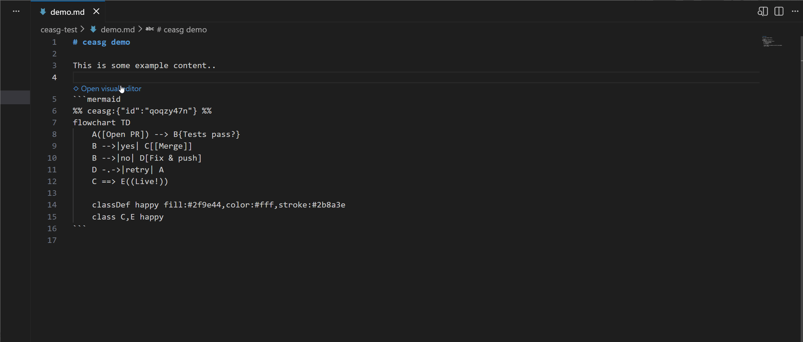

# ceasg — Visual Mermaid Editor

A VS Code extension for editing Mermaid diagrams visually. Click a CodeLens on any `mermaid` code block in Markdown, and the editor opens in a pane beside your text. Edit flowcharts with an intuitive drag-and-drop canvas, or preview other Mermaid diagram types with live rendering.



## Features

- **CodeLens integration** — "Mermaid: Open Visual Editor" appears above every `mermaid` block in Markdown.
- **Dual-mode editing:**
  - **Flowchart WYSIWYG** — Drag nodes, connect edges, adjust shapes/colors, auto-layout, and set position all visually on the canvas.
  - **Live preview for other types** — Sequence, state, class, and other diagram types render live as you edit the Mermaid source in the editor.
- **Subgraphs** — Render subgraph containers (including nested ones); create one from a selection, drag a whole subgraph, drag nodes in/out to change membership, rename, resize, and ungroup — all on the canvas.
- **Two-way sync:**
  - Edits in the visual editor write back to the Markdown file instantly.
  - External changes (save in the Markdown editor) pull into the visual editor automatically.
- **Layout persistence** — Node positions are stored in hidden `%% mermaid-flow:pos %%` comments and survive round-trips.
- **Block identity** — Flowchart nodes carry hidden `%% ceasg:{"id":...} %%` markers to maintain identity across edits.

## Workflow

1. Open a Markdown file with one or more `` ```mermaid `` code blocks.
2. Click "Mermaid: Open Visual Editor" in the CodeLens above a block.
3. The editor pane opens beside your Markdown.
4. For **flowchart** blocks: drag to move, click to select, click endpoints to connect edges, right-click to delete, use the properties panel to change shape/color/label.
5. For **other diagram types**: edit the text in the Markdown editor (left), see live preview updates in the editor pane (right).
6. Save the Markdown file (`Ctrl+S` / `Cmd+S`). External changes sync back into the visual editor automatically.

## Hidden Comment Conventions

The extension preserves two lightweight comment formats for interoperability:

- `%% ceasg:{"id":"....."} %%` — Marks a flowchart node with a stable identity. Safe to edit or remove (if removed, a new ID is assigned on next save).
- `%% mermaid-flow:pos id=x,y id=x,y ... %%` — Records node layout positions. Updated on every edit; safe to ignore or delete (layout resets to auto-layout on next save).
- `%% mermaid-flow:gpos id=x,y,w,h ... %%` — Records subgraph box geometry. Updated on every edit; safe to ignore or delete (boxes re-derive from their members on next open).

## Known Limitations (v1)

- **Flowchart WYSIWYG only** — Other diagram types (sequence, state, class, etc.) render as live preview with a text editor; no visual editing UI.
- **No PNG/SVG export** — Use Mermaid's live editor or browser DevTools to screenshot/save.
- **No copy/paste** — Select, duplicate, and other multi-select shortcuts deferred to later.
- **No theme/style presets dropdown** — Inline color/style controls available in the properties panel.

## Requirements

- VS Code 1.103.0 or later.
- A Markdown file with `` ```mermaid `` code blocks.

## Acknowledgements

The flowchart engine — parsing, serialization, dagre layout, geometry, and shapes — is
**ported from [Mermaid Flow](https://github.com/THANSHEER/obsidian-mermaid-flow)** by
THANSHEER, an Obsidian plugin for visually editing Mermaid flowcharts. Those files live in
`src/core/` and each carries an attribution header. The `%% mermaid-flow:pos %%` layout
convention is reused so diagrams stay cross-compatible with that plugin. Sincere thanks to
the Mermaid Flow project — ceasg would not exist without it.

Diagrams are rendered with [Mermaid](https://mermaid.js.org/) and laid out with
[dagre](https://github.com/dagrejs/dagre).

## License

Licensed under the **GNU General Public License v3.0 or later** — [GPL-3.0-or-later](LICENSE).

Because ceasg's flowchart engine is derived from Mermaid Flow (which is GPL-3.0-or-later),
the whole extension — including its newly written code — is licensed under GPL-3.0-or-later.
See [LICENSE](LICENSE) and [NOTICE.md](NOTICE.md) for details.
