# ceasg flowchart feature demo

Every section below is one `mermaid` block exercising one flowchart feature that
ceasg understands. Open any block with the **"Mermaid: Open Visual Editor"**
CodeLens to edit it on the canvas — everything here parses into the visual model
and serializes back to Mermaid.

Two things are worth knowing before reading on:

- **Nothing is ever dropped.** Syntax ceasg does not model explicitly is kept
  verbatim in the block and re-emitted on save (see
  [Preserved syntax](#preserved-syntax)).
- **Saving normalizes.** The serializer writes one canonical form per feature,
  so a few equivalent spellings collapse into one. Each section notes where that
  happens.

---

## Node shapes

All fourteen shapes ceasg can draw, select in the properties panel, and drop
from the shape palette sidebar.

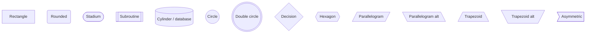

A bare identifier with no brackets is also valid — it becomes a rectangle whose
label is the id.

## Edge kinds

The six link operators the editor models. Each is selectable on a selected edge
in the properties panel.

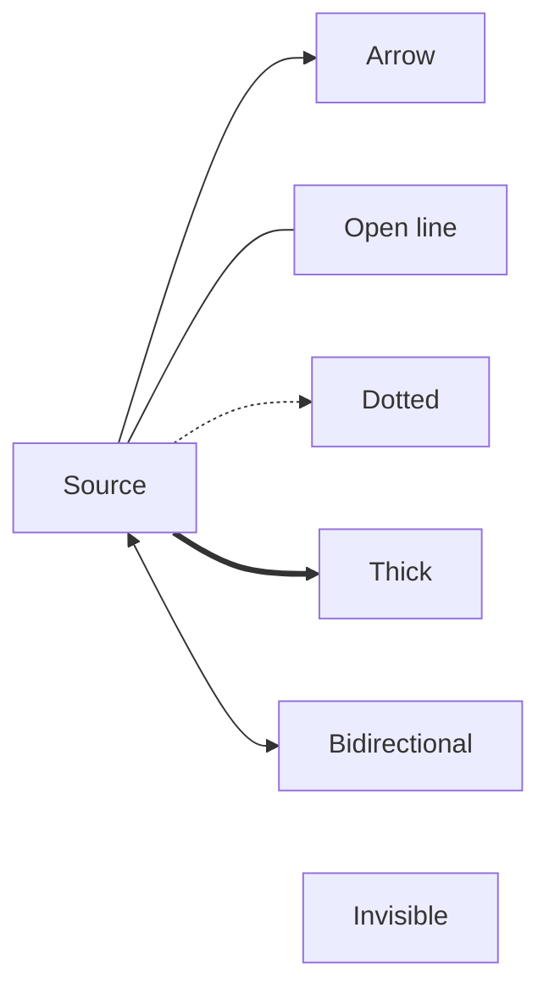

The dotted-open (`-.-`) and thick-open (`===`) operators parse too, but they
carry no separate model kind: they load as **dotted** and **thick** and save as
`-.->` and `==>`.

## Edge labels

Both label spellings are accepted — the pipe form and Mermaid's inline form.

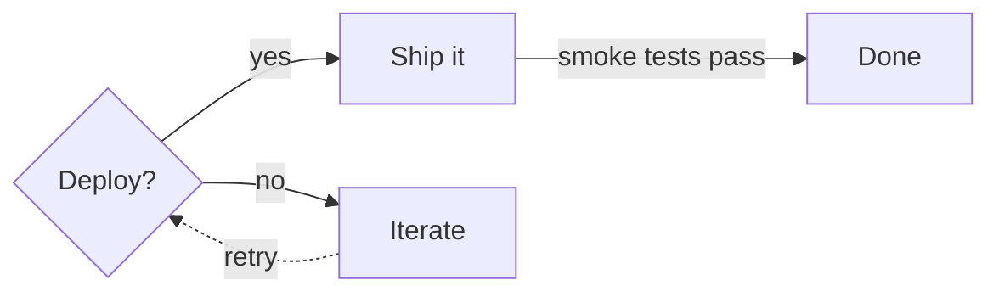

Inline labels (`-- text -->`, `-. text .->`, `== text ==>`, `<-- text -->`) are
normalized to the pipe form on save, so `B -- smoke tests pass --> D` comes back
as `B -->|"smoke tests pass"| D`. Invisible links (`~~~`) drop any label,
matching Mermaid.

## Layout direction

`flowchart` and `graph` headers both work, in all four directions: `TB`, `BT`,
`LR`, `RL`. `TD` is accepted as a synonym and saved as `TB`. The toolbar's
direction dropdown edits this field.

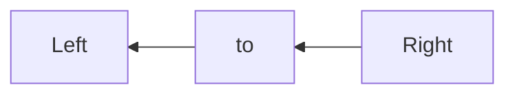

## Chains and multi-node statements

Chained links and `&` fan-out/fan-in expand into individual edges in the model,
which is what makes each one separately selectable and styleable on the canvas.

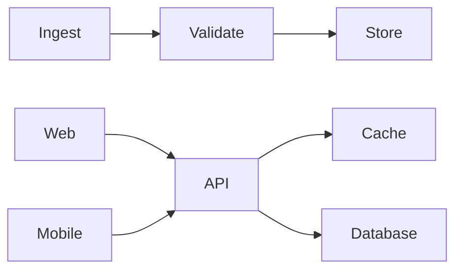

`D & E --> F` connects every left node to every right node. Saving expands these
into one line per edge.

## Subgraphs

Subgraphs render as containers on the canvas. You can create one from a
selection, drag the whole box, drag nodes in and out to change membership,
rename, resize, and ungroup — all visually. Nesting works.

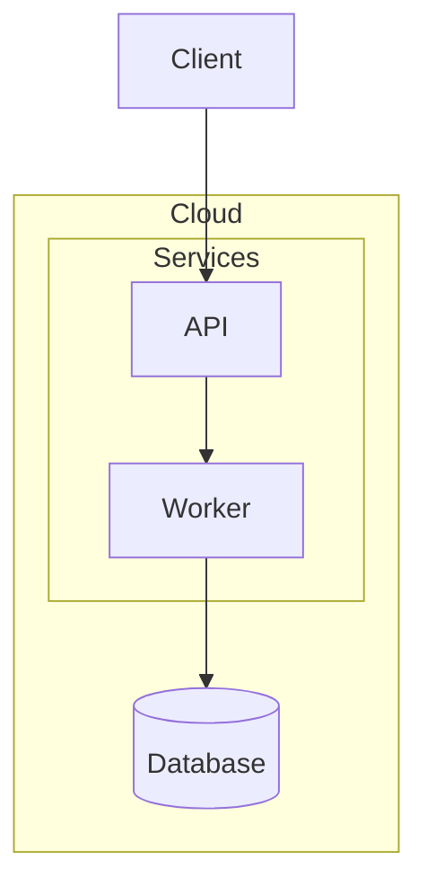

Titles may be given as `subgraph id [Title]`, `subgraph id`, or `subgraph "Just
a title"` (which gets a generated id). A node belongs to the subgraph it is
first mentioned in.

## Per-node styling

`style <id> …` folds into the node's style and drives the properties panel's
fill, stroke, text colour, font and border controls.

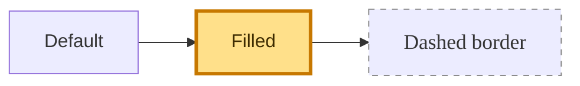

Modelled properties are `fill`, `stroke`, `stroke-width`, `stroke-dasharray`,
`color`, `font-size` and `font-family`. Any other property is kept verbatim and
re-emitted.

## Reusable classes

`classDef` defines a named style; `class` and the `:::` shorthand assign it.

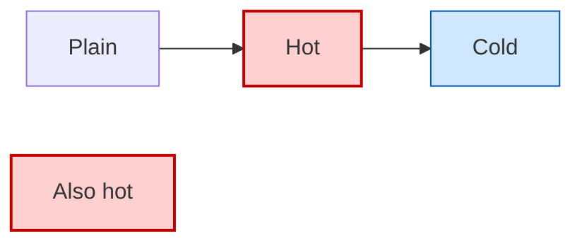

Resolution order for a node's final look, lowest precedence first: theme
defaults → `classDef default` → the node's classes in assignment order → its own
`style` line. The `:::` shorthand is canonicalized to the grouped `class`
form on save, so `D[Also hot]:::hot` returns as `class B,D hot`.

## Edge styling

`linkStyle <index> …` styles an edge by its position in the edge list.

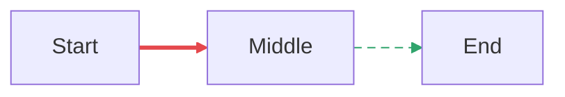

Modelled properties are `stroke`, `stroke-width`, `stroke-dasharray`, `color`
and `font-size`. A directive listing several indices (`linkStyle 0,1 …`) applies
to each of them and is saved as one line per edge.

## Animated edges

Marching-ants animation is a ceasg extension, persisted as a marker property
inside an otherwise ordinary `linkStyle` line so the block stays valid Mermaid.

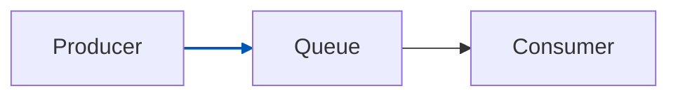

The marker is lifted into the edge's `animated` flag on load and written back on
save. Other Mermaid renderers ignore the unknown property.

## Mermaid v11 shape syntax

The `@{shape: …, label: …}` attribute form is understood and mapped onto the
nearest supported shape.

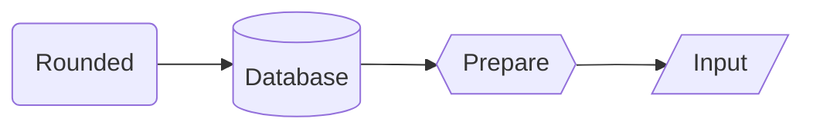

Aliases from the v11 shape table are covered (`proc`, `pill`, `terminal`,
`subproc`, `cyl`, `circ`, `dbl-circ`, `diam`, `decision`, `lean-l`/`lean-r`,
`trap-b`/`trap-t`, `odd`, and more); an unrecognized name degrades to a
rectangle. On save these are rewritten in the classic bracket form —
`A@{shape: db}` becomes `A[("…")]`.

## Node hyperlinks

`click` bindings become a node's link, carried through the model and re-emitted
on save.

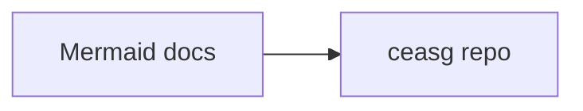

Both the plain and `href` spellings load; both save as `click <id> "<target>"`.
Callback, tooltip and target-window forms are not modelled — they are preserved
untouched instead (see [Preserved syntax](#preserved-syntax)). There is no
properties-panel control for the link yet; edit it in the Markdown.

## Diagram config

An `%%{init: …}%%` directive supplies theme and spacing. It is parsed into the
model, drives what the canvas draws, and is written back on save.

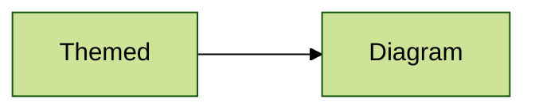

`theme`, `themeVariables` (with `background` lifted into its own field),
`flowchart.nodeSpacing` and `flowchart.rankSpacing` are modelled. Single-quoted
JSON is accepted; a directive that cannot be parsed at all is preserved verbatim.

What each modelled field actually does:

- `theme` — `default`, `dark`, `forest` and `neutral` set the canvas's default
  node fill, border, text and line colours. Any other name falls back to the
  editor's own palette.
- `themeVariables` — `primaryColor`, `primaryBorderColor`, `primaryTextColor`
  and `lineColor` override those defaults directly, which is how a `base` theme
  with explicit variables renders.
- `flowchart.nodeSpacing` / `rankSpacing` — feed dagre's `nodesep`/`ranksep` when
  auto-layout runs (both default to 50).
- `background` — round-trips faithfully but does not currently tint the canvas.

There is no diagram-level properties panel; this directive is edited by hand in
the Markdown. Per-node and per-edge appearance *is* editable on the canvas — see
[Per-node styling](#per-node-styling) and [Edge styling](#edge-styling).

## Labels with markup and punctuation

Labels are quoted on save, so commas, brackets and ampersands are safe. `<br/>`
round-trips as a real line break in the editor's label field.

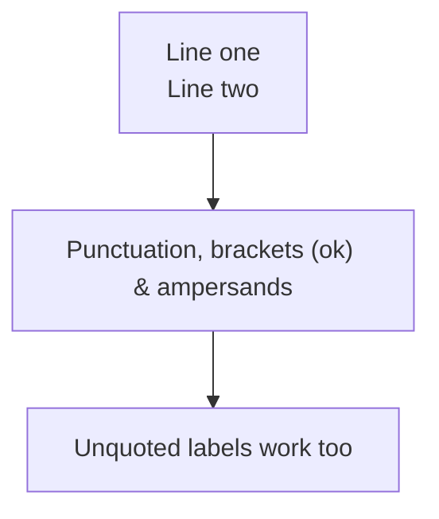

Editing a label to contain a newline writes `<br/>`, and reading it back gives
you the newline again. An `&` inside a quoted or bracketed label is never
mistaken for the multi-node separator, and neither are brackets.

**Avoid semicolons in labels.** The parser splits statements on `;` without
regard for quotes, so `A["a; b"]` is torn in half and reloads as garbage. This
also rules out HTML entities such as `&quot;` and `&amp;` — and because a
literal `"` inside a label is saved as `&quot;`, a label containing a double
quote does not survive a save/reload cycle either. Use apostrophes or typographic
quotes (`'`, `“ ”`) instead — those carry no `;` and round-trip fine.

## Layout persistence

Manual node positions and subgraph boxes survive round-trips in hidden comments.
Move a node in the editor and this is what changes in the Markdown.

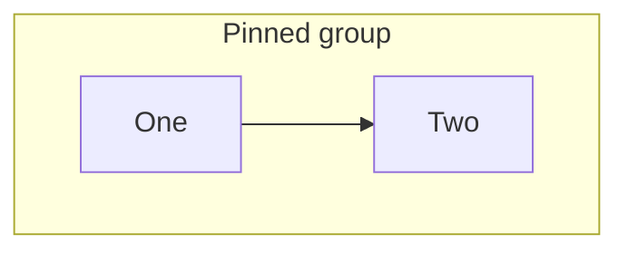

- `%% mermaid-flow:pos id=x,y %%` — node centres, optionally with a manual size
  as `id=x,y,w,h`.
- `%% mermaid-flow:gpos id=x,y,w,h %%` — subgraph box geometry (top-left origin).

Delete either line and the diagram falls back to dagre auto-layout on next open.
The format is shared with the Mermaid Flow Obsidian plugin, so positioned
diagrams stay cross-compatible. These positions also drive rendering in the
built-in Markdown preview when `ceasg.previewRendering` is on.

## Block identity

The extension stamps a block with a stable id the first time it edits it, so
edits keep targeting the right block as the file changes around it.

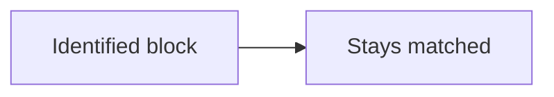

Safe to edit or delete — a new id is assigned on the next edit.

## Preserved syntax

<a id="preserved-syntax"></a>

Lines ceasg does not model are round-tripped untouched rather than dropped, so
opening a diagram in the visual editor never destroys advanced syntax.

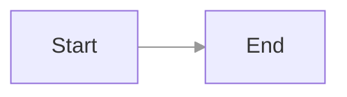

This covers callback/tooltip `click` forms, `linkStyle default`, unparseable
statements, and plain `%%` comments. One caveat: preserved lines are re-emitted
at the end of the block at top level, so a `direction LR` written *inside* a
subgraph survives but moves out of it — set the diagram direction from the
toolbar instead.

## Headerless snippets

A block with no `flowchart`/`graph` header still opens on the canvas; saving
adds the header.

```mermaid
A[No header] --> B[Still editable]
```

## Non-flowchart diagrams

Any block whose type is recognized as something other than a flowchart opens in
live-preview mode instead: edit the Mermaid text on the left, see it render on
the right. Sequence, class, state, ER, Gantt, pie, journey, git, mindmap,
timeline, quadrant, requirement, C4, Sankey, XY, block, packet, kanban,
architecture and ZenUML diagrams are all detected and routed this way.

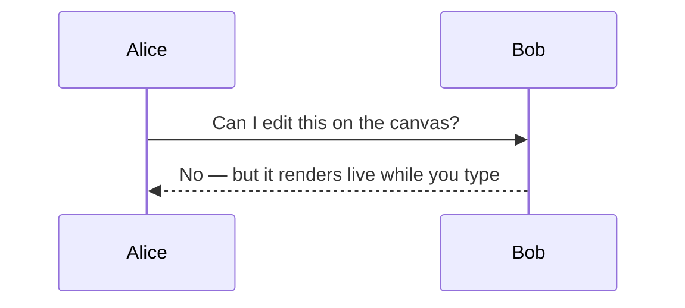
