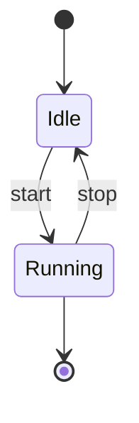
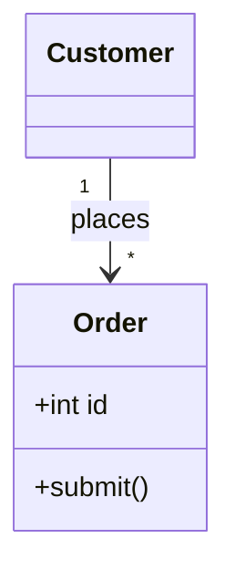
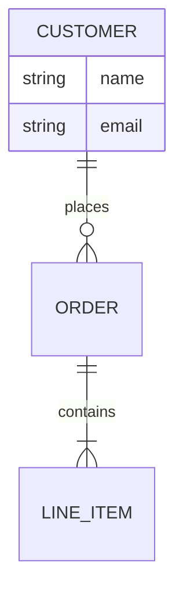
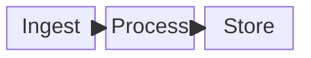
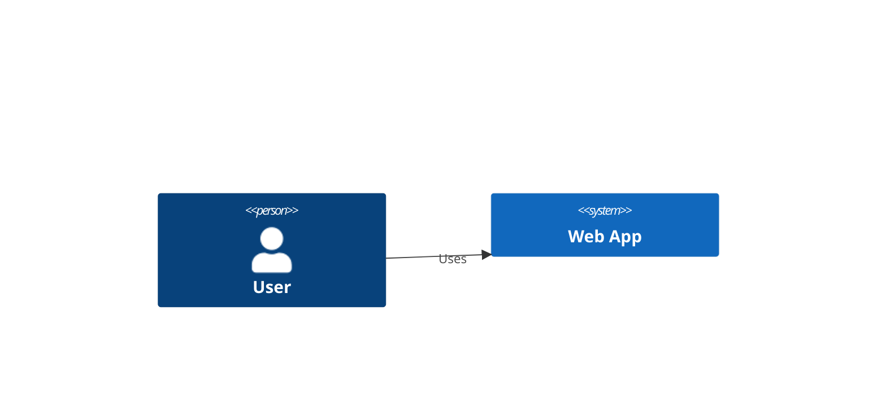
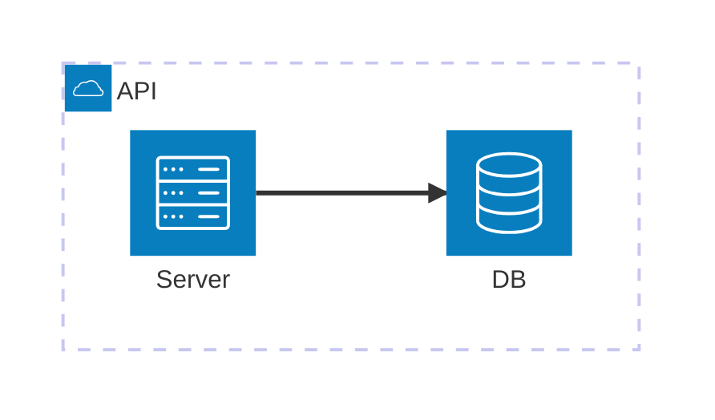
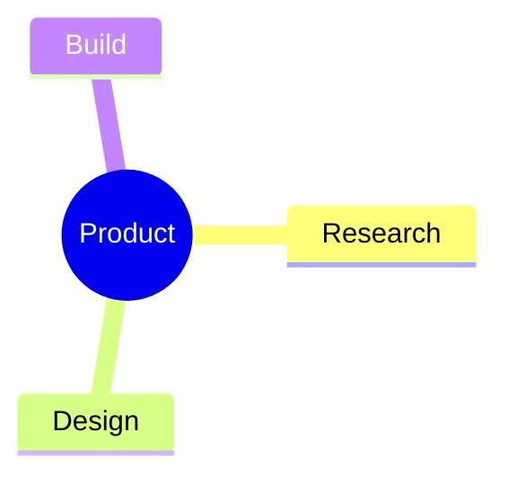
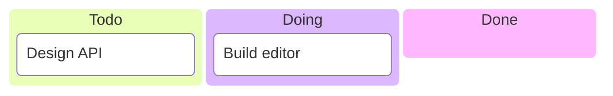
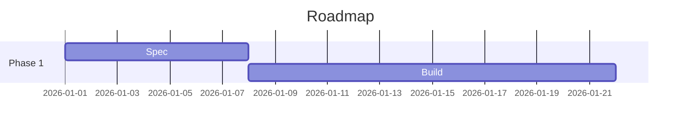

# Visual Editing Opportunity — Other Diagram Types

Today the ceasg visual editor gives full WYSIWYG (drag nodes, connect edges,
style) to **flowcharts** only; every other Mermaid diagram type falls back to a
live text-preview pane. This doc ranks the other diagram types by **how much a
visual editor would help**, so it can drive a roadmap for "what to make visually
editable next."

**How sections are ordered.** Two factors, benefit first:

1. **Benefit** — does the diagram have *spatial freedom* a canvas helps with?
   Node-and-edge diagrams where the author cares about placement, and where the
   text syntax is verbose/fiddly, benefit most. Diagrams with a **fixed or
   fully auto-derived layout** (sequence, gitgraph) or that are really **data
   tables/charts** (pie, gantt, xy) benefit little — the text (or a form) is
   already the best interface.
2. **Engine fit** — how much of the *existing* flowchart canvas (node geometry,
   edge routing, drag, connect, style panel) transfers. High-fit types are
   cheaper to ship and are flagged as such, because a graph of boxes-and-arrows
   is exactly what the current engine already does.

Ratings: **Benefit** = High / Medium / Low. **Engine fit** = High (reuses the
flowchart canvas nearly as-is) / Medium (same canvas, new node/edge vocabulary)
/ Low (needs a different editing surface entirely).

---

## 1. State diagram (`stateDiagram-v2`)

**Benefit: High · Engine fit: High**

States are boxes, transitions are labelled arrows, and layout is free-form —
this is *structurally the same problem as a flowchart*. The current canvas
(drag, connect, relabel, position-persist) transfers almost directly; the main
additions are start/end pseudo-states (`[*]`), composite (nested) states, and
fork/join bars.

Because the payoff is high and the reuse is highest of any type, this is the
strongest first candidate — much of it is "flowchart with a different node
vocabulary."



---

## 2. Class diagram / UML (`classDiagram`)

**Benefit: High · Engine fit: Medium**

(Called out in the request.) Classes are boxes connected by typed relationships
(inheritance, composition, aggregation, association) — placement matters and
users routinely hand-arrange UML. The relationship *endpoints* (hollow triangle,
diamond, arrow) are richer than flowchart arrowheads, and each class box has
**internal structure** (fields, methods, visibility) that wants an inline
mini-form rather than a single label.

High value; the canvas/edge model reuses well, but the node-internals editor
(members list, visibility markers, cardinality on relations) is net-new work.



---

## 3. Entity–Relationship diagram (`erDiagram`)

**Benefit: High · Engine fit: Medium**

Very close to class diagrams: entities are attribute tables, connected by
relationships with **crow's-foot cardinality** (`||--o{`). ER diagrams are
notoriously fiddly to hand-write (the cardinality glyph syntax is cryptic), so a
visual picker for "one-to-many / optional" plus drag layout is a big usability
win. Shares the "box with an internal attribute list" editor with class
diagrams — build one, the other gets cheaper.



---

## 4. Block diagram (`block-beta`)

**Benefit: High · Engine fit: Medium**

The whole point of block diagrams is **manual layout** — explicit columns, block
spans, and grid placement. That makes them almost *impossible to author
comfortably as text* and a near-perfect match for a drag-and-drop grid editor;
the visual surface is arguably the intended authoring mode. Caveat: it is still
a `-beta` syntax, so it's a bet on stability.



---

## 5. C4 architecture diagrams (`C4Context` / `C4Container` / …)

**Benefit: Medium–High · Engine fit: Medium**

Persons, systems, and containers are boxes with typed relationships and **nested
boundaries** — conceptually flowchart-with-subgraphs plus a fixed element
vocabulary. Architects care a lot about arrangement, and the element/relation
syntax is verbose, so visual editing helps. Nesting boundaries lean on the same
subgraph work identified in the flowchart gap doc.



---

## 6. Requirement diagram (`requirementDiagram`)

**Benefit: Medium · Engine fit: Medium**

Requirements and elements are boxes linked by typed relations (`satisfies`,
`derives`, `traces`). Graph-like and thus a decent canvas fit, but each node
carries several structured fields (id, text, risk, verifymethod) that need a
form — and it's a comparatively niche diagram, so value is moderate.

```mermaid
requirementDiagram
    requirement req1 {
        id: 1
        text: must authenticate
    }
    element e1 {
        type: test
    }
    e1 - satisfies -> req1
```

---

## 7. Architecture diagram (`architecture-beta`)

**Benefit: Medium · Engine fit: Medium**

Services (with icons) grouped into clusters and wired by edges — positional and
graph-like, so a canvas fits. Value is capped by it being newer/`-beta` and
icon-centric (overlaps the icon-rendering gap from the flowchart doc). Good
second-wave candidate once state/class/ER land.



---

## 8. Mindmap (`mindmap`)

**Benefit: Medium · Engine fit: Low–Medium**

A pure hierarchy that Mermaid **auto-lays-out radially**, so positioning matters
less — but *structural* editing (add child, reparent, relabel, collapse) is
exactly what people fumble in text (indentation-sensitive). The win here is an
outline/tree-drag interaction more than free canvas dragging, so it needs a
somewhat different surface.



---

## 9. Kanban (`kanban`)

**Benefit: Medium · Engine fit: Low**

Cards in columns — dragging a card between columns is a genuinely nice visual
interaction, but it's a **board UI, not a node-edge graph**, so almost none of
the flowchart engine applies. Reasonable standalone feature; low synergy with
current work.



---

## 10. Gantt (`gantt`)

**Benefit: Low–Medium · Engine fit: Low**

Layout is fully derived from dates/durations, so there's nothing to "drag on a
canvas" in the flowchart sense. It *would* benefit from a **structured form /
table editor** (rows of task, start, duration, dependency) and maybe draggable
bars on a timeline — but that's a bespoke widget, not the graph canvas. Treat as
a separate track if pursued.



---

## 11. Low / no benefit — keep as live-preview text

These render fine and are best left to the existing text + live-preview flow.
Grouped with the reason each is a poor fit for a visual editor:

- **Sequence diagram** (`sequenceDiagram`) — *(called out in the request as low
  need)*. Layout is fixed and auto: participants across the top, time down the
  page. There's no placement to control; the text *is* the natural editing
  surface. A form for reordering participants is the most one could justify.
- **Git graph** (`gitGraph`) — commit/branch layout is entirely derived from the
  commit order; nothing to position.
- **User journey** (`journey`) — a table of tasks × actors with scores;
  form/table territory, not a canvas.
- **Pie** (`pie`) — label + value pairs; a two-column form beats any canvas.
- **Quadrant** (`quadrantChart`), **XY chart** (`xychart-beta`), **Sankey**
  (`sankey-beta`), **Radar** (`radar-beta`), **Timeline** (`timeline`),
  **Packet** (`packet-beta`), **Treemap** — all **data-driven charts**: their
  shape comes from numbers, so a data grid / form is the right tool, and drag
  editing adds little.

---

## Quick reference matrix

Ordered by priority (same as sections above).

| # | Diagram type | Benefit | Engine fit (reuse flowchart canvas) | Notes |
|---|---|---|---|---|
| 1 | State (`stateDiagram-v2`) | High | High | Nearly "flowchart with new node types" — best first pick |
| 2 | Class / UML (`classDiagram`) | High | Medium | + node-internals editor (members, visibility, cardinality) |
| 3 | ER (`erDiagram`) | High | Medium | Cryptic crow's-foot syntax → big picker win; shares class work |
| 4 | Block (`block-beta`) | High | Medium | Manual layout is the point; but `-beta` |
| 5 | C4 (`C4Context`…) | Med–High | Medium | Boxes + nested boundaries; leans on subgraph work |
| 6 | Requirement | Medium | Medium | Graph-like but field-heavy and niche |
| 7 | Architecture (`architecture-beta`) | Medium | Medium | Icon-centric, `-beta`; second wave |
| 8 | Mindmap | Medium | Low–Med | Wants outline/tree drag, not free canvas |
| 9 | Kanban | Medium | Low | Board UI, little engine reuse |
| 10 | Gantt | Low–Med | Low | Form/timeline widget, not the graph canvas |
| — | Sequence, Git graph, Journey, Pie, Quadrant, XY, Sankey, Radar, Timeline, Packet, Treemap | Low | — | Fixed-layout or data-driven — keep as text + live preview |

**Suggested sequencing:** State → Class → ER first (highest value, and each
lowers the cost of the next by sharing the canvas and the box-internals editor),
then reassess Block / C4 based on demand.
</content>
