# Flowchart Rendering Gap Analysis

A comparison between what **Mermaid's flowchart syntax supports** and what the
ceasg visual editor (`extension/src/core` + `extension/src/webview/wysiwyg`)
actually **models, renders, and lets you edit**.

Each section below is a distinct capability that Mermaid supports but our editor
does **not** fully render — meaning the feature is either invisible on the
canvas, silently degraded to something simpler, or preserved only as opaque
round-trip text that the user can neither see nor change from the visual editor.

**Ordering:** sections are sorted by rough **usefulness / impact for everyday
flowchart authoring**, most useful first — so you can work down the list in
priority order. Subgraph capabilities lead (grouping / nested concepts are used
constantly), followed by label and styling gaps that affect ordinary diagrams,
then edge semantics and the extended shape library, and finally the niche or
decorative features (animation, callbacks, icons, accessibility).

> Scope note: "round-tripped" below means the original Mermaid text survives a
> save (it is stashed in `model.extras`, `style.extra`, or the raw node/edge)
> and is **not corrupted** — but it is not drawn on the canvas and there is no
> UI to edit it. For a visual editor, "invisible and uneditable" is the gap that
> matters, even when the text is technically preserved.

---

## 1. Nested subgraphs

**Mermaid supports:** subgraphs nested inside subgraphs, to arbitrary depth.

**Our editor supports:** a **flat** list of groups (`DiagramGroup` has
`nodeIds` but no parent/child relationship).

**Gap / consequence:**
- On parse, a node is assigned to whichever subgraph *first mentions* it
  (innermost wins), and an outer subgraph that contains only nested subgraphs
  (no direct nodes) ends up empty and is **dropped**. Nesting hierarchy is
  **flattened / lost** — it neither renders as nested containers nor
  round-trips.

**Example:**

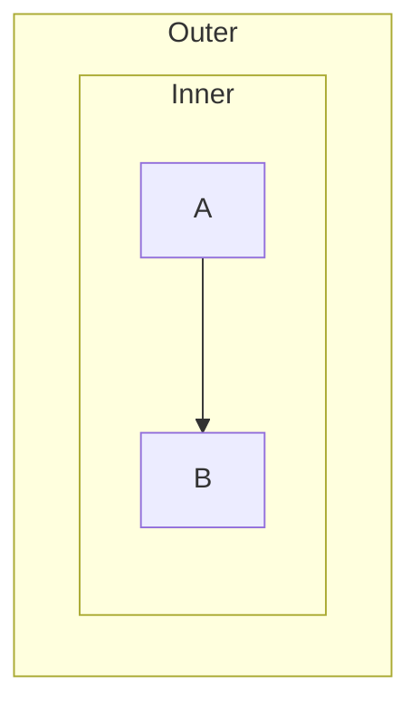

---

## 2. No subgraph creation / editing UI

**Mermaid supports:** subgraphs as a first-class grouping construct.

**Our editor supports:** parsing, membership, and re-serialization of existing
subgraphs — but (per README "Known Limitations") **no UI** to create a subgraph,
rename it, add/remove members, or delete it.

**Gap / consequence:**
- Subgraphs present in the source are round-tripped, but a user starting from
  the visual editor cannot introduce or restructure grouping at all.

**Example:** (nothing in the toolbar/palette produces this grouping)

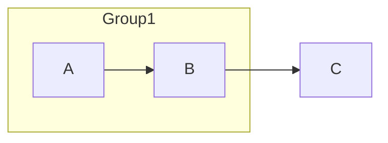

---

## 3. Edges to/from a subgraph, and subgraph styling

**Mermaid supports:** using a subgraph's id as a link endpoint
(`SubgraphA --> B`) and styling subgraphs (`style SubgraphA fill:#…`,
`class SubgraphA …`).

**Our editor supports:** links and styles keyed to **nodes** only.

**Gap / consequence:**
- A subgraph id used as an edge endpoint is treated as an ordinary node id,
  which **fabricates a phantom node** with that id instead of connecting to the
  container — so the diagram renders incorrectly.
- Likewise `style <subgraphId> …` / `class <subgraphId> …` create/attach to a
  phantom node rather than styling the container. Subgraph fill/stroke is not
  rendered or editable.

**Example:**

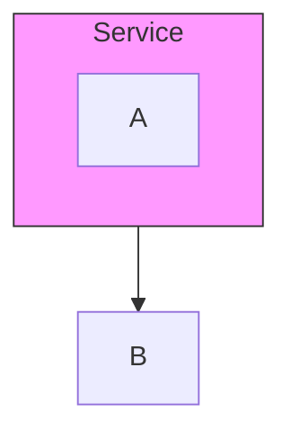

---

## 4. Per-subgraph direction (`direction LR` inside a `subgraph`)

**Mermaid supports:** overriding flow direction within a single subgraph.

**Our editor supports:** one global diagram `direction` only.

**Gap / consequence:**
- A `direction …` line inside a subgraph is classified as structural and pushed
  to `extras`. It is preserved in text but **has no effect on the canvas
  layout** and cannot be set per-subgraph in the UI.

**Example:** (outer flow is top-down, but `S` lays its members out left-to-right)

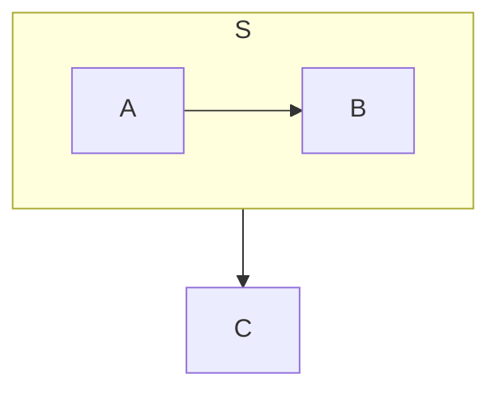

---

## 5. Markdown-formatted and HTML labels — supported, with limits

**Mermaid supports:** markdown string labels (`` A["`**bold** and _italic_`"] ``)
with bold/italic/line-wrap, and HTML entities / `<b>`, `<i>` markup in labels.

**Our editor supports:** both. A markdown string renders bold and italic runs and
word-wraps at Mermaid's default `flowchart.wrappingWidth` of 200 (or at the
node's stored width, when the diagram specifies one); HTML markup — `<b>`,
`<strong>`, `<i>`, `<em>`, `<br>` and named, numeric and hex entities — renders
in **any** label, plain or markdown, matching Mermaid's `htmlLabels: true`
default. This covers node labels, edge labels and subgraph titles, on the
WYSIWYG canvas and in the Markdown preview alike (they share one renderer), and
a **Label format** (Plain / Markdown) control in the node and edge property
panels — **Title format** for subgraphs — lets the markdown form be authored
from the visual editor rather than only read from hand-written Mermaid.

**Remaining gap / consequence:**
- The wrapping width is a **constant 200**. It is not read from a
  `%%{init: {flowchart: {wrappingWidth: …}}}%%` directive, so a diagram that
  overrides it wraps at the default here and at its own width in Mermaid (see
  §12 for flowchart config generally).
- Only `<b>`, `<strong>`, `<i>`, `<em>` and `<br>` are recognized. **Any other
  tag stays literal text** — `a <span> b` draws its angle brackets — where
  Mermaid's HTML labels would interpret or swallow it.
- There is **no rich-text editing UI**. The label field holds markup *source*:
  you type `**bold**` and see it rendered on the canvas, the way a source-mode
  Markdown editor works, rather than selecting text and pressing a bold button.
- In markdown mode, underscore emphasis has **no CommonMark intraword
  exclusion**, so `_snake_case_words_` italicizes its inner segments instead of
  staying literal.
- **Markdown mode normalizes whitespace.** Every line of a markdown string goes
  through the wrapper even when it does not wrap, which strips leading and
  trailing spaces and merges adjacent same-styled runs: `` `  hi  ` `` lays out
  as `hi`, where the same text in a plain label keeps its spaces. A
  whitespace-only markdown label therefore measures zero width and falls back to
  the minimum node width.
- **A plain label wrapped in backticks becomes a markdown label on reload.**
  Typing `` `code` `` into the **Label** field with format **Plain** serializes
  to ``A["`code`"]`` — which on the next parse *is* Mermaid's markdown-string
  form, so the backticks are consumed and the label starts rendering as
  markdown. This follows from Mermaid's own grammar rather than from anything
  ceasg can detect, so it is a limitation to know about rather than a bug. In
  the degenerate case a label of exactly two backticks reparses to an empty
  string.
- Nodes whose labels contain markup are now sized to the text actually
  **painted** rather than to the markup source, so such nodes are narrower than
  before — `A["A &amp; B"]` sizes for `A & B`. Labels containing no markup are
  measured exactly as they always were.

**Example:**

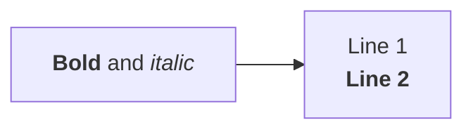

---

## 6. Edge line color / width / font not drawn on the canvas

**Mermaid supports:** `linkStyle` controlling `stroke`, `stroke-width`,
`color`, `font-size`, `stroke-dasharray`, etc. per link.

**Our editor:** parses these into `EdgeStyle`, exposes a **Line color** picker
and round-trips them — but the canvas renderer (`render.ts › renderEdge`)
**never applies `edge.style`** to the drawn path.

**Gap / consequence:**
- Edge stroke color, stroke width, label font-size, and label color set via
  `linkStyle` (or the properties panel) are **not visible on the WYSIWYG
  canvas** — they only appear in the emitted Mermaid / external preview. The
  editor is effectively WYS-not-WYG for edge styling.

**Example:** (the red 4px line shows in Mermaid output but not on the canvas)

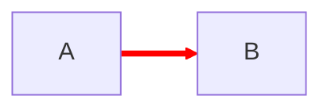

---

## 7. Node font size / family and advanced style props not drawn

**Mermaid supports:** node `font-size`, `font-family`, `stroke-width`,
`stroke-dasharray`, and arbitrary CSS via `style`/`classDef`.

**Our editor:** models `fontSize`/`fontFamily` and round-trips any other prop in
`style.extra`, but the canvas renderer applies **only** `fill`, `stroke`, and
text `color`. Label rendering uses a fixed font and fixed 16px line height.

**Gap / consequence:**
- `font-size`, `font-family`, `stroke-width`, `stroke-dasharray`, and every
  `style.extra` property are **invisible on the canvas** (some round-trip to
  text, but there is no picker for stroke width, dash pattern, or font, and no
  visual feedback).

**Example:**

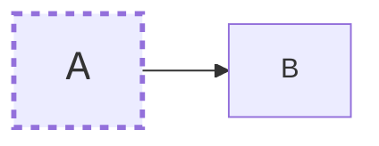

---

## 8. Node shapes — the entire Mermaid v11 shape library

**Mermaid supports:** the ~30 new shapes introduced in Mermaid v11 via the
`A@{ shape: <name> }` syntax — e.g. card/notched-rectangle, document/`doc`,
lined-document, tagged-document, multi-document (`docs`/`st`),
delay, `das`/`h-cyl` (horizontal cylinder), lined-cylinder,
`bolt`/lightning, `brace`/comment, `curv-trap`, `div-rect`/divided,
`f-circ`/filled circle, `sm-circ`/small circle, `fr-circ`/framed circle,
`hourglass`/collate, `bow-tie`/join, `flag`/paper-tape, `stored-data`/bow-rect,
`tag-rect`, `processes`/multi-rect, `window-pane`, `flip-tri`/extract,
`sl-rect`/manual-file, `manual-input`, `text` block, and more.

**Our editor supports** only the **14 classic shapes**: rect, round, stadium,
subroutine, cylinder, circle, double-circle, diamond, hexagon, parallelogram
(+alt), trapezoid (+alt), asymmetric.

**Gap / consequence:**
- The `@{ shape: … }` parser (`parser.ts`, `V11_SHAPE_MAP`) maps only the
  handful of v11 names that alias a classic shape. **Every other v11 shape name
  degrades to a plain rectangle** on parse (`?? "rect"`).
- Because the model has no shape enum for these, the original shape name is
  **lost on save** — it does not even round-trip. A `doc` becomes a `rect`
  permanently once the diagram is edited and re-serialized.
- There is no way to *create* any of these shapes from the shape palette.

**Example:**

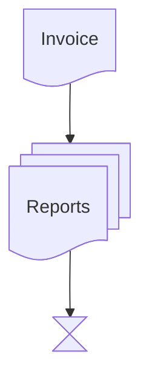

---

## 9. Circle and cross arrowheads (`--o`, `--x`, `o--o`, `x--x`)

**Mermaid supports:** three arrow endings — arrow (`-->`), circle (`--o`), and
cross (`--x`) — in one- or two-directional forms.

**Our editor supports:** only arrowhead, open, and bidirectional-arrowhead
endings (`EdgeKind` = arrow / open / dotted / thick / bidirectional / invisible).

**Gap / consequence:**
- The link operator regex (`LINK_OP_RE`) has no alternative for `o`/`x`
  endpoints, so a statement like `A --o B` or `A --x B` **fails to parse as an
  edge**. It falls through to `extras` with a warning — the connection is not
  shown as an edge, not drawn, and not editable.

**Example:**

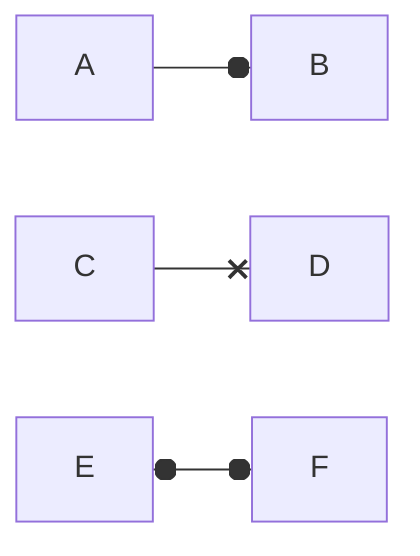

---

## 10. Bidirectional thick / dotted links (`<==>`, `<-.->`)

**Mermaid supports:** bidirectional variants of every line style: `<-->`,
`<==>`, `<-.->`.

**Our editor supports:** only `<-->` (bidirectional + normal line). `bidirectional`
is a single `EdgeKind` with no line-style dimension.

**Gap / consequence:**
- `<==>` and `<-.->` are not in the operator regex → **not parsed as edges** →
  round-tripped to `extras`, invisible on the canvas.
- Conversely, you cannot author a thick-and-bidirectional edge from the UI: kind
  and line-style are collapsed into one dropdown.

**Example:**

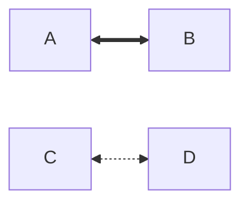

---

## 11. Link length / rank hints (`--->`, `====>`, extra dashes)

**Mermaid supports:** adding dashes/equals to a link to increase its rank span
(`A ---> B` places B one rank further than `A --> B`), affecting layout.

**Our editor supports:** a fixed set of exact operators only.

**Gap / consequence:**
- Extra-length operators are not recognized as-is; the "length" information is
  **not modeled**. Even when the edge is captured, the intended rank distance is
  lost, and there is no UI to set link length.

**Example:** (B sits one rank below A; C is pushed two ranks down)

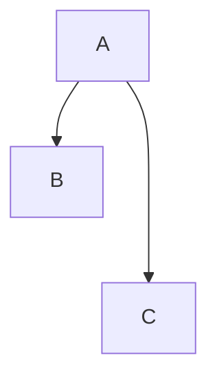

---

## 12. `linkStyle default` and curve/global flowchart config

**Mermaid supports:** `linkStyle default …` (applies to all links) and flowchart
config such as `%%{init: {flowchart: {curve: 'basis', …}}}%%`
(`curve`, `defaultRenderer`/ELK, `padding`, `htmlLabels`, `wrappingWidth`, …).

**Our editor supports:** indexed `linkStyle <n>` only, and reads just
`nodeSpacing`/`rankSpacing` (plus `theme`/`themeVariables`/`background`) from
`init`.

**Gap / consequence:**
- `linkStyle default …` does not match the indexed-only parser → pushed to
  `extras`, **not applied** to edges.
- Curve style, ELK renderer selection, label wrapping, and other flowchart
  config keys are round-tripped in the raw `init` block but **not modeled,
  rendered, or editable** — the canvas always draws its own curve style.

**Example:**

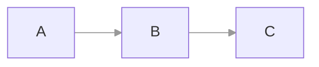

---

## 13. Explicit edge IDs and edge metadata (`e1@{ … }`, animation)

**Mermaid supports (v11.3+):** naming an edge (`A e1@--> B`) and attaching
metadata (`e1@{ animate: true, animation: fast }`) — the *native* way to animate
or address a specific link.

**Our editor supports:** a **non-standard** animation flag stored as a private
marker (`mermaid-flow-animated:1` smuggled inside a `linkStyle` line).

**Gap / consequence:**
- Native Mermaid edge IDs (`e1@`) and `@{ … }` edge metadata are **not parsed**;
  they round-trip to `extras` at best and are not represented as edge properties.
- The "Animated" checkbox produces output that only *this* toolchain
  understands, not stock Mermaid — so animation set here will not animate in a
  standard Mermaid renderer, and animation authored in standard Mermaid will not
  show here.

**Example:**

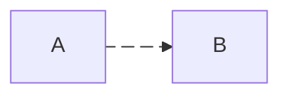

---

## 14. Interaction: click callbacks, tooltips, and link target windows

**Mermaid supports:** `click A callback` (JS callback), `click A "url" "tooltip"`,
`click A href "url" _blank` (target window), and tooltips on hover.

**Our editor supports:** only the clean `click A "url"` / `click A href "url"`
hyperlink form, stored as `node.link`.

**Gap / consequence:**
- Callback bindings, tooltip text, and `_blank`/target-window variants fall
  through to `extras` — **preserved but invisible and uneditable**. There is no
  tooltip display and no UI to set a callback or tooltip.

**Example:**


---

## 15. Node icons and images (`@{ icon: … }`, `@{ img: … }`)

**Mermaid supports:** icon nodes (`A@{ icon: "fa:bell", form: square }`) and
image nodes (`A@{ img: "https://…", w: 60, h: 60 }`), plus FontAwesome / custom
icon packs inside labels (`fa:fa-camera`, `fab:fa-github`).

**Our editor supports:** none of this.

**Gap / consequence:**
- `@{ … }` parsing reads only the `shape` and `label` keys; `icon`, `img`,
  `form`, `pos`, `w`, `h`, `constraint`, etc. are **read and dropped** — they do
  not round-trip and are not rendered.
- `fa:`/`fab:` icon tokens inside a label are treated as literal text and shown
  verbatim, not as glyphs.

**Example:**

```mermaid
flowchart LR
    A@{ icon: "fa:bell", form: square, label: "Alert" }
    B@{ img: "https://example.com/logo.png", w: 60, h: 60, label: "Logo" }
    C["fa:fa-camera Snapshot"]
```

---

## 16. Accessibility metadata (`accTitle`, `accDescr`)

**Mermaid supports:** `accTitle:` and `accDescr:` / `accDescr { … }` for
accessible titles and descriptions.

**Our editor supports:** neither.

**Gap / consequence:**
- These lines do not match any recognized statement and land in `extras` with a
  parse warning. Preserved in text, but **not surfaced or editable** in the
  visual editor.

**Example:**


---

## Quick reference matrix

Rows follow the same priority order as the sections above.

| # | Feature | Parsed | Rendered on canvas | Editable in UI | Round-trips |
|---|---|---|---|---|---|
| — | 14 classic node shapes (baseline, supported) | ✅ | ✅ | ✅ | ✅ |
| 1 | Nested subgraphs | ⚠️ flattened | ❌ | ❌ | ❌ (lost) |
| 2 | Subgraph create/edit UI | — | — | ❌ | ✅ |
| 3 | Subgraph as edge endpoint | ⚠️ phantom node | ❌ | ❌ | ⚠️ |
| 3 | Subgraph styling | ⚠️ phantom node | ❌ | ❌ | ⚠️ |
| 4 | Per-subgraph direction | ⚠️ | ❌ | ❌ | ✅ extras |
| 5 | Markdown / HTML labels | ✅ | ⚠️ | ✅ | ✅ |
| 6 | Edge color / width / font | ✅ | ❌ | ⚠️ color only | ✅ |
| 7 | Node font / stroke-width / dash | ⚠️ | ❌ | ❌ | ✅ (extra) |
| 8 | v11 `@{ shape }` library (~30) | ⚠️ degrade→rect | ❌ | ❌ | ❌ (lost) |
| 9 | `--o` / `--x` arrowheads | ❌ | ❌ | ❌ | ⚠️ extras |
| 10 | `<==>` / `<-.->` bidi styles | ❌ | ❌ | ❌ | ⚠️ extras |
| 11 | Link length (extra dashes) | ❌ | ❌ | ❌ | ⚠️ |
| 12 | `linkStyle default`, curve config | ⚠️ | ❌ | ❌ | ✅ extras |
| 13 | Native edge IDs / animation | ❌ | ❌ | ⚠️ non-standard flag | ⚠️ extras |
| 14 | Click callbacks / tooltips / target | ⚠️ | ❌ | ❌ | ✅ extras |
| 15 | Node icons / images | ❌ | ❌ | ❌ | ❌ (dropped) |
| 16 | `accTitle` / `accDescr` | ❌ | ❌ | ❌ | ✅ extras |

Legend: ✅ full · ⚠️ partial/degraded · ❌ none.
</content>
