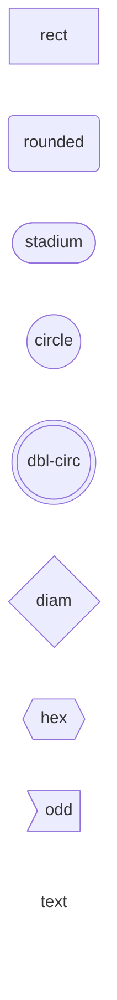
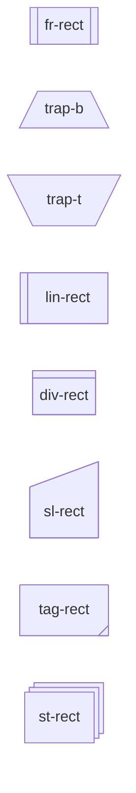
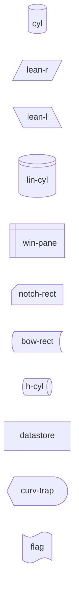
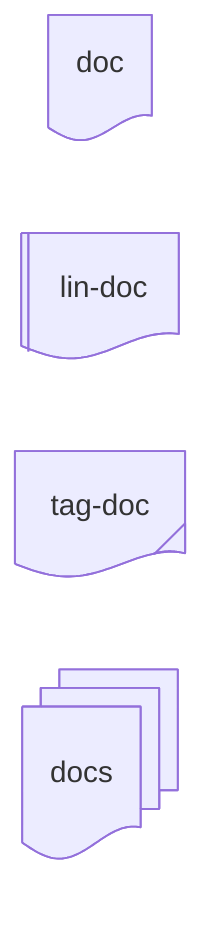
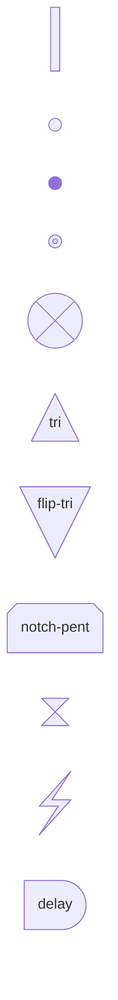
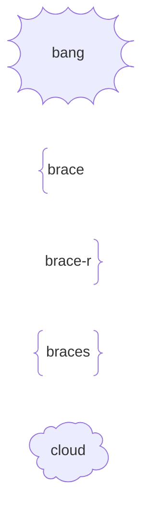

# Shape gallery

Generated by `pnpm gallery`. 48 shapes.

Open this file in the VS Code Markdown preview to see every shape rendered by
ceasg's own positioned renderer. Each node is labelled with its canonical
Mermaid name.

## Basic

## Process

## Data & I/O

## Documents

## Flow Control

## Annotations

