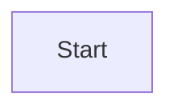
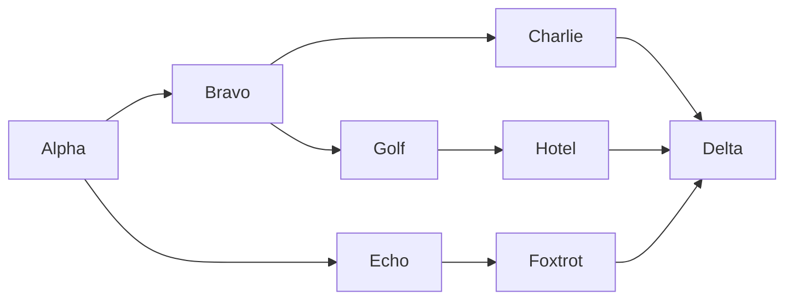
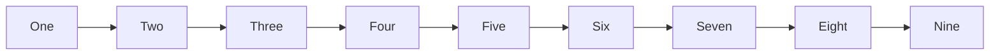

# Shape Palette Sidebar Implementation Plan

> **For agentic workers:** REQUIRED SUB-SKILL: Use superpowers:subagent-driven-development (recommended) or superpowers:executing-plans to implement this plan task-by-task. Steps use checkbox (`- [ ]`) syntax for tracking.

**Goal:** Add a persistent, collapsible left sidebar palette of shape groups to the flowchart WYSIWYG editor, as an alternative to the existing toolbar dropdown, and fix the pre-existing bug where the canvas viewBox is never recomputed when the canvas host resizes.

**Architecture:** A shared registry module (`paletteModel.ts`) describes palette groups and items and builds the item buttons; both the new sidebar and the existing dropdown render from it, so the drag payload and item markup have one definition. Click-to-add routes through a new pure `findFreeSpot` helper in `src/core` so repeated clicks cascade instead of stacking. A single `ResizeObserver` on the canvas host drives a new `Viewport.resize()`.

**Tech Stack:** TypeScript, esbuild, vitest (jsdom environment), VS Code webview API, plain DOM (no framework).

## Global Constraints

- Repo root for all paths in this plan is `C:\work\ceasg\extension`. Run all commands from there.
- Trunk-based development: commit directly to `main`, one commit per task.
- Package manager is `pnpm`. Unit tests: `pnpm exec vitest run`. Type check: `pnpm run check-types`. Lint: `pnpm run lint`.
- Tests live beside their module as `<module>.spec.ts` and are picked up by `include: ['src/**/*.spec.ts']`.
- The `ceasg-test/` folder is OUTSIDE the git repo — never `git add` anything from it.
- Existing code style: 2-space indent in `src/webview/`, tabs in `src/core/`. Match the file you are editing.
- Do not change the toolbar dropdown's appearance or behavior (flat 4-column grid, closes after a click). Its item construction moves to the shared factory; the result must look identical.
- Only one palette group ships: `basic`, holding all 14 `NODE_SHAPES`. Do not add image/icon groups.
- The drag payload stays `text/ceasg-shape` with the shape name as data — the existing `drop` handler in `editor.ts` depends on it.
- Spec: `docs/superpowers/specs/2026-07-28-shape-palette-sidebar-design.md`

---

## File Structure

**Create:**
- `src/core/placement.ts` — pure `findFreeSpot`; no DOM.
- `src/core/placement.spec.ts`
- `src/webview/wysiwyg/paletteModel.ts` — `PaletteItem` / `PaletteGroup` types, `PALETTE_GROUPS`, `createPaletteItemButton`.
- `src/webview/wysiwyg/paletteModel.spec.ts`
- `src/webview/wysiwyg/sidebar.ts` — `ShapeSidebar`.
- `src/webview/wysiwyg/sidebar.spec.ts`
- `ceasg-test/shape-palette.md` — manual validation diagrams (NOT committed).

**Modify:**
- `src/core/index.ts` — re-export `./placement`.
- `src/webview/wysiwyg/viewport.ts` — add `resize()`.
- `src/webview/wysiwyg/viewport.spec.ts` — add a `resize()` case.
- `src/webview/wysiwyg/editor.ts` — sidebar host in body markup, `sidebarBuilt` guard, `addNodeAtFreeSpot`, select-on-add, `toggleSidebar`, `ResizeObserver`.
- `src/webview/wysiwyg/editor.spec.ts` — add an `addNodeAtFreeSpot` case.
- `src/webview/wysiwyg/palette.ts` — dropdown consumes `PALETTE_GROUPS` + shared factory.
- `src/webview/wysiwyg/toolbar.ts` — `◧` toggle button.
- `media/webview.css` — sidebar styles.
- `README.md`, `CHANGELOG.md`, `package.json` — docs and version bump.

---

## Task 1: `findFreeSpot` placement helper

**Files:**
- Create: `src/core/placement.ts`
- Create: `src/core/placement.spec.ts`
- Modify: `src/core/index.ts`

**Interfaces:**
- Consumes: `DiagramModel`, `DiagramNode`, `NodeShape`, `nodeSize` from `./model`.
- Produces: `findFreeSpot(model: DiagramModel, x: number, y: number, shape: NodeShape): { x: number; y: number }` — exported from `src/core/index.ts`. Task 3 calls it.

**Context:** `nodeSize(model, node)` returns `{ w, h }`, using `node.w`/`node.h` when set and estimating from the label otherwise. Node `x`/`y` are **centre** coordinates, so a node's box is `[x - w/2, x + w/2] × [y - h/2, y + h/2]`. `src/core/` files use **tabs** for indentation.

- [ ] **Step 1: Write the failing test**

Create `src/core/placement.spec.ts`:

```ts
import { describe, it, expect } from 'vitest';
import { emptyModel, nodeSize } from './model';
import { findFreeSpot } from './placement';

describe('findFreeSpot', () => {
	it('returns the requested point when nothing is there', () => {
		const m = emptyModel();
		expect(findFreeSpot(m, 100, 50, 'rect')).toEqual({ x: 100, y: 50 });
	});

	it('offsets down-right when the requested point is occupied', () => {
		const m = emptyModel();
		m.nodes.push({ id: 'A', label: 'A', shape: 'rect', x: 100, y: 50, w: 80, h: 44 });
		const p = findFreeSpot(m, 100, 50, 'rect');
		expect(p.x).toBeGreaterThan(100);
		expect(p.y).toBeGreaterThan(50);
	});

	it('returns a point whose box overlaps no existing node', () => {
		const m = emptyModel();
		// A staircase of nodes along the cascade direction, so a single step is not enough.
		for (let i = 0; i < 5; i++) {
			m.nodes.push({ id: `N${i}`, label: `N${i}`, shape: 'rect', x: 100 + i * 24, y: 50 + i * 24, w: 80, h: 44 });
		}
		const p = findFreeSpot(m, 100, 50, 'rect');
		const probe = { id: '', label: '', shape: 'rect' as const, x: p.x, y: p.y };
		const s = nodeSize(m, probe);
		for (const n of m.nodes) {
			const ns = nodeSize(m, n);
			const overlaps =
				Math.abs(n.x - p.x) < (s.w + ns.w) / 2 && Math.abs(n.y - p.y) < (s.h + ns.h) / 2;
			expect(overlaps).toBe(false);
		}
	});

	it('gives up after the step cap instead of looping forever', () => {
		const m = emptyModel();
		// Blanket the whole cascade path so no candidate is ever free.
		for (let i = 0; i < 200; i++) {
			m.nodes.push({ id: `N${i}`, label: `N${i}`, shape: 'rect', x: 100 + i * 24, y: 50 + i * 24, w: 400, h: 400 });
		}
		const p = findFreeSpot(m, 100, 50, 'rect');
		expect(Number.isFinite(p.x)).toBe(true);
		expect(p.x).toBeLessThanOrEqual(100 + 40 * 24);
	});
});
```

- [ ] **Step 2: Run test to verify it fails**

Run: `pnpm exec vitest run src/core/placement.spec.ts`
Expected: FAIL — cannot resolve `./placement`.

- [ ] **Step 3: Write the implementation**

Create `src/core/placement.ts` (tabs, matching `src/core/`):

```ts
import { DiagramModel, DiagramNode, NodeShape, nodeSize } from "./model";

/** Clearance kept between the new node's box and any existing node's box. */
const GAP = 12;
/** Cascade step, in svg units, applied to both axes on each retry. */
const STEP = 24;
/** Cap on retries. Past this the caller gets the last candidate — placing a node
 *  slightly overlapping is far better than spinning on a densely packed canvas. */
const MAX_STEPS = 40;

function overlapsAnyNode(model: DiagramModel, x: number, y: number, w: number, h: number): boolean {
	return model.nodes.some((n) => {
		const s = nodeSize(model, n);
		return (
			Math.abs(n.x - x) < (w + s.w) / 2 + GAP &&
			Math.abs(n.y - y) < (h + s.h) / 2 + GAP
		);
	});
}

/** Nearest free point at or down-right of (x, y) for a node of `shape`.
 *
 *  The probe is sized from the shape's empty-label default rather than the real
 *  label (the caller has not named the node yet); GAP absorbs the difference.
 *  Pure — takes no DOM and mutates nothing. */
export function findFreeSpot(
	model: DiagramModel,
	x: number,
	y: number,
	shape: NodeShape,
): { x: number; y: number } {
	const probe: DiagramNode = { id: "", label: "", shape, x, y };
	const { w, h } = nodeSize(model, probe);
	let cx = x;
	let cy = y;
	for (let i = 0; i < MAX_STEPS; i++) {
		if (!overlapsAnyNode(model, cx, cy, w, h)) {
			return { x: cx, y: cy };
		}
		cx += STEP;
		cy += STEP;
	}
	return { x: cx, y: cy };
}
```

- [ ] **Step 4: Export from the core barrel**

In `src/core/index.ts`, add after the `export * from './layout';` line:

```ts
export * from './placement';
```

- [ ] **Step 5: Run tests to verify they pass**

Run: `pnpm exec vitest run src/core/placement.spec.ts`
Expected: PASS, 4 tests.

- [ ] **Step 6: Type check and lint**

Run: `pnpm run check-types && pnpm run lint`
Expected: no errors.

- [ ] **Step 7: Commit**

```bash
git add src/core/placement.ts src/core/placement.spec.ts src/core/index.ts
git commit -m "feat(core): findFreeSpot placement helper"
```

---

## Task 2: `Viewport.resize()` and the canvas ResizeObserver

**Files:**
- Modify: `src/webview/wysiwyg/viewport.ts`
- Modify: `src/webview/wysiwyg/viewport.spec.ts`
- Modify: `src/webview/wysiwyg/editor.ts` (constructor only)

**Interfaces:**
- Consumes: nothing from earlier tasks.
- Produces: `Viewport.resize(): void`. Nothing later depends on it directly; it is what makes Task 5's sidebar toggle correct.

**Context — the bug:** `Viewport.apply()` builds the `viewBox` from `this.host.clientWidth / this.zoom` and `this.host.clientHeight / this.zoom`, but is only ever called from `fit`, `zoomBy`, `panBy`, `setTransform` and `reset`. Nothing reacts to the host changing size. Grep confirms there is no `ResizeObserver` or `'resize'` listener anywhere under `src/webview/`. So after the VS Code pane is resized the `viewBox` still describes the old size: the SVG letterboxes (default `preserveAspectRatio`), and `screenToSvg` — which assumes the viewBox exactly covers the host rect — returns wrong coordinates, so clicks land on the wrong nodes. Toggling a sidebar changes the canvas width the same way, which is why this must be fixed here.

- [ ] **Step 1: Write the failing test**

Append to `src/webview/wysiwyg/viewport.spec.ts` (and extend the import on line 2 to `import { computeContentBounds, Viewport } from './viewport';`):

```ts
describe('Viewport.resize', () => {
  it('recomputes the viewBox from the new host size, preserving pan and zoom', () => {
    const svg = document.createElementNS('http://www.w3.org/2000/svg', 'svg') as SVGSVGElement;
    const host = { clientWidth: 800, clientHeight: 600 };
    const vp = new Viewport(svg, host as unknown as HTMLElement);

    vp.setTransform({ zoom: 2, vbX: 10, vbY: 20 });
    expect(svg.getAttribute('viewBox')).toBe('10 20 400 300');

    host.clientWidth = 1000;
    vp.resize();

    // Same pan origin and zoom; only the visible extent grew.
    expect(svg.getAttribute('viewBox')).toBe('10 20 500 300');
    expect(vp.scale).toBe(2);
  });
});
```

- [ ] **Step 2: Run test to verify it fails**

Run: `pnpm exec vitest run src/webview/wysiwyg/viewport.spec.ts`
Expected: FAIL — `vp.resize is not a function`.

- [ ] **Step 3: Add `resize()` to Viewport**

In `src/webview/wysiwyg/viewport.ts`, add this method immediately before `reset()`:

```ts
  /** Re-derive the viewBox from the host's current size, keeping pan and zoom.
   *  Nothing else recomputes it when the host resizes, which otherwise
   *  letterboxes the diagram and desyncs screenToSvg. */
  resize(): void { this.apply(); }
```

- [ ] **Step 4: Run test to verify it passes**

Run: `pnpm exec vitest run src/webview/wysiwyg/viewport.spec.ts`
Expected: PASS.

- [ ] **Step 5: Drive it from a ResizeObserver on the canvas host**

In `src/webview/wysiwyg/editor.ts`, add a field beside the other private fields (near `private canvasHost: HTMLElement;`):

```ts
  private resizeObserver: ResizeObserver | null = null;
```

Then in the constructor, after the existing `drop` listener block (the one closing with `});` right before the end of the constructor), add:

```ts
    // The viewBox is derived from the host's size and nothing else recomputes it,
    // so a pane resize (or toggling the palette sidebar) would letterbox the
    // diagram and desync screenToSvg. Observe once here rather than in repaint(),
    // which recreates the Viewport on every paint and would leak observers.
    if (typeof ResizeObserver !== 'undefined') {
      this.resizeObserver = new ResizeObserver(() => {
        if (!this.canvasHost.clientWidth || !this.canvasHost.clientHeight) { return; }
        this.viewport?.resize();
      });
      this.resizeObserver.observe(this.canvasHost);
    }
```

The `typeof` guard keeps jsdom (which has no `ResizeObserver`) from throwing in the existing `editor.spec.ts` tests.

- [ ] **Step 6: Run the full unit suite**

Run: `pnpm exec vitest run`
Expected: PASS, no regressions.

- [ ] **Step 7: Type check and lint**

Run: `pnpm run check-types && pnpm run lint`
Expected: no errors.

- [ ] **Step 8: Commit**

```bash
git add src/webview/wysiwyg/viewport.ts src/webview/wysiwyg/viewport.spec.ts src/webview/wysiwyg/editor.ts
git commit -m "fix(viewport): recompute viewBox when the canvas host resizes"
```

---

## Task 3: `addNodeAtFreeSpot` and select-on-add

**Files:**
- Modify: `src/webview/wysiwyg/editor.ts:139-145` (`addNodeOfShape`)
- Modify: `src/webview/wysiwyg/editor.spec.ts`

**Interfaces:**
- Consumes: `findFreeSpot(model, x, y, shape)` from Task 1.
- Produces:
  - `WysiwygEditor.addNodeOfShape(shape: NodeShape, clientX: number, clientY: number): void` — unchanged signature, now also selects the new node.
  - `WysiwygEditor.addNodeAtFreeSpot(shape: NodeShape): void` — Tasks 4 and 5 call this.

**Context:** `mutate(fn, { commit: true })` applies `fn` to the model, repaints (which redraws the selection overlay) and commits to history + sync. `this.selection` is a `SelectionState` with `select(id)`; `this.refreshSelection()` redraws the overlay and refreshes the properties panel. Select **after** `mutate` returns, then call `refreshSelection()` — selecting before would be wiped by the repaint's `drawSelection`.

- [ ] **Step 1: Write the failing test**

Append to `src/webview/wysiwyg/editor.spec.ts`:

```ts
describe('adding nodes from a palette', () => {
  it('addNodeAtFreeSpot cascades instead of stacking, and selects the new node', () => {
    const { editor } = make();
    editor.init('flowchart TB\nA[A]\n');

    editor.addNodeAtFreeSpot('rect');
    const nodes1 = editor.getModel().nodes;
    const first = nodes1[nodes1.length - 1];

    editor.addNodeAtFreeSpot('rect');
    const nodes2 = editor.getModel().nodes;
    const second = nodes2[nodes2.length - 1];

    expect(second.id).not.toBe(first.id);
    expect(first.x !== second.x || first.y !== second.y).toBe(true);
    expect(editor.selection!.single).toBe(second.id);
  });

  it('addNodeOfShape selects the dropped node', () => {
    const { editor } = make();
    editor.init('flowchart TB\nA[A]\n');
    editor.addNodeOfShape('diamond', 0, 0);
    const nodes = editor.getModel().nodes;
    const added = nodes[nodes.length - 1];
    expect(added.shape).toBe('diamond');
    expect(editor.selection!.single).toBe(added.id);
  });
});
```

- [ ] **Step 2: Run test to verify it fails**

Run: `pnpm exec vitest run src/webview/wysiwyg/editor.spec.ts`
Expected: FAIL — `editor.addNodeAtFreeSpot is not a function`.

- [ ] **Step 3: Implement both methods**

In `src/webview/wysiwyg/editor.ts`, extend the `../../core` import to include `findFreeSpot`, then replace the whole existing `addNodeOfShape` method:

```ts
  addNodeOfShape(shape: NodeShape, clientX: number, clientY: number): void {
    const p = this.viewport?.screenToSvg(clientX, clientY) ?? { x: 100, y: 100 };
    this.addNodeAt(shape, p.x, p.y);
  }

  /** Add at the canvas centre, cascading down-right past anything already there
   *  so repeated palette clicks never stack nodes on one spot. */
  addNodeAtFreeSpot(shape: NodeShape): void {
    const r = this.canvasHost.getBoundingClientRect();
    const c = this.viewport?.screenToSvg(r.left + r.width / 2, r.top + r.height / 2)
      ?? { x: 100, y: 100 };
    const p = findFreeSpot(this.model, c.x, c.y, shape);
    this.addNodeAt(shape, p.x, p.y);
  }

  /** Shared tail of every add path: insert, then select so the properties panel
   *  targets the new node immediately. Select after mutate — the repaint inside
   *  it redraws the overlay from the selection as it stood before. */
  private addNodeAt(shape: NodeShape, x: number, y: number): void {
    let addedId = '';
    this.mutate((m) => {
      addedId = nextNodeId(m);
      m.nodes.push({ id: addedId, label: addedId, shape, x, y });
    }, { commit: true });
    if (addedId && this.selection) {
      this.selection.select(addedId);
      this.refreshSelection();
    }
  }
```

- [ ] **Step 4: Run tests to verify they pass**

Run: `pnpm exec vitest run src/webview/wysiwyg/editor.spec.ts`
Expected: PASS, including the pre-existing cases.

- [ ] **Step 5: Type check and lint**

Run: `pnpm run check-types && pnpm run lint`
Expected: no errors.

- [ ] **Step 6: Commit**

```bash
git add src/webview/wysiwyg/editor.ts src/webview/wysiwyg/editor.spec.ts
git commit -m "feat(editor): addNodeAtFreeSpot with cascade, select node on add"
```

---

## Task 4: Palette registry, and the dropdown consuming it

**Files:**
- Create: `src/webview/wysiwyg/paletteModel.ts`
- Create: `src/webview/wysiwyg/paletteModel.spec.ts`
- Modify: `src/webview/wysiwyg/palette.ts`

**Interfaces:**
- Consumes: `WysiwygEditor.addNodeOfShape` / `addNodeAtFreeSpot` from Task 3; `NODE_SHAPES`, `SHAPE_LABELS`, `createShapeIcon`, `NodeShape` from `../../core`.
- Produces:
  ```ts
  export const SHAPE_DRAG_TYPE = 'text/ceasg-shape';
  export interface PaletteItem {
    id: string;
    title: string;
    createIcon(): SVGElement;
    dragType: string;
    dragData: string;
    add(editor: WysiwygEditor, at?: { clientX: number; clientY: number }): void;
  }
  export interface PaletteGroup { id: string; title: string; items: PaletteItem[]; }
  export const PALETTE_GROUPS: PaletteGroup[];
  export function createPaletteItemButton(
    item: PaletteItem,
    onActivate: (item: PaletteItem) => void,
  ): HTMLButtonElement;
  ```
  Task 5's `ShapeSidebar` renders `PALETTE_GROUPS` with `createPaletteItemButton`.

**Context:** `createShapeIcon(shape)` returns an `SVGSVGElement` with `viewBox="0 0 36 24"`. `SHAPE_LABELS` maps every `NodeShape` to a display name. Import `WysiwygEditor` as a **type-only** import (`import type { ... }`) — `palette.ts` already does this to avoid a module cycle.

- [ ] **Step 1: Write the failing test**

Create `src/webview/wysiwyg/paletteModel.spec.ts`:

```ts
import { describe, it, expect, vi } from 'vitest';
import { NODE_SHAPES } from '../../core';
import { PALETTE_GROUPS, SHAPE_DRAG_TYPE, createPaletteItemButton } from './paletteModel';

describe('PALETTE_GROUPS', () => {
  it('ships exactly one group, Basic, holding every node shape', () => {
    expect(PALETTE_GROUPS).toHaveLength(1);
    expect(PALETTE_GROUPS[0].id).toBe('basic');
    expect(PALETTE_GROUPS[0].title).toBe('Basic');
    expect(PALETTE_GROUPS[0].items).toHaveLength(NODE_SHAPES.length);
  });

  it('every item carries a valid shape as its drag payload and a human title', () => {
    for (const item of PALETTE_GROUPS[0].items) {
      expect(item.dragType).toBe(SHAPE_DRAG_TYPE);
      expect(NODE_SHAPES).toContain(item.dragData);
      expect(item.title.length).toBeGreaterThan(0);
    }
  });

  it('item ids are unique', () => {
    const ids = PALETTE_GROUPS.flatMap((g) => g.items.map((i) => i.id));
    expect(new Set(ids).size).toBe(ids.length);
  });
});

describe('createPaletteItemButton', () => {
  const item = PALETTE_GROUPS[0].items[0];

  it('builds a draggable button with the icon and a tooltip', () => {
    const btn = createPaletteItemButton(item, () => {});
    expect(btn.className).toBe('ceasg-palette-item');
    expect(btn.title).toBe(item.title);
    expect(btn.draggable).toBe(true);
    expect(btn.querySelector('svg')).toBeTruthy();
  });

  it('writes the drag payload on dragstart', () => {
    const btn = createPaletteItemButton(item, () => {});
    const calls: [string, string][] = [];
    const ev = new Event('dragstart');
    Object.defineProperty(ev, 'dataTransfer', {
      value: { setData: (t: string, d: string) => { calls.push([t, d]); } },
    });
    btn.dispatchEvent(ev);
    expect(calls).toEqual([[item.dragType, item.dragData]]);
  });

  it('calls onActivate with the item on click', () => {
    const onActivate = vi.fn();
    const btn = createPaletteItemButton(item, onActivate);
    btn.click();
    expect(onActivate).toHaveBeenCalledWith(item);
  });
});
```

- [ ] **Step 2: Run test to verify it fails**

Run: `pnpm exec vitest run src/webview/wysiwyg/paletteModel.spec.ts`
Expected: FAIL — cannot resolve `./paletteModel`.

- [ ] **Step 3: Write the registry**

Create `src/webview/wysiwyg/paletteModel.ts`:

```ts
import { NODE_SHAPES, NodeShape, SHAPE_LABELS, createShapeIcon } from '../../core';
import type { WysiwygEditor } from './editor';

/** dataTransfer type for a shape dragged from any palette onto the canvas.
 *  The canvas drop handler in editor.ts reads this exact string. */
export const SHAPE_DRAG_TYPE = 'text/ceasg-shape';

export interface PaletteItem {
  /** Namespaced so future groups (images, icon packs) cannot collide. */
  id: string;
  title: string;
  createIcon(): SVGElement;
  dragType: string;
  dragData: string;
  /** Insert this item into the diagram. Given `at`, place it there (a drop);
   *  otherwise let the editor pick a free spot near the canvas centre.
   *  Lives on the item so a future image group can add itself differently
   *  without either palette UI having to know about it. */
  add(editor: WysiwygEditor, at?: { clientX: number; clientY: number }): void;
}

export interface PaletteGroup {
  id: string;
  title: string;
  items: PaletteItem[];
}

function shapeItem(shape: NodeShape): PaletteItem {
  return {
    id: `shape:${shape}`,
    title: SHAPE_LABELS[shape],
    createIcon: () => createShapeIcon(shape),
    dragType: SHAPE_DRAG_TYPE,
    dragData: shape,
    add: (editor, at) => {
      if (at) { editor.addNodeOfShape(shape, at.clientX, at.clientY); }
      else { editor.addNodeAtFreeSpot(shape); }
    },
  };
}

/** Every palette group, in display order. Both the toolbar dropdown and the
 *  sidebar render from this; adding a group is one entry here. */
export const PALETTE_GROUPS: PaletteGroup[] = [
  { id: 'basic', title: 'Basic', items: NODE_SHAPES.map(shapeItem) },
];

/** The single definition of a palette item button, so the dropdown and the
 *  sidebar stay pixel-identical and the drag payload is written in one place. */
export function createPaletteItemButton(
  item: PaletteItem,
  onActivate: (item: PaletteItem) => void,
): HTMLButtonElement {
  const btn = document.createElement('button');
  btn.className = 'ceasg-palette-item';
  btn.title = item.title;
  btn.draggable = true;
  btn.appendChild(item.createIcon());
  btn.addEventListener('click', () => onActivate(item));
  btn.addEventListener('dragstart', (e) => {
    (e as DragEvent).dataTransfer?.setData(item.dragType, item.dragData);
  });
  return btn;
}
```

- [ ] **Step 4: Run tests to verify they pass**

Run: `pnpm exec vitest run src/webview/wysiwyg/paletteModel.spec.ts`
Expected: PASS, 6 tests.

- [ ] **Step 5: Point the dropdown at the registry**

Replace the whole body of `src/webview/wysiwyg/palette.ts` with:

```ts
import type { WysiwygEditor } from './editor';
import { PALETTE_GROUPS, createPaletteItemButton } from './paletteModel';

export class ShapePalette {
  private popover: HTMLElement;
  private open = false;
  constructor(private readonly editor: WysiwygEditor, private readonly anchor: HTMLElement) {
    this.popover = document.createElement('div');
    this.popover.className = 'ceasg-palette';
    this.popover.style.display = 'none';
    // The dropdown is a flat grid — it ignores group structure by design and
    // shows every item from every group.
    for (const item of PALETTE_GROUPS.flatMap((g) => g.items)) {
      this.popover.appendChild(createPaletteItemButton(item, (it) => {
        it.add(this.editor);
        this.toggle(false);
      }));
    }
    document.body.appendChild(this.popover);
  }
  toggle(force?: boolean): void {
    this.open = force ?? !this.open;
    this.popover.style.display = this.open ? 'grid' : 'none';
    if (this.open) {
      const r = this.anchor.getBoundingClientRect();
      this.popover.style.position = 'fixed';
      this.popover.style.left = `${r.left}px`;
      this.popover.style.top = `${r.bottom}px`;
    }
  }
}
```

Note the behavior change this makes to the dropdown: a click now goes through `addNodeAtFreeSpot` (cascading from the canvas centre) instead of `addNodeOfShape(shape, innerWidth / 2, innerHeight / 2)`. That is the intended fix — the old call measured the whole window, not the canvas, so it was already off-centre once the properties panel took width.

- [ ] **Step 6: Run the full unit suite**

Run: `pnpm exec vitest run`
Expected: PASS, no regressions.

- [ ] **Step 7: Type check and lint**

Run: `pnpm run check-types && pnpm run lint`
Expected: no errors.

- [ ] **Step 8: Commit**

```bash
git add src/webview/wysiwyg/paletteModel.ts src/webview/wysiwyg/paletteModel.spec.ts src/webview/wysiwyg/palette.ts
git commit -m "refactor(palette): shared group registry behind the shapes dropdown"
```

---

## Task 5: The sidebar

**Files:**
- Create: `src/webview/wysiwyg/sidebar.ts`
- Create: `src/webview/wysiwyg/sidebar.spec.ts`
- Modify: `src/webview/wysiwyg/editor.ts` (body markup, `sidebarBuilt` guard, `toggleSidebar`)
- Modify: `src/webview/wysiwyg/toolbar.ts`
- Modify: `media/webview.css`

**Interfaces:**
- Consumes: `PALETTE_GROUPS`, `createPaletteItemButton`, `PaletteItem` from Task 4; `WysiwygEditor.addNodeAtFreeSpot` from Task 3.
- Produces:
  - `class ShapeSidebar { constructor(host: HTMLElement, editor: WysiwygEditor); toggle(force?: boolean): boolean; get isOpen(): boolean }`
  - `WysiwygEditor.toggleSidebar(force?: boolean): boolean`

**Context:** `.ceasg-body` is `display: flex` holding `.ceasg-canvas` (`flex: 1`) and `#panel`. The sidebar host div is inserted as the **first** child. `ShapeSidebar` puts the `ceasg-sidebar` class on the host itself (rather than a wrapper) so the host is the flex item and `display: none` collapses it cleanly. `Toolbar` builds buttons via its private `btn(label, title, onClick)` helper and uses the `is-active` class for toggle state (see the connect-mode button). `editor.ts` builds Toolbar and PropertiesPanel exactly once behind `toolbarBuilt` / `panelBuilt` flags because `applyExternal` re-runs `init`.

- [ ] **Step 1: Write the failing test**

Create `src/webview/wysiwyg/sidebar.spec.ts`:

```ts
import { describe, it, expect, vi } from 'vitest';
import { NODE_SHAPES } from '../../core';
import type { WysiwygEditor } from './editor';
import { ShapeSidebar } from './sidebar';

function make() {
  const host = document.createElement('div');
  const addNodeAtFreeSpot = vi.fn();
  const editor = { addNodeAtFreeSpot } as unknown as WysiwygEditor;
  const sidebar = new ShapeSidebar(host, editor);
  return { host, sidebar, addNodeAtFreeSpot };
}

describe('ShapeSidebar', () => {
  it('renders a group header and one button per shape, expanded by default', () => {
    const { host } = make();
    expect(host.classList.contains('ceasg-sidebar')).toBe(true);
    expect(host.querySelectorAll('.ceasg-sidebar-group')).toHaveLength(1);
    expect(host.querySelectorAll('.ceasg-palette-item')).toHaveLength(NODE_SHAPES.length);
    const header = host.querySelector('.ceasg-sidebar-group-header') as HTMLButtonElement;
    expect(header.textContent).toContain('Basic');
    expect(header.getAttribute('aria-expanded')).toBe('true');
  });

  it('collapses and re-expands a group when its header is clicked', () => {
    const { host } = make();
    const header = host.querySelector('.ceasg-sidebar-group-header') as HTMLButtonElement;
    const group = host.querySelector('.ceasg-sidebar-group') as HTMLElement;

    header.click();
    expect(group.classList.contains('is-collapsed')).toBe(true);
    expect(header.getAttribute('aria-expanded')).toBe('false');

    header.click();
    expect(group.classList.contains('is-collapsed')).toBe(false);
    expect(header.getAttribute('aria-expanded')).toBe('true');
  });

  it('adds a node at a free spot when an item is clicked', () => {
    const { host, addNodeAtFreeSpot } = make();
    const first = host.querySelector('.ceasg-palette-item') as HTMLButtonElement;
    first.click();
    expect(addNodeAtFreeSpot).toHaveBeenCalledWith(NODE_SHAPES[0]);
  });

  it('toggle() hides and shows the whole sidebar and reports the new state', () => {
    const { host, sidebar } = make();
    expect(sidebar.isOpen).toBe(true);

    expect(sidebar.toggle()).toBe(false);
    expect(host.style.display).toBe('none');

    expect(sidebar.toggle()).toBe(true);
    expect(host.style.display).toBe('');

    expect(sidebar.toggle(true)).toBe(true);
    expect(host.style.display).toBe('');
  });
});
```

- [ ] **Step 2: Run test to verify it fails**

Run: `pnpm exec vitest run src/webview/wysiwyg/sidebar.spec.ts`
Expected: FAIL — cannot resolve `./sidebar`.

- [ ] **Step 3: Write `ShapeSidebar`**

Create `src/webview/wysiwyg/sidebar.ts`:

```ts
import type { WysiwygEditor } from './editor';
import { PALETTE_GROUPS, PaletteGroup, createPaletteItemButton } from './paletteModel';

/** Persistent left palette: shapes in collapsible groups, alongside (not
 *  replacing) the toolbar dropdown. Open/collapsed state is per webview
 *  session — it lives on this instance and is not persisted. */
export class ShapeSidebar {
  private open = true;

  constructor(private readonly host: HTMLElement, private readonly editor: WysiwygEditor) {
    // Class goes on the host so the host itself is the flex item in
    // .ceasg-body and `display: none` collapses it without leaving a gap.
    this.host.classList.add('ceasg-sidebar');
    for (const group of PALETTE_GROUPS) {
      this.host.appendChild(this.buildGroup(group));
    }
  }

  private buildGroup(group: PaletteGroup): HTMLElement {
    const section = document.createElement('div');
    section.className = 'ceasg-sidebar-group';
    section.dataset.groupId = group.id;

    const header = document.createElement('button');
    header.className = 'ceasg-sidebar-group-header';
    header.type = 'button';
    header.setAttribute('aria-expanded', 'true');
    const chevron = document.createElement('span');
    chevron.className = 'ceasg-chevron';
    chevron.textContent = '▾';
    header.appendChild(chevron);
    header.appendChild(document.createTextNode(group.title));
    header.addEventListener('click', () => {
      const collapsed = section.classList.toggle('is-collapsed');
      header.setAttribute('aria-expanded', collapsed ? 'false' : 'true');
    });
    section.appendChild(header);

    const body = document.createElement('div');
    body.className = 'ceasg-sidebar-group-body';
    for (const item of group.items) {
      body.appendChild(createPaletteItemButton(item, (it) => it.add(this.editor)));
    }
    section.appendChild(body);
    return section;
  }

  get isOpen(): boolean { return this.open; }

  /** Show or hide the sidebar. Returns the resulting open state. */
  toggle(force?: boolean): boolean {
    this.open = force ?? !this.open;
    this.host.style.display = this.open ? '' : 'none';
    return this.open;
  }
}
```

- [ ] **Step 4: Run tests to verify they pass**

Run: `pnpm exec vitest run src/webview/wysiwyg/sidebar.spec.ts`
Expected: PASS, 4 tests.

- [ ] **Step 5: Mount the sidebar in the editor**

In `src/webview/wysiwyg/editor.ts`:

a) Add the import beside the existing `Toolbar` import:

```ts
import { ShapeSidebar } from './sidebar';
```

b) Replace the `root.innerHTML` line in the constructor with:

```ts
    this.root.innerHTML = '<div class="ceasg-wysiwyg"><div id="toolbar"></div><div class="ceasg-body"><div id="sidebar"></div><div class="ceasg-canvas" id="canvas"></div><div id="panel"></div></div></div>';
```

c) Add fields beside `panelBuilt` / `panel`:

```ts
  private sidebarBuilt = false;
  private sidebar: ShapeSidebar | null = null;
```

d) In `init`, between the toolbar block and the panel block, add:

```ts
    // Built once per editor instance, like the toolbar and panel — init() runs
    // again on every applyExternal.
    if (!this.sidebarBuilt) {
      this.sidebarBuilt = true;
      const sidebarHost = this.root.querySelector('#sidebar') as HTMLElement;
      this.sidebar = new ShapeSidebar(sidebarHost, this);
    }
```

e) Add a public method beside `addNodeAtFreeSpot`:

```ts
  /** Show/hide the shape palette sidebar. Returns the resulting open state. */
  toggleSidebar(force?: boolean): boolean { return this.sidebar?.toggle(force) ?? false; }
```

Note the toolbar is built before the sidebar, so `Toolbar`'s constructor must not call `toggleSidebar` — it only reads the initial state as "open" (see Step 6).

- [ ] **Step 6: Add the toolbar toggle button**

In `src/webview/wysiwyg/toolbar.ts`, inside `build()`, insert this as the **first** button, before the undo button:

```ts
    const sidebarBtn = this.btn('◧', 'Toggle shape palette', () => {});
    sidebarBtn.classList.add('is-active'); // sidebar starts open
    sidebarBtn.addEventListener('click', () => {
      sidebarBtn.classList.toggle('is-active', this.editor.toggleSidebar());
    });
    bar.appendChild(sidebarBtn);
```

- [ ] **Step 7: Add the styles**

In `media/webview.css`, append after the existing `.ceasg-palette-item:hover` rule:

```css
.ceasg-sidebar { width: 140px; min-width: 140px; overflow-y: auto; border-right: 1px solid var(--vscode-panel-border); background: var(--vscode-sideBar-background); padding: 6px; box-sizing: border-box; }
.ceasg-sidebar-group-header { display: flex; align-items: center; gap: 4px; width: 100%; padding: 2px 0; background: none; border: none; color: var(--vscode-foreground); font-size: 11px; text-transform: uppercase; letter-spacing: 0.04em; text-align: left; cursor: pointer; }
.ceasg-sidebar-group-header:hover { color: var(--vscode-textLink-foreground); }
.ceasg-sidebar-group .ceasg-chevron { display: inline-block; font-size: 10px; }
.ceasg-sidebar-group.is-collapsed .ceasg-chevron { transform: rotate(-90deg); }
.ceasg-sidebar-group-body { display: grid; grid-template-columns: repeat(3, 1fr); gap: 4px; padding: 4px 0 8px; }
.ceasg-sidebar-group.is-collapsed .ceasg-sidebar-group-body { display: none; }
```

- [ ] **Step 8: Run the full unit suite**

Run: `pnpm exec vitest run`
Expected: PASS, no regressions.

- [ ] **Step 9: Type check and lint**

Run: `pnpm run check-types && pnpm run lint`
Expected: no errors.

- [ ] **Step 10: Commit**

```bash
git add src/webview/wysiwyg/sidebar.ts src/webview/wysiwyg/sidebar.spec.ts src/webview/wysiwyg/editor.ts src/webview/wysiwyg/toolbar.ts media/webview.css
git commit -m "feat(ui): collapsible shape palette sidebar"
```

---

## Task 6: Manual validation file, docs, and package

**Files:**
- Create: `../ceasg-test/shape-palette.md` (NOT committed — outside the repo)
- Modify: `README.md`
- Modify: `CHANGELOG.md`
- Modify: `package.json:6`

**Interfaces:**
- Consumes: everything from Tasks 1–5.
- Produces: a `ceasg-0.6.0.vsix` for the user to install.

- [ ] **Step 1: Create the manual validation file**

Create `C:\work\ceasg\ceasg-test\shape-palette.md`:

````markdown
# Shape palette sidebar — manual checks

## 1. Empty canvas — add by click and by drag

Open the visual editor. The palette sidebar should be visible on the left with a
"Basic" group. Click a few shapes, then drag a few onto the canvas.

- Clicking adds near the canvas centre and the new node is selected (properties
  panel on the right shows it).
- Dragging drops the node exactly under the cursor.
- Collapsing "Basic" hides the grid; the toolbar `◧` button hides the sidebar.



## 2. Dense diagram — repeated clicks must cascade, not stack

Click the same shape five times in a row. Each new node must land down-right of
the previous one, not on top of it.



## 3. Wide diagram — resize must not distort

Toggle the sidebar with `◧`, then drag the VS Code pane divider left and right.

- The diagram must not stretch, squash, or letterbox.
- After each resize, clicking a node must select **that** node (not a neighbour),
  and double-clicking must open the rename box over the right node.


````

- [ ] **Step 2: Add the README feature bullet**

In `README.md`, in the `## Features` list, insert after the **Dual-mode editing** block and before the **Subgraphs** bullet:

```markdown
- **Shape palette** — Add nodes from a collapsible left sidebar of shape groups, or from the toolbar's shapes dropdown. Click to drop a shape on the canvas, or drag it exactly where you want it.
```

- [ ] **Step 3: Add the CHANGELOG entry**

In `CHANGELOG.md`, insert directly above the `## [0.5.0] - 2026-07-28` heading:

```markdown
## [0.6.0] - 2026-07-28

### Added
- A collapsible **shape palette sidebar** on the left of the visual editor, showing shapes in expandable groups (one group, **Basic**, for now). Click a shape to add it, or drag it onto the canvas. Toggle the whole sidebar with the `◧` toolbar button. The toolbar's shapes dropdown is unchanged and still available.

### Changed
- A newly added node is now selected automatically, so the properties panel targets it right away. Applies whether the node came from the sidebar, the dropdown, or a drag-and-drop.
- Clicking a shape in the toolbar dropdown now places it at the canvas centre and cascades down-right if that spot is taken, so repeated clicks no longer stack nodes on one point.

### Fixed
- The canvas no longer distorts when the editor pane is resized. The `viewBox` was derived from the pane's size but never recomputed, so after a resize the diagram letterboxed and clicks landed on the wrong nodes until the next zoom or pan.
```

- [ ] **Step 4: Bump the version**

In `package.json`, change line 6 to:

```json
  "version": "0.6.0",
```

- [ ] **Step 5: Run the full verification pass**

Run: `pnpm exec vitest run && pnpm run check-types && pnpm run lint`
Expected: all unit tests PASS, no type errors, no lint errors.

- [ ] **Step 6: Commit the docs**

```bash
git add README.md CHANGELOG.md package.json
git commit -m "chore: 0.6.0 — shape palette sidebar"
```

- [ ] **Step 7: Build the vsix**

Run: `pnpm exec vsce package --no-dependencies`
Expected: `ceasg-0.6.0.vsix` written to the repo root.

If `--no-dependencies` errors, retry with plain `pnpm exec vsce package`.

- [ ] **Step 8: Report the install command to the user**

```
cd extension && code --install-extension ceasg-0.6.0.vsix
```

Then point them at `ceasg-test/shape-palette.md` and its three checks.

---

## Verification Checklist

Before reporting the feature complete:

- [ ] `pnpm exec vitest run` — all green, including the 4 new placement tests, 6 palette registry tests, 4 sidebar tests, and the new viewport and editor cases.
- [ ] `pnpm run check-types` — clean for both `tsconfig.json` and `tsconfig.webview.json`.
- [ ] `pnpm run lint` — clean.
- [ ] `ceasg-0.6.0.vsix` exists.
- [ ] Nothing from `ceasg-test/` was committed (`git status` in `extension/` is clean).
