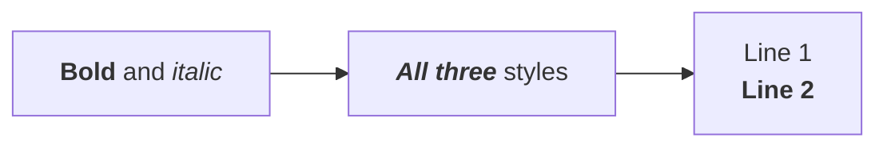
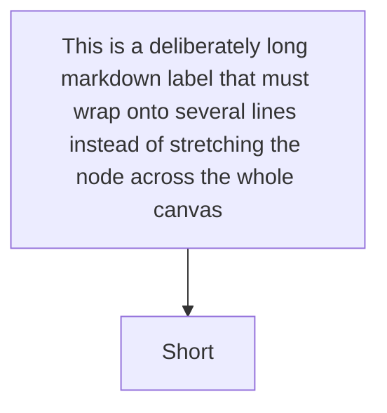
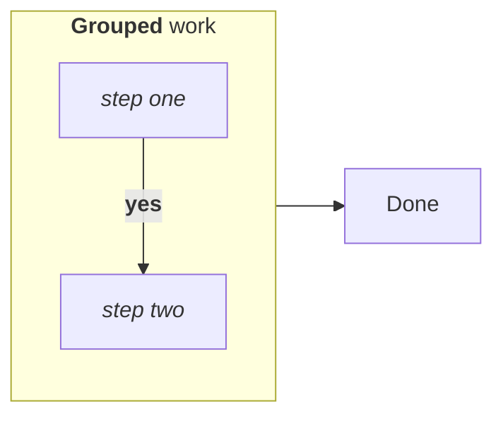
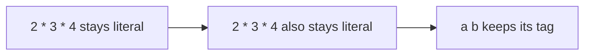

# Markdown and HTML Labels Implementation Plan

> **For agentic workers:** REQUIRED SUB-SKILL: Use superpowers:subagent-driven-development (recommended) or superpowers:executing-plans to implement this plan task-by-task. Steps use checkbox (`- [ ]`) syntax for tracking.

**Goal:** Render `**bold**` / `_italic_` markdown string labels (with word wrapping) and basic HTML markup (`<b>`, `<i>`, `<br/>`, entities) in node labels, edge labels and subgraph titles, on both the WYSIWYG canvas and the Markdown preview.

**Architecture:** Markup stays in the model as raw source text; a new `labelFormat?: 'markdown'` flag records whether the author wrote a backtick-wrapped Mermaid markdown string. A new core module `labelMarkup.ts` tokenizes that text into styled runs and word-wraps them; `nodeGeometry.ts` and `render.ts` both consume the same `LabelLayout`, so box sizing and glyph painting can never drift apart. Rendering emits one `<tspan>` per run, with only the first run of each line carrying `x`/`dy` so the browser centres the whole line as a single SVG text chunk.

**Tech Stack:** TypeScript, vitest (jsdom environment), esbuild, VS Code extension API. No new dependencies.

**Spec:** `docs/superpowers/specs/2026-08-11-markdown-html-labels-design.md`

## Global Constraints

- **No new runtime dependencies.** The tokenizer is hand-written; do not add `marked`, `markdown-it`, or an HTML sanitizer.
- **Round-trip is sacred.** An unedited diagram must re-serialize byte-identical. `roundtrip.spec.ts` already enforces idempotency — never weaken those tests.
- **Never throw from render or layout paths.** `renderFlowchartToSvg` runs inside the Markdown preview; an exception blanks the whole fenced block. Malformed markup degrades to literal text.
- **Existing geometry must not shift.** A plain single-line label with no markup must produce byte-identical `w`/`h` to today.
- **Indentation:** `src/core/*.ts` uses **tabs**. `src/webview/**/*.ts` uses **2 spaces**. Match the file you are editing.
- **Trailing comments explain _why_, not _what_** — match the existing density in the file (see `render.ts` lines 24-29 for the house style).
- Test command for every task: `cd extension && npx vitest run` (single file: `npx vitest run src/path/file.spec.ts`).
- Type check: `cd extension && pnpm run check-types`. Lint: `pnpm run lint`.
- Commit directly on `main` (trunk-based, per `.claude/CLAUDE.md`). One commit per task.

## File Structure

| File | Responsibility |
|---|---|
| `src/core/labelMarkup.ts` **(new)** | Tokenize label text into styled runs; decode entities; word-wrap; measure. The only place that knows markup syntax. |
| `src/core/labelMarkup.spec.ts` **(new)** | Table-driven tokenizer + wrapping tests. |
| `src/core/textMetrics.ts` | Gains a bold width factor so the no-canvas fallback is not weight-blind. |
| `src/core/model.ts` | `LabelFormat` type + `labelFormat` / `titleFormat` fields; `duplicateNode` copies the flag. |
| `src/core/parser.ts` | Detect backtick-wrapped strings; set the flags. |
| `src/core/serializer.ts` | Re-emit backticks for markdown labels. |
| `src/core/nodeGeometry.ts` | `nodeLabelLayout` / `edgeLabelLayout` — resolve wrap width, delegate to `layoutLabel`. Sizing re-expressed in terms of them. |
| `src/core/index.ts` | Re-export the new module. |
| `src/webview/wysiwyg/render.ts` | Paint runs as `<tspan>`s for nodes, edge labels and group titles. |
| `src/webview/wysiwyg/properties.ts` | Label format / Title format `<select>` in the node, edge and group panels. |
| `ceasg-test/markdown-labels.md` **(new)** | Hand-check fixture. |
| `docs/flowchart_diff_gap.md` | Close §5 and update the matrix row. |
| `CHANGELOG.md` | 0.8.0 entry. |

---

### Task 1: Markup tokenizer

Parse label text into lines of styled runs. No wrapping and no measurement yet — this task is pure string → structure.

**Files:**
- Create: `extension/src/core/labelMarkup.ts`
- Test: `extension/src/core/labelMarkup.spec.ts`

**Interfaces:**
- Consumes: nothing.
- Produces:
  ```ts
  export interface LabelRun { text: string; bold?: boolean; italic?: boolean }
  export type LabelLine = LabelRun[];
  export function parseLabelMarkup(text: string, markdown?: boolean): LabelLine[];
  ```
  Tasks 2, 4 and 5 depend on these exact names.

- [ ] **Step 1: Write the failing test**

Create `extension/src/core/labelMarkup.spec.ts`:

```ts
import { describe, it, expect } from 'vitest';
import { parseLabelMarkup } from './labelMarkup';

describe('parseLabelMarkup — plain text', () => {
  it('returns a single unstyled run', () => {
    expect(parseLabelMarkup('Hello')).toEqual([[{ text: 'Hello' }]]);
  });
  it('splits on newlines', () => {
    expect(parseLabelMarkup('a\nb')).toEqual([[{ text: 'a' }], [{ text: 'b' }]]);
  });
  it('splits on <br/> in all its spellings', () => {
    expect(parseLabelMarkup('a<br>b<br/>c<br />d')).toEqual([
      [{ text: 'a' }], [{ text: 'b' }], [{ text: 'c' }], [{ text: 'd' }],
    ]);
  });
  it('returns one empty line for an empty label', () => {
    expect(parseLabelMarkup('')).toEqual([[]]);
  });
  it('leaves markdown delimiters literal when markdown is off', () => {
    expect(parseLabelMarkup('**Bold**')).toEqual([[{ text: '**Bold**' }]]);
  });
});

describe('parseLabelMarkup — HTML tags (both modes)', () => {
  it('renders <b> and <strong> as bold', () => {
    expect(parseLabelMarkup('a<b>B</b>c')).toEqual([
      [{ text: 'a' }, { text: 'B', bold: true }, { text: 'c' }],
    ]);
    expect(parseLabelMarkup('<strong>B</strong>')).toEqual([[{ text: 'B', bold: true }]]);
  });
  it('renders <i> and <em> as italic', () => {
    expect(parseLabelMarkup('<i>I</i>')).toEqual([[{ text: 'I', italic: true }]]);
    expect(parseLabelMarkup('<em>I</em>')).toEqual([[{ text: 'I', italic: true }]]);
  });
  it('is case-insensitive', () => {
    expect(parseLabelMarkup('<B>x</B>')).toEqual([[{ text: 'x', bold: true }]]);
  });
  it('nests bold and italic', () => {
    expect(parseLabelMarkup('<b>a<i>b</i></b>')).toEqual([
      [{ text: 'a', bold: true }, { text: 'b', bold: true, italic: true }],
    ]);
  });
  // Mermaid would eat an unknown tag as HTML, but silently deleting text the
  // user typed is worse than showing it — `A <B> C` must keep its `<B>`.
  it('leaves an unrecognized tag literal', () => {
    expect(parseLabelMarkup('a <span> b')).toEqual([[{ text: 'a <span> b' }]]);
  });
  it('leaves an unclosed recognized tag styling the rest of the line', () => {
    expect(parseLabelMarkup('a<b>B')).toEqual([
      [{ text: 'a' }, { text: 'B', bold: true }],
    ]);
  });
});

describe('parseLabelMarkup — entities', () => {
  it('decodes named entities', () => {
    expect(parseLabelMarkup('Tom &amp; Jerry')).toEqual([[{ text: 'Tom & Jerry' }]]);
    expect(parseLabelMarkup('&lt;tag&gt;')).toEqual([[{ text: '<tag>' }]]);
    expect(parseLabelMarkup('say &quot;hi&quot;')).toEqual([[{ text: 'say "hi"' }]]);
    expect(parseLabelMarkup('a&nbsp;b')).toEqual([[{ text: 'a\u00a0b' }]]);
  });
  it('decodes decimal and hex numeric entities', () => {
    expect(parseLabelMarkup('&#169;')).toEqual([[{ text: '\u00a9' }]]);
    expect(parseLabelMarkup('&#x2764;')).toEqual([[{ text: '\u2764' }]]);
  });
  it('leaves an unknown entity literal', () => {
    expect(parseLabelMarkup('&foo;')).toEqual([[{ text: '&foo;' }]]);
  });
  // Entities are decoded after tag tokenization, so a decoded `<` can never
  // turn into markup on a second look.
  it('does not treat a decoded &lt;b&gt; as a tag', () => {
    expect(parseLabelMarkup('&lt;b&gt;x&lt;/b&gt;')).toEqual([[{ text: '<b>x</b>' }]]);
  });
});

describe('parseLabelMarkup — markdown mode', () => {
  it('renders ** and __ as bold', () => {
    expect(parseLabelMarkup('**B**', true)).toEqual([[{ text: 'B', bold: true }]]);
    expect(parseLabelMarkup('__B__', true)).toEqual([[{ text: 'B', bold: true }]]);
  });
  it('renders * and _ as italic', () => {
    expect(parseLabelMarkup('*I*', true)).toEqual([[{ text: 'I', italic: true }]]);
    expect(parseLabelMarkup('_I_', true)).toEqual([[{ text: 'I', italic: true }]]);
  });
  it('renders *** as bold italic', () => {
    expect(parseLabelMarkup('***X***', true)).toEqual([[{ text: 'X', bold: true, italic: true }]]);
  });
  it('keeps the surrounding spaces as their own run', () => {
    expect(parseLabelMarkup('**Bold** and _italic_', true)).toEqual([
      [{ text: 'Bold', bold: true }, { text: ' and ' }, { text: 'italic', italic: true }],
    ]);
  });
  it('nests emphasis', () => {
    expect(parseLabelMarkup('**bold with _it_**', true)).toEqual([
      [{ text: 'bold with ', bold: true }, { text: 'it', bold: true, italic: true }],
    ]);
  });
  it('leaves an unterminated delimiter literal', () => {
    expect(parseLabelMarkup('2 * 3 * 4', true)).toEqual([[{ text: '2 * 3 * 4' }]]);
    expect(parseLabelMarkup('**oops', true)).toEqual([[{ text: '**oops' }]]);
  });
  it('honours backslash escapes', () => {
    expect(parseLabelMarkup('a \\* b', true)).toEqual([[{ text: 'a * b' }]]);
    expect(parseLabelMarkup('a \\\\ b', true)).toEqual([[{ text: 'a \\ b' }]]);
  });
  it('still handles HTML tags and entities', () => {
    expect(parseLabelMarkup('**a** &amp; <i>b</i>', true)).toEqual([
      [{ text: 'a', bold: true }, { text: ' & ' }, { text: 'b', italic: true }],
    ]);
  });
});
```

- [ ] **Step 2: Run the test and verify it fails**

Run: `cd extension && npx vitest run src/core/labelMarkup.spec.ts`
Expected: FAIL — `Failed to resolve import "./labelMarkup"`.

- [ ] **Step 3: Write the implementation**

Create `extension/src/core/labelMarkup.ts`. Note the file uses **tabs**.

```ts
/*
 * Label markup: Mermaid's two flavours of formatted label, tokenized into
 * styled runs that both the size estimator and the renderer consume.
 *
 * Mermaid defaults to `htmlLabels: true`, so an ordinary quoted string already
 * renders <b>/<i>/<br> and HTML entities. A *markdown string* — the
 * backtick-wrapped form, A["`**bold**`"] — additionally gets markdown emphasis
 * and automatic word wrapping. `markdown` selects between the two.
 *
 * Nothing here ever throws: this runs inside the Markdown preview, where an
 * exception blanks the whole fenced block. Every malformed construct degrades
 * to the literal characters the author typed.
 */

export interface LabelRun {
	text: string;
	bold?: boolean;
	italic?: boolean;
}

/** One visual line: the runs it is made of, in reading order. */
export type LabelLine = LabelRun[];

/** Tags we can actually draw in SVG text. Anything else stays literal, because
 *  silently swallowing `A <B> C` is worse than showing the angle brackets. */
const TAG_RE = /^<(\/?)(b|strong|i|em)\s*>/i;
const BR_RE = /^<br\s*\/?>/i;

const NAMED_ENTITIES: Record<string, string> = {
	amp: "&", lt: "<", gt: ">", quot: '"', apos: "'", nbsp: "\u00a0",
	copy: "\u00a9", reg: "\u00ae", trade: "\u2122", hellip: "\u2026",
	mdash: "\u2014", ndash: "\u2013", laquo: "\u00ab", raquo: "\u00bb",
	times: "\u00d7", divide: "\u00f7", deg: "\u00b0", plusmn: "\u00b1",
	middot: "\u00b7", bull: "\u2022", larr: "\u2190", rarr: "\u2192",
	uarr: "\u2191", darr: "\u2193", harr: "\u2194",
};

/** Decode HTML entities. Runs *after* tag tokenization, so a decoded `<` can
 *  never be re-read as markup. An unknown entity is left exactly as typed. */
function decodeEntities(s: string): string {
	return s.replace(/&(#x[0-9a-f]+|#\d+|[a-z]+);/gi, (whole, body: string) => {
		const named = NAMED_ENTITIES[body.toLowerCase()];
		if (named !== undefined) return named;
		if (body[0] === "#") {
			const code = body[1] === "x" || body[1] === "X"
				? parseInt(body.slice(2), 16)
				: parseInt(body.slice(1), 10);
			// Reject non-scalar values rather than letting fromCodePoint throw.
			if (Number.isFinite(code) && code > 0 && code <= 0x10ffff) {
				try {
					return String.fromCodePoint(code);
				} catch {
					return whole;
				}
			}
		}
		return whole;
	});
}

/** The markdown delimiters, longest first so `***` wins over `**` over `*`. */
const DELIMS: Array<{ mark: string; bold: boolean; italic: boolean }> = [
	{ mark: "***", bold: true, italic: true },
	{ mark: "___", bold: true, italic: true },
	{ mark: "**", bold: true, italic: false },
	{ mark: "__", bold: true, italic: false },
	{ mark: "*", bold: false, italic: true },
	{ mark: "_", bold: false, italic: true },
];

interface Style {
	bold: boolean;
	italic: boolean;
}

/** Tokenize one line. `stack` carries the emphasis state; a delimiter or tag
 *  with no partner is emitted as literal text instead of being dropped. */
function parseLine(line: string, markdown: boolean): LabelLine {
	const runs: LabelRun[] = [];
	const stack: Array<{ mark: string; style: Style }> = [];
	let buf = "";
	let style: Style = { bold: false, italic: false };

	const flush = (): void => {
		if (buf === "") return;
		const run: LabelRun = { text: decodeEntities(buf) };
		if (style.bold) run.bold = true;
		if (style.italic) run.italic = true;
		runs.push(run);
		buf = "";
	};

	let i = 0;
	while (i < line.length) {
		const rest = line.slice(i);

		if (markdown && rest[0] === "\\" && rest.length > 1) {
			// A backslash escape makes the next character literal, so `\*` can
			// appear in a markdown label without opening emphasis.
			buf += rest[1];
			i += 2;
			continue;
		}

		if (rest[0] === "<") {
			const tag = TAG_RE.exec(rest);
			if (tag) {
				const closing = tag[1] === "/";
				const bold = /^(b|strong)$/i.test(tag[2] as string);
				const open = stack[stack.length - 1];
				if (closing) {
					// Only pop a tag we actually opened; a stray </b> is literal.
					if (open && open.mark === (bold ? "<b>" : "<i>")) {
						flush();
						stack.pop();
						style = { ...open.style };
						i += tag[0].length;
						continue;
					}
				} else {
					flush();
					stack.push({ mark: bold ? "<b>" : "<i>", style: { ...style } });
					style = { bold: style.bold || bold, italic: style.italic || !bold };
					i += tag[0].length;
					continue;
				}
			}
		}

		if (markdown) {
			const d = DELIMS.find((c) => rest.startsWith(c.mark));
			if (d) {
				const open = stack[stack.length - 1];
				if (open && open.mark === d.mark) {
					flush();
					stack.pop();
					style = { ...open.style };
					i += d.mark.length;
					continue;
				}
				// Only open when the delimiter is actually closed later on this
				// line — otherwise `2 * 3` would italicize the rest of the label.
				if (line.indexOf(d.mark, i + d.mark.length) !== -1) {
					flush();
					stack.push({ mark: d.mark, style: { ...style } });
					style = { bold: style.bold || d.bold, italic: style.italic || d.italic };
					i += d.mark.length;
					continue;
				}
			}
		}

		buf += rest[0];
		i += 1;
	}
	flush();
	return runs;
}

/**
 * Split `text` into lines of styled runs.
 *
 * `markdown` enables markdown emphasis and is set from the backtick-wrapped
 * Mermaid markdown-string form. HTML tags and entities are honoured in both
 * modes, matching Mermaid's `htmlLabels: true` default.
 */
export function parseLabelMarkup(text: string, markdown = false): LabelLine[] {
	// The model stores newlines, but a hand-written label may still carry the
	// <br/> the author typed; normalize before splitting so both behave alike.
	const normalized = text.replace(/<br\s*\/?>/gi, "\n");
	return normalized.split("\n").map((line) => parseLine(line, markdown));
}
```

Note: `BR_RE` is declared for symmetry with `TAG_RE` but the `<br>` split happens in `parseLabelMarkup`. **Delete `BR_RE`** — an unused const will fail `pnpm run lint`.

- [ ] **Step 4: Run the tests and verify they pass**

Run: `cd extension && npx vitest run src/core/labelMarkup.spec.ts`
Expected: PASS, all cases.

If `leaves an unclosed recognized tag styling the rest of the line` fails, note that the "only open when closed later" guard applies to markdown delimiters only — an unclosed `<b>` deliberately styles the remainder, which is what the test asserts.

- [ ] **Step 5: Type check and lint**

Run: `cd extension && pnpm run check-types && pnpm run lint`
Expected: clean.

- [ ] **Step 6: Commit**

```bash
cd extension
git add src/core/labelMarkup.ts src/core/labelMarkup.spec.ts
git commit -m "feat(core): tokenize markdown and HTML label markup into styled runs"
```

---

### Task 2: Measurement and word wrapping

Turn runs into a laid-out, measured, wrapped `LabelLayout`. Also make the no-canvas measurement fallback weight-aware, otherwise bold text measures the same as plain and nothing downstream can be tested.

**Files:**
- Modify: `extension/src/core/textMetrics.ts`
- Modify: `extension/src/core/labelMarkup.ts` (append)
- Modify: `extension/src/core/labelMarkup.spec.ts` (append)
- Modify: `extension/src/core/index.ts:1-12` (add the export)
- Test: `extension/src/core/textMetrics.spec.ts` (append)

**Interfaces:**
- Consumes: `parseLabelMarkup`, `LabelRun`, `LabelLine` from Task 1; `measureTextWidth`, `BASE_FONT_SIZE`, `BASE_FONT_FAMILY` from `textMetrics.ts`.
- Produces:
  ```ts
  export interface LabelLayout { lines: LabelLine[]; width: number; height: number }
  export interface LabelLayoutOpts {
    markdown?: boolean; fontSize?: number; fontFamily?: string; wrapWidth?: number;
  }
  export function layoutLabel(text: string, opts?: LabelLayoutOpts): LabelLayout;
  export const DEFAULT_WRAP_WIDTH = 200;
  ```
  Tasks 4 and 5 depend on these exact names.

- [ ] **Step 1: Write the failing tests**

Append to `extension/src/core/textMetrics.spec.ts`:

```ts
describe('measureTextWidth — weight', () => {
  const f = '"trebuchet ms", verdana, arial, sans-serif';
  // Under vitest's jsdom there is no canvas, so measureTextWidth takes its
  // per-codepoint fallback. That fallback used to be weight-blind, which made
  // a bold label size exactly like a plain one.
  it('estimates bold text wider than plain text', () => {
    expect(measureTextWidth('Bold', `bold 16px ${f}`))
      .toBeGreaterThan(measureTextWidth('Bold', `16px ${f}`));
  });
  it('leaves plain text unchanged', () => {
    expect(measureTextWidth('Bold', `16px ${f}`)).toBe(32.8);
  });
});
```

Append to `extension/src/core/labelMarkup.spec.ts`:

```ts
import { layoutLabel, DEFAULT_WRAP_WIDTH } from './labelMarkup';

describe('layoutLabel', () => {
  it('reports one line and a positive width for plain text', () => {
    const l = layoutLabel('Hello');
    expect(l.lines).toEqual([[{ text: 'Hello' }]]);
    expect(l.width).toBeGreaterThan(0);
    expect(l.height).toBe(16);
  });
  it('sizes height from the line count', () => {
    expect(layoutLabel('a\nb\nc').height).toBe(48);
  });
  it('scales height with fontSize', () => {
    expect(layoutLabel('a\nb', { fontSize: 24 }).height).toBe(48);
  });
  it('measures an empty label as zero width, one line high', () => {
    const l = layoutLabel('');
    expect(l.lines).toEqual([[]]);
    expect(l.width).toBe(0);
    expect(l.height).toBe(16);
  });
  it('measures a bold run wider than the same plain run', () => {
    expect(layoutLabel('**Bold**', { markdown: true }).width)
      .toBeGreaterThan(layoutLabel('Bold').width);
  });
  it('sums run widths across a line', () => {
    const mixed = layoutLabel('**ab** cd', { markdown: true });
    expect(mixed.lines[0]).toHaveLength(2);
    expect(mixed.width).toBeGreaterThan(layoutLabel('ab cd').width);
  });
});

describe('layoutLabel — wrapping', () => {
  const long = 'the quick brown fox jumps over the lazy dog again and again';

  it('does not wrap plain labels however long', () => {
    expect(layoutLabel(long, { wrapWidth: 100 }).lines).toHaveLength(1);
  });
  it('wraps a markdown label at wrapWidth', () => {
    const l = layoutLabel(long, { markdown: true, wrapWidth: 100 });
    expect(l.lines.length).toBeGreaterThan(1);
    expect(l.width).toBeLessThanOrEqual(100);
  });
  it('defaults to DEFAULT_WRAP_WIDTH', () => {
    expect(DEFAULT_WRAP_WIDTH).toBe(200);
    const l = layoutLabel(long, { markdown: true });
    expect(l.lines.length).toBeGreaterThan(1);
    expect(l.width).toBeLessThanOrEqual(200);
  });
  it('carries run styling across a wrap boundary', () => {
    const l = layoutLabel(`**${long}**`, { markdown: true, wrapWidth: 100 });
    expect(l.lines.length).toBeGreaterThan(1);
    for (const line of l.lines) {
      for (const run of line) { expect(run.bold).toBe(true); }
    }
  });
  it('does not hard-break a word wider than wrapWidth', () => {
    const l = layoutLabel('supercalifragilisticexpialidocious', { markdown: true, wrapWidth: 20 });
    expect(l.lines).toHaveLength(1);
    expect(l.lines[0]?.[0]?.text).toBe('supercalifragilisticexpialidocious');
  });
  it('keeps explicit line breaks while wrapping', () => {
    const l = layoutLabel(`${long}\nshort`, { markdown: true, wrapWidth: 100 });
    expect(l.lines[l.lines.length - 1]).toEqual([{ text: 'short' }]);
  });
});
```

- [ ] **Step 2: Run the tests and verify they fail**

Run: `cd extension && npx vitest run src/core/labelMarkup.spec.ts src/core/textMetrics.spec.ts`
Expected: FAIL — `layoutLabel` is not exported; the bold-width test fails because plain and bold both measure 32.8.

- [ ] **Step 3: Make the measurement fallback weight-aware**

In `extension/src/core/textMetrics.ts`, add the constant next to `FALLBACK_CHAR_W`:

```ts
const FALLBACK_CHAR_W = 8.2;
// Bold glyphs are wider than their regular counterparts. Real `measureText`
// accounts for it; the per-codepoint fallback would not, which would size a
// bold label exactly like a plain one and let its text overflow the shape.
const FALLBACK_BOLD_FACTOR = 1.06;
```

and apply it in the fallback branch of `measureTextWidth`, after `scale` is computed:

```ts
	const px = /(\d+(?:\.\d+)?)px/.exec(font);
	const scale = px ? Number(px[1]) / BASE_FONT_SIZE : 1;
	const weight = /(^|\s)(bold|[6-9]00)(\s|$)/i.test(font) ? FALLBACK_BOLD_FACTOR : 1;
	return units * FALLBACK_CHAR_W * scale * weight;
```

- [ ] **Step 4: Implement layout and wrapping**

Append to `extension/src/core/labelMarkup.ts` (tabs):

```ts
/** Mermaid's `flowchart.wrappingWidth` default: markdown labels wrap here. */
export const DEFAULT_WRAP_WIDTH = 200;

export interface LabelLayout {
	/** Wrapped lines of styled runs. Never empty; a blank label is `[[]]`. */
	lines: LabelLine[];
	/** Widest laid-out line in px, each run measured in its own font. */
	width: number;
	/** `lines.length * fontSize`. */
	height: number;
}

export interface LabelLayoutOpts {
	markdown?: boolean;
	fontSize?: number;
	fontFamily?: string;
	/** Wrap markdown labels at this width. Ignored when `markdown` is unset —
	 *  a plain Mermaid string breaks only where the author wrote `<br/>`. */
	wrapWidth?: number;
}

/** The CSS font shorthand for a run, in the order `measureText` expects. */
function runFont(run: LabelRun, fontSize: number, fontFamily: string): string {
	return `${run.italic ? "italic " : ""}${run.bold ? "bold " : ""}${fontSize}px ${fontFamily}`;
}

function lineWidth(line: LabelLine, fontSize: number, fontFamily: string): number {
	let w = 0;
	for (const run of line) {
		w += measureTextWidth(run.text, runFont(run, fontSize, fontFamily));
	}
	return w;
}

/**
 * Greedy word wrap. Words keep the styling of the run they came from, so a
 * `**long bold phrase**` stays bold across the break. A single word wider than
 * `max` is left to overflow rather than hard-broken, which is what Mermaid does.
 */
function wrapLine(line: LabelLine, max: number, fontSize: number, fontFamily: string): LabelLine[] {
	if (line.length === 0) return [line];
	// Explode into words, each remembering its run's styling. Splitting on the
	// space *before* a word keeps the separator out of the wrapped output.
	const words: LabelRun[] = [];
	for (const run of line) {
		const parts = run.text.split(/(\s+)/).filter((p) => p !== "");
		for (const p of parts) {
			words.push({ ...run, text: p });
		}
	}
	const out: LabelLine[] = [];
	let current: LabelRun[] = [];
	let currentW = 0;
	for (const word of words) {
		const w = measureTextWidth(word.text, runFont(word, fontSize, fontFamily));
		const isSpace = /^\s+$/.test(word.text);
		// A run of whitespace never starts a line: it is dropped at the break.
		if (currentW > 0 && currentW + w > max && !isSpace) {
			out.push(mergeRuns(current));
			current = [];
			currentW = 0;
		}
		if (currentW === 0 && isSpace) continue;
		current.push(word);
		currentW += w;
	}
	out.push(mergeRuns(current));
	return out;
}

/** Re-join adjacent words that share styling, so the renderer emits one tspan
 *  per style change rather than one per word. */
function mergeRuns(words: LabelRun[]): LabelLine {
	const out: LabelRun[] = [];
	for (const word of words) {
		const last = out[out.length - 1];
		if (last && !!last.bold === !!word.bold && !!last.italic === !!word.italic) {
			last.text += word.text;
		} else {
			out.push({ ...word });
		}
	}
	// Trailing whitespace at a wrap point would push the visual centre off.
	const last = out[out.length - 1];
	if (last) {
		last.text = last.text.replace(/\s+$/, "");
		if (last.text === "" && out.length > 1) out.pop();
	}
	return out;
}

/**
 * Parse, wrap and measure a label in one call.
 *
 * Both `estimateNodeSize` and the renderer go through here, so the box a node
 * reserves and the glyphs painted inside it always come from the same layout.
 */
export function layoutLabel(text: string, opts: LabelLayoutOpts = {}): LabelLayout {
	const fontSize = opts.fontSize ?? BASE_FONT_SIZE;
	const fontFamily = opts.fontFamily ?? BASE_FONT_FAMILY;
	const parsed = parseLabelMarkup(text, opts.markdown);
	const max = opts.markdown ? (opts.wrapWidth ?? DEFAULT_WRAP_WIDTH) : Infinity;
	const lines = Number.isFinite(max)
		? parsed.flatMap((line) => wrapLine(line, max, fontSize, fontFamily))
		: parsed;
	const width = Math.max(0, ...lines.map((l) => lineWidth(l, fontSize, fontFamily)));
	return { lines, width, height: lines.length * fontSize };
}
```

Add the import at the top of `labelMarkup.ts`, below the file comment:

```ts
import { BASE_FONT_FAMILY, BASE_FONT_SIZE, measureTextWidth } from "./textMetrics";
```

- [ ] **Step 5: Export from the core barrel**

In `extension/src/core/index.ts`, add after the `textMetrics` line:

```ts
export * from './labelMarkup';
```

- [ ] **Step 6: Run the full suite**

Run: `cd extension && npx vitest run`
Expected: PASS. The new bold factor only affects fonts whose shorthand says `bold`, and nothing measured one before, so existing geometry tests are untouched.

- [ ] **Step 7: Type check and lint**

Run: `cd extension && pnpm run check-types && pnpm run lint`
Expected: clean.

- [ ] **Step 8: Commit**

```bash
cd extension
git add src/core/labelMarkup.ts src/core/labelMarkup.spec.ts src/core/textMetrics.ts src/core/textMetrics.spec.ts src/core/index.ts
git commit -m "feat(core): measure and word-wrap markup labels via layoutLabel"
```

---

### Task 3: Model flag, parsing and serialization

Record which labels were written as Mermaid markdown strings, and put the backticks back on save.

**Files:**
- Modify: `extension/src/core/model.ts:97-136` (interfaces), `:189-198` (edge), `:604-620` (`duplicateNode`)
- Modify: `extension/src/core/parser.ts:60-68`, `:118-156`, `:167-190`, `:391-421`, `:434-459`, `:775-813`
- Modify: `extension/src/core/serializer.ts:37-45`, `:58-66`, `:74-81`, `:105-108`, `:215-219`
- Test: `extension/src/core/roundtrip.spec.ts` (append), `extension/src/core/parser.spec.ts` (append)

**Interfaces:**
- Consumes: nothing from earlier tasks.
- Produces:
  ```ts
  export type LabelFormat = "markdown";
  // DiagramNode.labelFormat?: LabelFormat
  // DiagramEdge.labelFormat?: LabelFormat
  // DiagramGroup.titleFormat?: LabelFormat
  ```
  Tasks 4, 5 and 6 read these fields.

- [ ] **Step 1: Write the failing tests**

Append to `extension/src/core/parser.spec.ts`:

```ts
describe('markdown string labels', () => {
  it('flags a backtick-wrapped node label and strips the backticks', () => {
    const { model } = mermaidToModel('flowchart LR\nA["`**Bold**`"]\n');
    expect(model.nodes[0]?.label).toBe('**Bold**');
    expect(model.nodes[0]?.labelFormat).toBe('markdown');
  });
  it('leaves a plain label unflagged', () => {
    const { model } = mermaidToModel('flowchart LR\nA["**Bold**"]\n');
    expect(model.nodes[0]?.label).toBe('**Bold**');
    expect(model.nodes[0]?.labelFormat).toBeUndefined();
  });
  it('flags a markdown edge label', () => {
    const { model } = mermaidToModel('flowchart LR\nA -->|"`_yes_`"| B\n');
    expect(model.edges[0]?.label).toBe('_yes_');
    expect(model.edges[0]?.labelFormat).toBe('markdown');
  });
  it('flags a markdown subgraph title', () => {
    const { model } = mermaidToModel('flowchart LR\nsubgraph S["`**G**`"]\nA\nend\n');
    expect(model.groups[0]?.title).toBe('**G**');
    expect(model.groups[0]?.titleFormat).toBe('markdown');
  });
  it('flags a markdown label in the v11 attribute form', () => {
    const { model } = mermaidToModel('flowchart LR\nA@{ shape: rect, label: "`**B**`" }\n');
    expect(model.nodes[0]?.label).toBe('**B**');
    expect(model.nodes[0]?.labelFormat).toBe('markdown');
  });
  it('keeps HTML markup in a plain label verbatim', () => {
    const { model } = mermaidToModel('flowchart LR\nA["x <b>y</b>"]\n');
    expect(model.nodes[0]?.label).toBe('x <b>y</b>');
  });
});
```

Append to `extension/src/core/roundtrip.spec.ts`:

```ts
describe('round-trip — formatted labels', () => {
  it('preserves a markdown node label including its backticks', () => {
    const src = 'flowchart LR\n    A["`**Bold** and _italic_`"]\n';
    const out = roundtrip(src);
    expect(out).toContain('"`**Bold** and _italic_`"');
    expect(roundtrip(out)).toBe(out);
  });
  it('preserves HTML markup and entities in a plain label', () => {
    const src = 'flowchart LR\n    B["Line 1<br/><b>Line 2</b> &amp; more"]\n';
    const out = roundtrip(src);
    expect(out).toContain('<b>Line 2</b>');
    expect(out).toContain('&amp;');
    expect(roundtrip(out)).toBe(out);
  });
  it('preserves a markdown edge label', () => {
    const out = roundtrip('flowchart LR\n    A -->|"`**yes**`"| B\n');
    expect(out).toContain('|"`**yes**`"|');
    expect(roundtrip(out)).toBe(out);
  });
  it('preserves a markdown subgraph title', () => {
    const out = roundtrip('flowchart LR\n    subgraph S["`**Group**`"]\n    A\n    end\n');
    expect(out).toContain('"`**Group**`"');
    expect(roundtrip(out)).toBe(out);
  });
  it('drops the backticks when the format is cleared', () => {
    const { model } = mermaidToModel('flowchart LR\nA["`**B**`"]\n');
    delete model.nodes[0]!.labelFormat;
    const out = modelToMermaid(model, { includePositions: false });
    expect(out).toContain('A["**B**"]');
    expect(out).not.toContain('`');
  });
});
```

- [ ] **Step 2: Run the tests and verify they fail**

Run: `cd extension && npx vitest run src/core/parser.spec.ts src/core/roundtrip.spec.ts`
Expected: FAIL — `labelFormat` does not exist on the type (vitest still runs, assertions fail with `undefined`), and the backticks survive into `label`.

- [ ] **Step 3: Add the model fields**

In `extension/src/core/model.ts`, add above `interface DiagramNode`:

```ts
/** How a label's text should be interpreted. Undefined means a plain Mermaid
 *  string, which still renders HTML markup because Mermaid defaults to
 *  `htmlLabels: true`; "markdown" is the backtick-wrapped form, which adds
 *  markdown emphasis and automatic word wrapping. */
export type LabelFormat = "markdown";
```

Add to `DiagramNode` (after `label`):

```ts
	/** Set when the author wrote the backtick-wrapped markdown-string form. */
	labelFormat?: LabelFormat;
```

Add the same field to `DiagramEdge` after its `label`, and to `DiagramGroup` after `title`:

```ts
	/** Set when the author wrote the backtick-wrapped markdown-string form. */
	titleFormat?: LabelFormat;
```

In `duplicateNode` (~line 604), copy the flag next to `label: src.label`:

```ts
		labelFormat: src.labelFormat,
```

- [ ] **Step 4: Detect backticks in the parser**

In `extension/src/core/parser.ts`, replace `stripQuotes` (lines 60-68) with:

```ts
/** A quoted Mermaid string, unwrapped. `markdown` is set for the backtick-
 *  wrapped markdown-string form, `"`**bold**`"`, whose contents get markdown
 *  emphasis and word wrapping rather than plain-with-HTML treatment. */
interface ParsedString {
	text: string;
	markdown?: boolean;
}

function stripQuotesEx(s: string): ParsedString {
	const t = s.trim();
	let inner = t;
	if (inner.length >= 2 && inner.startsWith('"') && inner.endsWith('"')) {
		inner = inner.slice(1, -1);
	}
	let markdown = false;
	if (inner.length >= 2 && inner.startsWith("`") && inner.endsWith("`")) {
		inner = inner.slice(1, -1);
		markdown = true;
	}
	// Decode <br/> back to \n for multi-line labels
	const text = inner.replace(/<br\s*\/?>/gi, "\n");
	return markdown ? { text, markdown } : { text };
}

function stripQuotes(s: string): string {
	return stripQuotesEx(s).text;
}
```

Add `labelFormat`/`titleFormat` to `ParsedToken` (line 70):

```ts
	labelFormat?: LabelFormat;
```

and import `LabelFormat` from `./model` alongside the other type imports.

Bracket node labels (line 121):

```ts
		if (m && m[1] !== undefined && m[2] !== undefined) {
			const parsed = stripQuotesEx(m[2]);
			const token: ParsedToken = { id: m[1], shape, label: parsed.text, syntax: "bracket" };
			if (parsed.markdown) token.labelFormat = "markdown";
			return token;
		}
```

`parseV11Props` (line 168) must keep the flag. Change its map value type and the three consumers:

```ts
/** Parse the body of `@{…}`: comma-separated key: value pairs, quote-aware. */
function parseV11Props(body: string): Map<string, ParsedString> {
	const props = new Map<string, ParsedString>();
	// ...splitting loop unchanged...
	for (const part of parts) {
		const m = part.match(/^\s*([\w-]+)\s*:\s*(.*?)\s*$/);
		if (m && m[1] !== undefined && m[2] !== undefined) {
			props.set(m[1].toLowerCase(), stripQuotesEx(m[2]));
		}
	}
	return props;
}
```

In the v11 branch (lines 129-154), read `.text` from each value and the flag from `label`:

```ts
		const shapeName = props.get("shape")?.text;
		const label = props.get("label");
		const result: ParsedToken = { id: v11[1], syntax: "attr" };
		// ...shape resolution unchanged, using shapeName...
		if (label !== undefined) {
			result.label = label.text;
			if (label.markdown) result.labelFormat = "markdown";
		}
		const attrs: Record<string, string> = {};
		for (const [k, v] of props) {
			if (k !== "shape" && k !== "label") attrs[k] = v.text;
		}
```

In `ensureNode` (lines 391-421), carry the flag on both the create and update paths:

```ts
			node = {
				id: token.id,
				label: token.label ?? token.id,
				labelFormat: token.labelFormat,
				// ...rest unchanged...
			};
```
```ts
			if (token.label !== undefined) {
				node.label = token.label;
				node.labelFormat = token.labelFormat;
			}
```

In `openGroup` (lines 441-457), capture the title's flag:

```ts
		let titleMarkdown = false;
		// ...
		} else if ((m = rest.match(/^([A-Za-z0-9_]+)\s*\[(.+)\]$/))) {
			id = m[1] as string;
			const parsed = stripQuotesEx(m[2] as string);
			title = parsed.text;
			titleMarkdown = !!parsed.markdown;
		}
		// ...
		const group: DiagramGroup = { id, title, nodeIds: [] };
		if (titleMarkdown) group.titleFormat = "markdown";
```

For the pipe edge label (line 779):

```ts
		let label = "";
		let labelFormat: LabelFormat | undefined;
		let nodePart = piece;
		const labelMatch = piece.match(/^\|([^|]*)\|\s*(.*)$/);
		if (labelMatch && labelMatch[1] !== undefined && labelMatch[2] !== undefined) {
			const parsed = stripQuotesEx(labelMatch[1]);
			label = parsed.text;
			if (parsed.markdown) labelFormat = "markdown";
			nodePart = labelMatch[2].trim();
		}
```

and in the `edges.push` block (line 807), after `label,`:

```ts
						labelFormat,
```

`stripQuotes` is still used by nothing else after these edits — if lint reports it unused, delete the wrapper and use `stripQuotesEx(...).text` at any remaining call site.

- [ ] **Step 5: Re-emit the backticks in the serializer**

In `extension/src/core/serializer.ts`, replace `quoteLabel` (lines 37-45):

```ts
/** Wrap a label so Mermaid treats spaces/punctuation safely.
 *  `\n` in the label is encoded as `<br/>` which Mermaid renders as a line break.
 *  `markdown` re-adds the backticks of Mermaid's markdown-string form. */
function quoteLabel(label: string, markdown?: LabelFormat): string {
	// Newlines would split the single-line Mermaid statement, so encode them as
	// <br/> (which Mermaid renders as a line break and the parser decodes back
	// to \n). Embedded double quotes use the entity Mermaid understands.
	const safe = label.replace(/\r?\n/g, "<br/>").replace(/"/g, "&quot;");
	return markdown === "markdown" ? `"\`${safe}\`"` : `"${safe}"`;
}
```

Import `LabelFormat` from `./model`. Then thread the flag through the four call sites:

- `nodeDeclaration` (line 59): `const label = quoteLabel(node.label, node.labelFormat);`
- `attrForm` — signature unchanged; it receives the already-quoted `label`.
- edge label (line 107): `quoteLabel(edge.label, edge.labelFormat)`
- subgraph title (line 217): `quoteLabel(group.title, group.titleFormat)`

- [ ] **Step 6: Run the full suite**

Run: `cd extension && npx vitest run`
Expected: PASS, including the existing idempotency tests.

- [ ] **Step 7: Type check and lint**

Run: `cd extension && pnpm run check-types && pnpm run lint`
Expected: clean.

- [ ] **Step 8: Commit**

```bash
cd extension
git add src/core/model.ts src/core/parser.ts src/core/serializer.ts src/core/parser.spec.ts src/core/roundtrip.spec.ts
git commit -m "feat(core): parse and re-emit Mermaid markdown-string labels"
```

---

### Task 4: Markup-aware sizing

Make node boxes, edge-label boxes and the dagre layout size themselves from the wrapped, styled layout.

**Files:**
- Modify: `extension/src/core/nodeGeometry.ts`
- Test: `extension/src/core/nodeGeometry.spec.ts` (append)

**Interfaces:**
- Consumes: `layoutLabel`, `LabelLayout`, `DEFAULT_WRAP_WIDTH` (Task 2); `DiagramNode.labelFormat`, `DiagramEdge.labelFormat` (Task 3).
- Produces:
  ```ts
  export function nodeLabelLayout(node: DiagramNode, style?: NodeStyle): LabelLayout;
  export function edgeLabelLayout(edge: DiagramEdge): LabelLayout;
  ```
  Task 5 calls both.

- [ ] **Step 1: Write the failing tests**

Append to `extension/src/core/nodeGeometry.spec.ts`:

```ts
import { nodeLabelLayout, edgeLabelLayout } from './nodeGeometry';

function node(over: Partial<DiagramNode> = {}): DiagramNode {
  return { id: 'A', label: 'Hi', shape: 'rect', x: 0, y: 0, ...over };
}

describe('nodeLabelLayout', () => {
  it('leaves a plain label as one unstyled run', () => {
    expect(nodeLabelLayout(node({ label: '**B**' })).lines)
      .toEqual([[{ text: '**B**' }]]);
  });
  it('styles a markdown label', () => {
    expect(nodeLabelLayout(node({ label: '**B**', labelFormat: 'markdown' })).lines)
      .toEqual([[{ text: 'B', bold: true }]]);
  });
  it('wraps a markdown label at the default width', () => {
    const long = 'the quick brown fox jumps over the lazy dog again and again';
    expect(nodeLabelLayout(node({ label: long, labelFormat: 'markdown' })).lines.length)
      .toBeGreaterThan(1);
  });
  it('wraps to a manual node width instead', () => {
    const long = 'the quick brown fox jumps over the lazy dog again and again';
    const narrow = nodeLabelLayout(node({ label: long, labelFormat: 'markdown', w: 90, h: 44 }));
    const dflt = nodeLabelLayout(node({ label: long, labelFormat: 'markdown' }));
    expect(narrow.lines.length).toBeGreaterThan(dflt.lines.length);
  });
  it('measures in the node font size', () => {
    const big = nodeLabelLayout(node({ label: 'Hi' }), { fontSize: 32 });
    expect(big.height).toBe(32);
    expect(big.width).toBeGreaterThan(nodeLabelLayout(node({ label: 'Hi' })).width);
  });
});

describe('estimateNodeSize — markup', () => {
  // The whole point of the shared layout: a bold label reserves a wider box.
  it('sizes a bold markdown label wider than the same plain text', () => {
    const bold = estimateNodeSize(node({ label: '**Bold text here**', labelFormat: 'markdown' }));
    const plain = estimateNodeSize(node({ label: 'Bold text here' }));
    expect(bold.w).toBeGreaterThan(plain.w);
  });
  it('grows in height, not width, when a markdown label wraps', () => {
    const long = 'the quick brown fox jumps over the lazy dog again and again';
    const wrapped = estimateNodeSize(node({ label: long, labelFormat: 'markdown' }));
    const flat = estimateNodeSize(node({ label: long }));
    expect(wrapped.h).toBeGreaterThan(flat.h);
    expect(wrapped.w).toBeLessThan(flat.w);
  });
  // Regression guard: unmarked labels must keep their historical geometry.
  it('is unchanged for a plain single-line label', () => {
    expect(estimateNodeSize(node({ label: 'Start' }))).toEqual({ w: 80, h: 44 });
  });
  it('is unchanged for a plain multi-line label', () => {
    expect(estimateNodeSize(node({ label: 'a\nb\nc' })).h).toBe(16 * 3 + 28);
  });
});

describe('edgeLabelLayout', () => {
  it('styles a markdown edge label', () => {
    const layout = edgeLabelLayout({ id: 'e', from: 'A', to: 'B', label: '**y**', kind: 'arrow', labelFormat: 'markdown' });
    expect(layout.lines).toEqual([[{ text: 'y', bold: true }]]);
  });
  it('sizes a bold edge label wider than plain', () => {
    const bold = edgeLabelSize({ id: 'e', from: 'A', to: 'B', label: '**yes please**', kind: 'arrow', labelFormat: 'markdown' });
    const plain = edgeLabelSize({ id: 'e', from: 'A', to: 'B', label: 'yes please', kind: 'arrow' });
    expect(bold.w).toBeGreaterThan(plain.w);
  });
});
```

Make sure the existing imports at the top of `nodeGeometry.spec.ts` include `estimateNodeSize`, `edgeLabelSize` and the `DiagramNode` type; add whatever is missing.

- [ ] **Step 2: Run the tests and verify they fail**

Run: `cd extension && npx vitest run src/core/nodeGeometry.spec.ts`
Expected: FAIL — `nodeLabelLayout` / `edgeLabelLayout` are not exported.

- [ ] **Step 3: Implement the layout helpers and rewire sizing**

In `extension/src/core/nodeGeometry.ts`, add the import:

```ts
import { DEFAULT_WRAP_WIDTH, layoutLabel, type LabelLayout } from "./labelMarkup";
```

Add above `estimateNodeSize`:

```ts
/**
 * The laid-out label of a node: parsed, styled and wrapped.
 *
 * The renderer and `estimateNodeSize` both call this, so the box a node
 * reserves and the glyphs painted inside it can never disagree.
 *
 * A manually resized node wraps to its own width rather than Mermaid's default,
 * so dragging a resize handle reflows the text instead of overflowing it.
 */
export function nodeLabelLayout(node: DiagramNode, style?: NodeStyle): LabelLayout {
	return layoutLabel(node.label || node.id, {
		markdown: node.labelFormat === "markdown",
		fontSize: style?.fontSize ?? BASE_FONT_SIZE,
		fontFamily: style?.fontFamily ?? BASE_FONT_FAMILY,
		wrapWidth: node.w ? Math.max(1, node.w - PAD_W) : DEFAULT_WRAP_WIDTH,
	});
}

/** The laid-out label of an edge; see `nodeLabelLayout`. */
export function edgeLabelLayout(edge: DiagramEdge): LabelLayout {
	return layoutLabel(edge.label, {
		markdown: edge.labelFormat === "markdown",
		fontSize: edge.style?.fontSize ?? EDGE_LABEL_FONT_SIZE,
		fontFamily: BASE_FONT_FAMILY,
		wrapWidth: DEFAULT_WRAP_WIDTH,
	});
}
```

`EDGE_LABEL_FONT_SIZE` is declared below `estimateNodeSize` today; move its declaration above `nodeLabelLayout` so it is initialized before use (`const` is not hoisted).

Replace the body of `estimateNodeSize` after the `node.w && node.h` early return:

```ts
	const fontSize = style?.fontSize ?? BASE_FONT_SIZE;
	const layout = nodeLabelLayout(node, style);
	const widest = layout.width;
	const base = {
		w: Math.max(MIN_W, Math.ceil(widest) + PAD_W),
		h: fontSize * layout.lines.length + PAD_H,
	};
	const def = lookupShape(node.shape);
	if (!def?.size) {
		return base;
	}
	return def.size(base, { style, widest, fontSize, lineCount: layout.lines.length });
```

Replace the body of `edgeLabelSize` after its `!edge.label` early return:

```ts
	const fontSize = edge.style?.fontSize ?? EDGE_LABEL_FONT_SIZE;
	const layout = edgeLabelLayout(edge);
	return {
		w: Math.ceil(layout.width) + EDGE_LABEL_PAD_W,
		h: fontSize * layout.lines.length + EDGE_LABEL_PAD_H,
	};
```

- [ ] **Step 4: Run the full suite**

Run: `cd extension && npx vitest run`
Expected: PASS. Watch `layout.spec.ts`, `model.spec.ts`, `placement.spec.ts` and `viewport.spec.ts` — they all consume `nodeSize` and must be unaffected for unmarked labels.

- [ ] **Step 5: Type check and lint**

Run: `cd extension && pnpm run check-types && pnpm run lint`
Expected: clean.

- [ ] **Step 6: Commit**

```bash
cd extension
git add src/core/nodeGeometry.ts src/core/nodeGeometry.spec.ts
git commit -m "feat(core): size nodes and edge labels from the styled label layout"
```

---

### Task 5: Render styled runs

Paint the runs. This is what makes the feature visible on both the canvas and the Markdown preview (`src/preview/flowchartPreview.ts` imports this same renderer).

**Files:**
- Modify: `extension/src/webview/wysiwyg/render.ts:16-68` (node), `:101-126` (edge label), `:130-150` (group title)
- Test: `extension/src/webview/wysiwyg/render.spec.ts` (append)

**Interfaces:**
- Consumes: `nodeLabelLayout`, `edgeLabelLayout` (Task 4); `layoutLabel`, `LabelLine` (Task 2); `DiagramGroup.titleFormat` (Task 3).
- Produces: no new exports.

**This file uses 2-space indentation.**

- [ ] **Step 1: Write the failing tests**

Append to `extension/src/webview/wysiwyg/render.spec.ts`:

```ts
describe('formatted labels', () => {
  const place = (model: ReturnType<typeof mermaidToModel>['model']) => {
    model.nodes.forEach((n, i) => { n.x = i * 300; n.y = 0; });
  };

  it('emits one tspan per styled run', () => {
    const { model } = mermaidToModel('flowchart LR\nA["`**Bold** and _italic_`"]\n');
    place(model);
    const { refs } = renderDiagram(model);
    const tspans = refs.nodeEls.get('A')!.querySelectorAll('tspan');
    expect(tspans.length).toBe(3);
    expect(tspans[0]!.textContent).toBe('Bold');
    expect(tspans[0]!.style.fontWeight).toBe('bold');
    expect(tspans[1]!.textContent).toBe(' and ');
    expect(tspans[1]!.style.fontWeight).toBe('');
    expect(tspans[2]!.textContent).toBe('italic');
    expect(tspans[2]!.style.fontStyle).toBe('italic');
  });

  // Only the first run of a line carries x, so the whole line stays one SVG
  // text chunk and the browser centres it under text-anchor: middle.
  it('gives only the first run of a line an x', () => {
    const { model } = mermaidToModel('flowchart LR\nA["`**a** b`"]\n');
    place(model);
    const { refs } = renderDiagram(model);
    const tspans = refs.nodeEls.get('A')!.querySelectorAll('tspan');
    expect(tspans[0]!.hasAttribute('x')).toBe(true);
    expect(tspans[1]!.hasAttribute('x')).toBe(false);
    expect(tspans[1]!.hasAttribute('dy')).toBe(false);
  });

  it('preserves whitespace only when a line has several runs', () => {
    const { model: multi } = mermaidToModel('flowchart LR\nA["`**a** b`"]\n');
    place(multi);
    expect(renderDiagram(multi).refs.nodeEls.get('A')!
      .querySelector('text')!.getAttribute('xml:space')).toBe('preserve');

    const { model: single } = mermaidToModel('flowchart LR\nA[Plain]\n');
    place(single);
    expect(renderDiagram(single).refs.nodeEls.get('A')!
      .querySelector('text')!.hasAttribute('xml:space')).toBe(false);
  });

  it('renders HTML markup in a plain label', () => {
    const { model } = mermaidToModel('flowchart LR\nA["one<br/><b>two</b>"]\n');
    place(model);
    const g = renderDiagram(model).refs.nodeEls.get('A')!;
    const tspans = g.querySelectorAll('tspan');
    expect(tspans.length).toBe(2);
    expect(tspans[0]!.textContent).toBe('one');
    expect(tspans[1]!.textContent).toBe('two');
    expect(tspans[1]!.style.fontWeight).toBe('bold');
    // Second line: its own x, and a dy that steps down one line.
    expect(tspans[1]!.hasAttribute('x')).toBe(true);
  });

  it('decodes entities', () => {
    const { model } = mermaidToModel('flowchart LR\nA["Tom &amp; Jerry"]\n');
    place(model);
    expect(renderDiagram(model).refs.nodeEls.get('A')!.textContent).toBe('Tom & Jerry');
  });

  it('renders a markdown edge label as styled runs', () => {
    const { model } = mermaidToModel('flowchart LR\nA -->|"`**yes**`"| B\n');
    place(model);
    const label = renderDiagram(model).refs.edgeEls.get(model.edges[0]!.id)!
      .querySelector('.ceasg-edge-label')!;
    const tspans = label.querySelectorAll('tspan');
    expect(tspans.length).toBe(1);
    expect(tspans[0]!.textContent).toBe('yes');
    expect((tspans[0] as SVGElement).style.fontWeight).toBe('bold');
  });

  it('renders a markdown subgraph title as styled runs', () => {
    const { model } = mermaidToModel('flowchart LR\nsubgraph S["`**G**`"]\nA\nend\n');
    place(model);
    const title = renderDiagram(model).refs.groupEls.get('S')!
      .querySelector('.ceasg-group-title')!;
    const tspans = title.querySelectorAll('tspan');
    expect(tspans[0]!.textContent).toBe('G');
    expect((tspans[0] as SVGElement).style.fontWeight).toBe('bold');
  });
});
```

- [ ] **Step 2: Run the tests and verify they fail**

Run: `cd extension && npx vitest run src/webview/wysiwyg/render.spec.ts`
Expected: FAIL — one tspan per `\n` line, no `font-weight`, backticks/asterisks still in `textContent`.

- [ ] **Step 3: Add the shared run-painting helper**

In `extension/src/webview/wysiwyg/render.ts`, update the core import to add `nodeLabelLayout`, `edgeLabelLayout`, `layoutLabel` and the `LabelLine` type, then add above `renderNode`:

```ts
/**
 * Paint laid-out label lines into a `<text>` as one `<tspan>` per styled run.
 *
 * Only the first run of a line carries `x`/`dy`. That keeps the whole line a
 * single SVG text chunk, so the browser centres it exactly under the inherited
 * `text-anchor` — no measurement, and no drift between runs. `xml:space` is set
 * only for multi-run lines, so the space in `**Bold** and _italic_` survives the
 * tspan boundary while single-run labels keep their existing whitespace handling.
 */
function paintLabelLines(text: SVGTextElement, lines: LabelLine[], x: number, lineH: number): void {
  if (lines.some((line) => line.length > 1)) { text.setAttribute('xml:space', 'preserve'); }
  const top = -((lines.length - 1) / 2) * lineH;
  lines.forEach((line, i) => {
    // An empty line still needs a tspan, or the lines below it shift up.
    const runs = line.length > 0 ? line : [{ text: '' }];
    runs.forEach((run, j) => {
      const tspan = el('tspan');
      if (j === 0) {
        tspan.setAttribute('x', String(x));
        tspan.setAttribute('dy', i === 0 ? String(top) : String(lineH));
      }
      if (run.bold) { tspan.style.fontWeight = 'bold'; }
      if (run.italic) { tspan.style.fontStyle = 'italic'; }
      tspan.textContent = run.text;
      text.appendChild(tspan);
    });
  });
}
```

- [ ] **Step 4: Use it for node labels**

Replace lines 46-65 of `renderNode` (from `const lines = node.label.split('\n');` through the `lines.forEach` block) with:

```ts
  const layout = nodeLabelLayout(node, style);
  const text = el('text');
  text.setAttribute('class', 'ceasg-label');
  text.setAttribute('x', String(node.x));
  text.setAttribute('y', String(node.y));
  text.setAttribute('text-anchor', 'middle');
  text.setAttribute('dominant-baseline', 'central');
  if (style?.textColor) { text.style.fill = style.textColor; }
  if (style?.fontSize) { text.style.fontSize = `${style.fontSize}px`; }
  if (style?.fontFamily) { text.style.fontFamily = style.fontFamily; }
  // Line height tracks the font so multi-line labels stay spaced at any size,
  // and agrees with the height `estimateNodeSize` reserved for them.
  paintLabelLines(text, layout.lines, node.x, style?.fontSize ?? BASE_FONT_SIZE);
```

- [ ] **Step 5: Use it for edge labels**

In `renderEdge`, replace `label.textContent = edge.label;` (line 124) with:

```ts
    paintLabelLines(label, edgeLabelLayout(edge).lines, mid.x, style?.fontSize ?? EDGE_LABEL_FONT_SIZE);
```

Add `EDGE_LABEL_FONT_SIZE` to the core import.

- [ ] **Step 6: Use it for subgraph titles**

In `renderGroup`, replace `title.textContent = group.title;` (line 147) with:

```ts
  // The title is anchored at the box's top-left, and the box is sized from its
  // members, so the title never wraps — only its markup is styled.
  const lines = layoutLabel(group.title, {
    markdown: group.titleFormat === 'markdown', fontSize: GROUP_TITLE_FONT_SIZE,
  }).lines;
  paintLabelLines(title, lines, b.x + 10, GROUP_TITLE_FONT_SIZE);
```

`GROUP_TITLE_FONT_SIZE` must match the `.ceasg-group-title` rule in `media/diagram.css`. Read that rule and declare the constant at the top of `render.ts` with a comment pointing at the CSS, in the style of the existing `properties.ts` defaults:

```ts
/** Must match the .ceasg-group-title font-size in media/diagram.css. */
const GROUP_TITLE_FONT_SIZE = 13;
```

Verify the number against the CSS before committing; if the rule uses a different size, use that.

- [ ] **Step 7: Run the full suite**

Run: `cd extension && npx vitest run`
Expected: PASS. If `render.spec.ts`'s existing `renders the node label text` or `draws a background rect behind edge labels` break, the run-painting helper is dropping text — do not weaken those tests.

- [ ] **Step 8: Type check and lint**

Run: `cd extension && pnpm run check-types && pnpm run lint`
Expected: clean.

- [ ] **Step 9: Commit**

```bash
cd extension
git add src/webview/wysiwyg/render.ts src/webview/wysiwyg/render.spec.ts
git commit -m "feat(wysiwyg): paint markdown and HTML label markup as styled tspans"
```

---

### Task 6: Label format control in the properties panel

Without this the feature is render-only: a user could see hand-written markdown labels but never create one. This closes the "editable in UI" column of the gap matrix.

**Files:**
- Modify: `extension/src/webview/wysiwyg/properties.ts` — node panel (~line 99), edge panel (~line 173), group panel
- Test: `extension/src/webview/wysiwyg/properties.spec.ts` **(new)**

**Interfaces:**
- Consumes: `LabelFormat`, `labelFormat`, `titleFormat` (Task 3); `PropertiesPanel`, `WysiwygEditor` (existing).
- Produces: no new exports.

**This file uses 2-space indentation.**

- [ ] **Step 1: Read the group panel and the editor's mutate API**

Read `extension/src/webview/wysiwyg/properties.ts` in full (it is 268 lines) and `extension/src/webview/wysiwyg/sidebar.spec.ts` to see how the existing webview tests construct an editor and a host element. Follow that setup exactly — do not invent a new harness.

- [ ] **Step 2: Write the failing test**

Create `extension/src/webview/wysiwyg/properties.spec.ts`, modelled on `sidebar.spec.ts`'s setup. It must cover:

```ts
// 1. The node panel shows a Label format select defaulting to Plain.
// 2. Choosing Markdown sets node.labelFormat === 'markdown' on the model.
// 3. Choosing Plain again clears it to undefined (not the string 'plain').
// 4. The select reflects an already-markdown node as Markdown when the panel
//    is refreshed.
// 5. The same three behaviours for an edge (edge.labelFormat).
// 6. The group panel exposes Title format writing group.titleFormat.
```

Write the assertions concretely against the real `PropertiesPanel` API — locate the select by its row label text, set `select.value` and dispatch `new Event('change')`, then read the model back through `editor.getModel()`.

- [ ] **Step 3: Run the test and verify it fails**

Run: `cd extension && npx vitest run src/webview/wysiwyg/properties.spec.ts`
Expected: FAIL — no such control.

- [ ] **Step 4: Add a shared format select helper**

Add to `PropertiesPanel` next to `presetSelect`:

```ts
  /**
   * Plain / Markdown for a label. "Markdown" is Mermaid's backtick-wrapped
   * markdown-string form: it adds **bold**/_italic_ and word wrapping. HTML
   * markup (<b>, <i>, entities) renders in both, because Mermaid defaults to
   * htmlLabels: true.
   */
  private formatSelect(current: LabelFormat | undefined, onPick: (v: LabelFormat | undefined) => void): HTMLSelectElement {
    const sel = document.createElement('select');
    for (const [value, text] of [['', 'Plain'], ['markdown', 'Markdown']] as const) {
      const o = document.createElement('option'); o.value = value; o.textContent = text; sel.appendChild(o);
    }
    sel.value = current ?? '';
    sel.addEventListener('change', () => onPick(sel.value === 'markdown' ? 'markdown' : undefined));
    return sel;
  }
```

Import `LabelFormat` from `'../../core'`.

- [ ] **Step 5: Wire it into the three panels**

In `nodePanel`, directly after the Label row (line 99):

```ts
    this.host.appendChild(this.row('Label format', this.formatSelect(node().labelFormat, (v) =>
      this.editor.mutate((m) => { m.nodes.find((n) => n.id === id)!.labelFormat = v; }, { commit: true }))));
```

In `edgePanel`, directly after its Label row (line 173):

```ts
    this.host.appendChild(this.row('Label format', this.formatSelect(edge().labelFormat, (v) =>
      this.editor.mutate((m) => { m.edges.find((e) => e.id === id)!.labelFormat = v; }, { commit: true }))));
```

In `groupPanel`, directly after its title row:

```ts
    this.host.appendChild(this.row('Title format', this.formatSelect(group().titleFormat, (v) =>
      this.editor.mutate((m) => { m.groups.find((g) => g.id === id)!.titleFormat = v; }, { commit: true }))));
```

Match the accessor style already used in `groupPanel` — if it does not have a `group()` closure, follow whatever pattern it does use.

- [ ] **Step 6: Run the full suite**

Run: `cd extension && npx vitest run`
Expected: PASS.

- [ ] **Step 7: Type check and lint**

Run: `cd extension && pnpm run check-types && pnpm run lint`
Expected: clean.

- [ ] **Step 8: Commit**

```bash
cd extension
git add src/webview/wysiwyg/properties.ts src/webview/wysiwyg/properties.spec.ts
git commit -m "feat(wysiwyg): add a Plain/Markdown label format control"
```

---

### Task 7: Fixture, docs and package

Ship it: a hand-check file, the closed gap entry, and a `.vsix` for the user to install.

**Files:**
- Create: `ceasg-test/markdown-labels.md` (note: **outside** the `extension/` git repo)
- Modify: `extension/docs/flowchart_diff_gap.md:131-151` and the matrix row for §5
- Modify: `extension/CHANGELOG.md`
- Modify: `extension/package.json` (version bump)

**Interfaces:**
- Consumes: everything from Tasks 1-6.
- Produces: a `.vsix` the user installs to validate.

- [ ] **Step 1: Write the hand-check fixture**

Create `C:/work/ceasg/ceasg-test/markdown-labels.md` with a short intro line per diagram saying what to look for, then these fenced `mermaid` blocks:

```mermaid
flowchart LR
    E["Tom &amp; Jerry"] --> F["&lt;tag&gt; and &quot;quotes&quot;"]
    F --> G["&#169; 2026 &mdash; &hellip;"]
```











- [ ] **Step 2: Close the gap-doc section**

Rewrite `extension/docs/flowchart_diff_gap.md` §5 (lines 131-151) to describe what is now supported and what still is not — keep the section (renumbering would churn every other reference), restate it as supported, and list the remaining limits: `flowchart.wrappingWidth` is a constant 200 and not read from `%%{init}%%`; only `<b> <strong> <i> <em> <br>` are recognized, any other tag stays literal; there is no rich-text editing UI, the label field holds markup source.

Update the matrix row:

```
| 5 | Markdown / HTML labels | ✅ | ✅ | ✅ | ✅ |
```

Read the surrounding sections first and match their voice — this doc is written as prose gap analysis, not a checklist.

- [ ] **Step 3: Update the changelog and version**

Bump `extension/package.json` to `0.8.0`. Add at the top of `extension/CHANGELOG.md`, matching the existing entry style (user-facing prose, no file names):

```markdown
## [0.8.0] - 2026-08-11

### Added
- **Formatted labels.** Mermaid markdown-string labels — ``A["`**Bold** and _italic_`"]`` — now render as bold and italic text on the canvas and in the Markdown preview, and wrap onto several lines instead of stretching a node across the diagram. Basic HTML markup renders too: `<b>`, `<i>`, `<br/>` and HTML entities such as `&amp;`, `&lt;` and `&#169;`, in any label. Node labels, edge labels and subgraph titles are all covered.
- A **Label format** control (Plain / Markdown) in the node, edge and subgraph property panels, so formatted labels can be created from the visual editor rather than only read from hand-written Mermaid.
```

- [ ] **Step 4: Run everything**

```bash
cd extension
npx vitest run
pnpm run check-types
pnpm run lint
```
Expected: all pass.

- [ ] **Step 5: Commit and package**

```bash
cd extension
git add CHANGELOG.md package.json docs/flowchart_diff_gap.md
git commit -m "docs: close the markdown/HTML label gap; release 0.8.0"
npx @vscode/vsce package --no-dependencies
```

The fixture in `ceasg-test/` is outside the extension repo and is not committed.

- [ ] **Step 6: Report the install command**

Tell the user:

```
cd extension && code --install-extension ceasg-0.8.0.vsix
```

then open `ceasg-test/markdown-labels.md` and check each block against the intro line above it — in the Markdown preview *and* in the visual editor.

---

## Self-Review

**Spec coverage**

| Spec section | Task |
|---|---|
| §1 Markup stays as source text (`labelFormat`, `titleFormat`) | 3 |
| §2 `labelMarkup.ts` tokenizer, entities, tags | 1 |
| §2 Wrapping, `layoutLabel`, `DEFAULT_WRAP_WIDTH` | 2 |
| §3 One text chunk per line, `xml:space`, run tspans | 5 |
| §4 `nodeLabelLayout` / `edgeLabelLayout`, sizing rewire | 4 |
| §5 Label format / Title format selects | 6 |
| §6 `quoteLabel(label, markdown)`, `duplicateNode` copies flag | 3 |
| Error handling (never throws, degrades to literal) | 1 (tests), enforced by design |
| Testing — tokenizer table | 1, 2 |
| Testing — geometry incl. regression guard | 4 |
| Testing — round-trip | 3 |
| Testing — render tspans | 5 |
| Testing — `ceasg-test/markdown-labels.md` | 7 |
| Out-of-scope items recorded | 7 (gap doc) |

**Extra work found while planning, added to the plan:** under vitest's jsdom there is no canvas, so `measureTextWidth` falls back to a per-codepoint estimate that returns 32.8 for both `16px` and `bold 16px` — verified by probe. Without a bold factor, every "bold sizes wider" assertion in Task 4 is untestable and bold labels would overflow their shapes in the fallback path. Task 2 Step 3 adds `FALLBACK_BOLD_FACTOR`.

**Type consistency:** `LabelRun`, `LabelLine`, `LabelLayout`, `LabelLayoutOpts`, `layoutLabel`, `parseLabelMarkup`, `DEFAULT_WRAP_WIDTH`, `nodeLabelLayout`, `edgeLabelLayout`, `LabelFormat`, `labelFormat`, `titleFormat` are spelled identically everywhere they appear across Tasks 1-6.
