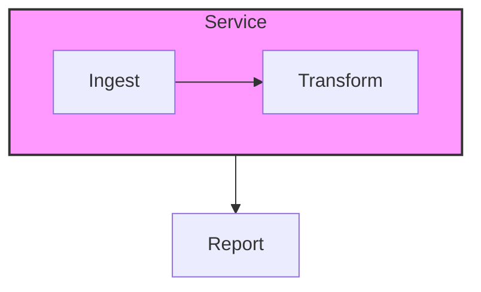
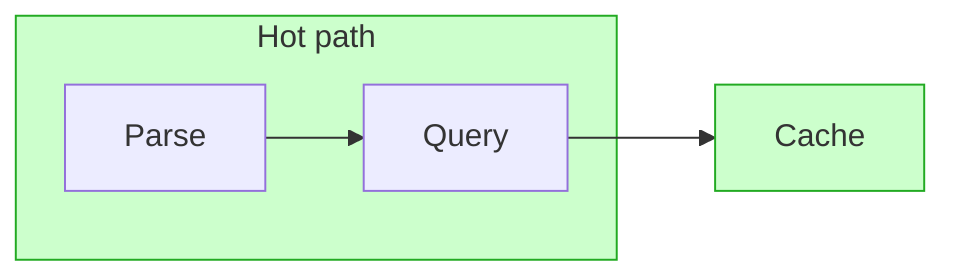
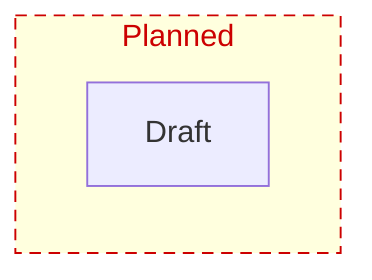
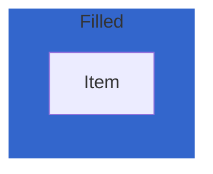
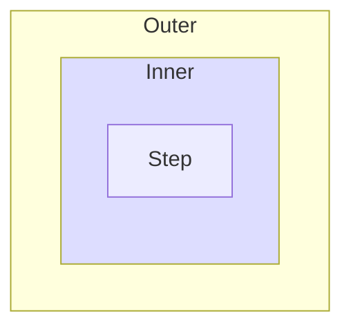
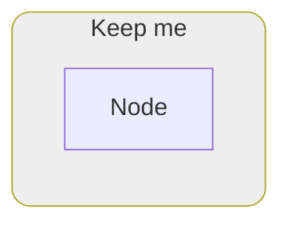

# Subgraph Styling Implementation Plan

> **For agentic workers:** REQUIRED SUB-SKILL: Use superpowers:subagent-driven-development (recommended) or superpowers:executing-plans to implement this plan task-by-task. Steps use checkbox (`- [ ]`) syntax for tracking.

**Goal:** Make `style <subgraphId> …` and `class <subgraphId> …` style the subgraph **container** — parsed into the model, painted as fill/stroke on the canvas, editable in the properties panel, and round-tripped — closing the second half of §3 of `docs/flowchart_diff_gap.md`.

**Architecture:** `DiagramGroup` gains the same `style?: NodeStyle` / `classes?: string[]` pair a `DiagramNode` already carries, because Mermaid's `style`/`classDef` property vocabulary is identical for both. The parser already funnels `style S1 …` / `class S1 hot` into a *phantom node* named `S1` and then deletes that node once it learns `S1` is a subgraph; the fix is to move the parsed style onto the group at that point instead of stringifying it back into `model.extras`. Renderer and serializer then read the group's style the same way they already read a node's.

**Tech Stack:** TypeScript, vitest (jsdom environment for webview specs), esbuild, pnpm, `@vscode/vsce` for packaging.

## Global Constraints

- Work happens in `C:\work\ceasg\extension`, which is the git repo. Trunk-based: commit directly to `main`, one commit per task.
- All shell commands go through the **Bash** tool (Git Bash / POSIX sh), never PowerShell.
- Package manager is **pnpm**. Unit tests: `pnpm run test:unit`. Types: `pnpm run check-types`. Lint: `pnpm run lint`.
- Source style: tabs in `src/core/*.ts`, two spaces in `src/webview/**` and `src/preview/**` — match the file you are editing.
- Comments explain *why*, not *what*, matching the density of the surrounding code. Do not add narration comments to obvious lines.
- Never edit `dist/` — it is a build artifact.
- `NodeStyle` is reused verbatim for groups. Do **not** introduce a parallel `GroupStyle` type.
- `classDef default` must **not** apply to groups (Mermaid applies it to nodes only); explicit classes and the group's own `style` do.

---

## File Structure

| File | Responsibility | Change |
|---|---|---|
| `src/core/model.ts` | `DiagramGroup` shape, style resolution, `cloneModel` | Modify |
| `src/core/model.spec.ts` | Guards every `DiagramGroup` field survives cloning | Modify |
| `src/core/parser.ts` | Phantom-node reconciliation moves style/classes onto the group | Modify |
| `src/core/parser.spec.ts` | Two existing subgraph style/class tests assert the new behaviour | Modify |
| `src/core/serializer.ts` | Emits `style <groupId> …` and includes group ids in `class` lines | Modify |
| `src/core/roundtrip.spec.ts` | Existing subgraph style/class round-trip test | Modify |
| `src/webview/wysiwyg/render.ts` | Paints group fill/stroke/title style; selection overlay rect | Modify |
| `src/webview/wysiwyg/render.spec.ts` | Rendering coverage | Modify |
| `media/diagram.css` | Selection outline moves to its own rect | Modify |
| `src/webview/wysiwyg/properties.ts` | Subgraph panel gains style controls | Modify |
| `src/webview/wysiwyg/properties.spec.ts` | Panel coverage | Modify |
| `docs/flowchart_diff_gap.md` | §3 + matrix reflect the closed gap | Modify |
| `CHANGELOG.md`, `README.md` | Release notes / feature list | Modify |
| `../ceasg-test/subgraph-styling.md` | Manual verification diagrams | Create |

---

### Task 1: Model — group style fields and resolution

**Files:**
- Modify: `src/core/model.ts` (`DiagramGroup` at ~line 133, `resolveNodeStyle` at ~line 247, `cloneModel` at ~line 660)
- Test: `src/core/model.spec.ts` (~line 58)

**Interfaces:**
- Consumes: nothing from earlier tasks.
- Produces:
  - `DiagramGroup.style?: NodeStyle`, `DiagramGroup.classes?: string[]`
  - `export function resolveGroupStyle(model: DiagramModel, group: DiagramGroup): NodeStyle | undefined`
  - `resolveNodeStyle(model, node)` keeps its exact existing signature and behaviour.

- [ ] **Step 1: Write the failing tests**

Add to `src/core/model.spec.ts`. `resolveGroupStyle` must be added to the existing import from `./model` at the top of the file, and `emptyModel` is already imported there.

```ts
describe('resolveGroupStyle', () => {
  it('layers a group class under its own style, ignoring classDef default', () => {
    const m = emptyModel();
    m.classDefs.push({ name: 'default', style: { fillColor: '#eee' } });
    m.classDefs.push({ name: 'hot', style: { fillColor: '#f00', strokeColor: '#900' } });
    m.groups.push({ id: 'S', title: 'S', nodeIds: [], classes: ['hot'], style: { strokeColor: '#00f' } });
    expect(resolveGroupStyle(m, m.groups[0]!)).toEqual({ fillColor: '#f00', strokeColor: '#00f' });
  });

  it('returns undefined for a group with no class and no style', () => {
    const m = emptyModel();
    m.classDefs.push({ name: 'default', style: { fillColor: '#eee' } });
    m.groups.push({ id: 'S', title: 'S', nodeIds: [] });
    expect(resolveGroupStyle(m, m.groups[0]!)).toBeUndefined();
  });
});
```

Then extend the existing `cloneModel round-trips every DiagramGroup field` test (~line 58) so `full` covers the new fields, and assert the arrays are copies rather than shared references:

```ts
  it('cloneModel round-trips every DiagramGroup field', () => {
    // Guard against a future field being added to `DiagramGroup` without
    // cloneModel copying it: undo would then write the loss to the user's file.
    const full: Required<DiagramGroup> = {
      id: 'g1', title: 'T', titleFormat: 'markdown', nodeIds: ['A', 'B'],
      parentId: 'g0', x: 1, y: 2, w: 3, h: 4,
      style: { fillColor: '#f00', extra: ['rx:4'] }, classes: ['hot'],
    };
    const m = emptyModel();
    m.groups.push({
      ...full,
      nodeIds: [...full.nodeIds],
      classes: [...full.classes],
      style: { ...full.style, extra: [...full.style.extra!] },
    });
    const clone = cloneModel(m).groups[0]!;
    expect(clone).toEqual(full);
    // Deep, not shared: mutating the clone must not reach the original.
    clone.classes!.push('cold');
    clone.style!.extra!.push('ry:4');
    expect(m.groups[0]!.classes).toEqual(['hot']);
    expect(m.groups[0]!.style!.extra).toEqual(['rx:4']);
  });
```

- [ ] **Step 2: Run the tests to verify they fail**

Run: `pnpm run test:unit -- src/core/model.spec.ts`
Expected: FAIL — `resolveGroupStyle is not a function`, and the `Required<DiagramGroup>` literal is a type error because `style`/`classes` do not exist on `DiagramGroup`.

- [ ] **Step 3: Add the group style fields**

In `src/core/model.ts`, inside `export interface DiagramGroup`, after the `nodeIds` field:

```ts
	/** Container styling from `style <id> …`, the same property set as a node's. */
	style?: NodeStyle;
	/** classDef names assigned via `class <id> name` — order matters. */
	classes?: string[];
```

- [ ] **Step 4: Extract the layer merge and add `resolveGroupStyle`**

Replace the body of `resolveNodeStyle` (~line 247) so the per-property merge lives in one shared helper, then add the group resolver next to it:

```ts
/** Per-property merge, lowest-precedence layer first. `extra` props are
 *  round-trip-only and never merged. */
function mergeStyleLayers(
	layers: Array<NodeStyle | undefined>,
): NodeStyle | undefined {
	const merged: NodeStyle = {};
	for (const layer of layers) {
		if (!layer) continue;
		if (layer.fillColor !== undefined) merged.fillColor = layer.fillColor;
		if (layer.strokeColor !== undefined) merged.strokeColor = layer.strokeColor;
		if (layer.textColor !== undefined) merged.textColor = layer.textColor;
		if (layer.fontSize !== undefined) merged.fontSize = layer.fontSize;
		if (layer.fontFamily !== undefined) merged.fontFamily = layer.fontFamily;
		if (layer.strokeWidth !== undefined) merged.strokeWidth = layer.strokeWidth;
		if (layer.strokeDasharray !== undefined)
			merged.strokeDasharray = layer.strokeDasharray;
	}
	return Object.keys(merged).length > 0 ? merged : undefined;
}

/**
 * Effective render style for a node. Per-property merge, lowest to highest
 * precedence: theme CSS defaults (returned undefined keeps them) <
 * `classDef default` < the node's classes in assignment order (later class
 * wins per property) < the node's explicit `style` (style line / panel edits).
 * `extra` props are round-trip-only and never merged.
 */
export function resolveNodeStyle(
	model: DiagramModel,
	node: DiagramNode,
): NodeStyle | undefined {
	const byName = new Map(model.classDefs.map((c) => [c.name, c.style]));
	const layers: Array<NodeStyle | undefined> = [byName.get("default")];
	for (const name of node.classes ?? []) layers.push(byName.get(name));
	layers.push(node.style);
	return mergeStyleLayers(layers);
}

/**
 * Effective render style for a subgraph container. Same layering as
 * `resolveNodeStyle` — classes in assignment order, then the group's own
 * `style` — minus `classDef default`, which Mermaid applies to nodes only;
 * inheriting it here would repaint every subgraph box in a diagram that
 * declares one.
 */
export function resolveGroupStyle(
	model: DiagramModel,
	group: DiagramGroup,
): NodeStyle | undefined {
	const byName = new Map(model.classDefs.map((c) => [c.name, c.style]));
	const layers: Array<NodeStyle | undefined> = [];
	for (const name of group.classes ?? []) layers.push(byName.get(name));
	layers.push(group.style);
	return mergeStyleLayers(layers);
}
```

- [ ] **Step 5: Deep-clone the new group fields**

In `cloneModel` (~line 680), replace the `groups:` line with:

```ts
		// Spread rather than list fields: a hand-written list silently drops any
		// field added to `DiagramGroup` later, and a dropped field is written
		// back to the user's file on the next undo. The nested containers still
		// need explicit copies so an edit to the clone cannot reach the original.
		groups: model.groups.map((g) => ({
			...g,
			nodeIds: [...g.nodeIds],
			style: g.style
				? { ...g.style, extra: g.style.extra ? [...g.style.extra] : undefined }
				: undefined,
			classes: g.classes ? [...g.classes] : undefined,
		})),
```

- [ ] **Step 6: Run the tests to verify they pass**

Run: `pnpm run test:unit -- src/core/model.spec.ts`
Expected: PASS.

Then the full suite plus types, since `resolveNodeStyle` was touched:
Run: `pnpm run test:unit && pnpm run check-types && pnpm run lint`
Expected: all PASS, no type or lint errors.

- [ ] **Step 7: Commit**

```bash
git add src/core/model.ts src/core/model.spec.ts
git commit -m "feat(core): model subgraph container style and classes"
```

---

### Task 2: Parser — move style/classes onto the group

**Files:**
- Modify: `src/core/parser.ts` (`rawStyleProps` declaration ~line 444, style branch ~line 613, reconciliation ~line 743)
- Test: `src/core/parser.spec.ts` (~lines 138-159)

**Interfaces:**
- Consumes: `DiagramGroup.style` / `DiagramGroup.classes` from Task 1.
- Produces: after `mermaidToModel`, a subgraph named by a `style`/`class` line carries the parsed style on its `DiagramGroup`; nothing is pushed to `model.extras` for it.

- [ ] **Step 1: Rewrite the two failing tests**

In `src/core/parser.spec.ts`, replace the comment and the two tests at ~lines 138-159 with:

```ts
  // `style S1 ...` / `class S1 hot` is how Mermaid styles a subgraph. Both route
  // through `ensureNode` into a placeholder node; reconciliation must move what
  // they parsed onto the group rather than losing it with the placeholder.
  it('applies a style line targeting a subgraph id to the group', () => {
    const { model } = mermaidToModel(
      'flowchart TB\nsubgraph S1\nA-->B\nend\nS1 --> D\nstyle S1 fill:#f00\n',
    );
    expect(model.nodes.find((n) => n.id === 'S1')).toBeUndefined();
    expect(model.groups.find((g) => g.id === 'S1')!.style).toEqual({ fillColor: '#f00' });
    expect(model.extras.join('\n')).not.toContain('style S1');
  });

  it('applies a style line written before its subgraph block', () => {
    const { model } = mermaidToModel(
      'flowchart TB\nstyle S1 fill:#f00\nsubgraph S1\nA-->B\nend\n',
    );
    expect(model.groups.find((g) => g.id === 'S1')!.style).toEqual({ fillColor: '#f00' });
  });

  it('applies a class assignment targeting a subgraph id to the group', () => {
    const { model } = mermaidToModel(
      'flowchart TB\nsubgraph S1\nA-->B\nend\nS1 --> D\nclassDef hot fill:#f00\nclass A,S1 hot\n',
    );
    expect(model.nodes.find((n) => n.id === 'S1')).toBeUndefined();
    expect(model.groups.find((g) => g.id === 'S1')!.classes).toEqual(['hot']);
    expect(model.nodes.find((n) => n.id === 'A')!.classes).toEqual(['hot']);
    expect(model.extras.filter((e) => e.startsWith('class '))).toEqual([]);
  });

  it('keeps unrecognised style props on a subgraph for round-trip', () => {
    const { model } = mermaidToModel(
      'flowchart TB\nsubgraph S1\nA\nend\nstyle S1 fill:#f00,rx:8\n',
    );
    expect(model.groups.find((g) => g.id === 'S1')!.style).toEqual({
      fillColor: '#f00', extra: ['rx:8'],
    });
  });
```

- [ ] **Step 2: Run the tests to verify they fail**

Run: `pnpm run test:unit -- src/core/parser.spec.ts`
Expected: FAIL — `model.groups.find(...)!.style` is `undefined`, and the extras assertions fail because the lines are still stringified into `extras`.

- [ ] **Step 3: Delete the raw-style bookkeeping**

In `src/core/parser.ts`, delete the `rawStyleProps` declaration and its comment (~lines 441-444):

```ts
	// Raw `style <id> <props>` text per id. `style S1 fill:#f00` is how Mermaid
	// styles a *subgraph*, and we only learn that `S1` names a group after the
	// whole document is read — see the reconciliation pass at the end.
	const rawStyleProps = new Map<string, string[]>();
```

and, in the `style <id> …` branch (~line 613), drop the two lines that fed it, leaving:

```ts
		// `style <id> prop:val,...` — fold into the node's style.
		const styleMatch = trimmed.match(/^style\s+([A-Za-z0-9_]+)\s+(.+)$/i);
		if (styleMatch && styleMatch[1] && styleMatch[2]) {
			const node = ensureNode({ id: styleMatch[1] });
			applyStyleProps(node, styleMatch[2]);
			continue;
		}
```

- [ ] **Step 4: Transfer style and classes in the reconciliation pass**

In the reconciliation block (~line 743), replace the `for (const phantom …)` loop and its comment with:

```ts
	const groupIds = new Set(model.groups.map((g) => g.id));
	const groupById = new Map(model.groups.map((g) => [g.id, g]));
	for (const phantom of model.nodes.filter((n) => groupIds.has(n.id))) {
		// `style S1 ...` and `class S1 hot` are how Mermaid styles a subgraph, and
		// both routed through `ensureNode` into this placeholder. Move what they
		// parsed onto the group, so the container is styled instead of the styling
		// being lost with the placeholder this pass removes.
		const group = groupById.get(phantom.id);
		if (!group) continue;
		if (phantom.style) group.style = phantom.style;
		if (phantom.classes) group.classes = phantom.classes;
	}
```

Leave the surrounding lines (`model.nodes = model.nodes.filter(…)`, the `nodeMap.delete` loop, the `group.nodeIds` filter) exactly as they are. Update the block comment immediately above `const groupIds` only if it still claims styling is unmodelled.

- [ ] **Step 5: Run the tests to verify they pass**

Run: `pnpm run test:unit -- src/core/parser.spec.ts`
Expected: PASS.

Run: `pnpm run test:unit`
Expected: `src/core/roundtrip.spec.ts` now fails its `keeps style and class lines that target the subgraph id` test — that is Task 3's job. Every other file passes. If anything else fails, fix it before committing.

- [ ] **Step 6: Commit**

```bash
git add src/core/parser.ts src/core/parser.spec.ts
git commit -m "feat(core): parse subgraph style and class lines onto the group"
```

---

### Task 3: Serializer — emit group style and class lines

**Files:**
- Modify: `src/core/serializer.ts` (`styleLine` ~line 128, `classLines` ~line 141, `modelToMermaid` ~line 295)
- Test: `src/core/roundtrip.spec.ts` (~line 135)

**Interfaces:**
- Consumes: `DiagramGroup.style` / `.classes` from Task 1, populated by Task 2.
- Produces: `modelToMermaid` emits `style <groupId> <props>` after the node style lines, and lists group ids alongside node ids in `class <ids> <name>`.

- [ ] **Step 1: Rewrite the failing round-trip test**

In `src/core/roundtrip.spec.ts`, replace the test at ~line 135 with:

```ts
  it('applies style and class lines that target the subgraph id to the group', () => {
    const src =
      'flowchart TB\n    subgraph S1 [Pipeline]\n        A[Ingest]\n    end\n    S1 --> D[Report]\n    classDef hot fill:#f00\n    class A,S1 hot\n    style S1 stroke:#00f\n';
    const out = roundtrip(src);
    expect(out).toContain('style S1 stroke:#00f');
    // Node and group ids share one grouped assignment, emitted exactly once.
    expect(out).toContain('class A,S1 hot');
    expect(out.match(/^\s*class /gm)!.length).toBe(1);
    expect(roundtrip(out)).toBe(out);
  });

  it('round-trips a subgraph style whose props ceasg does not model', () => {
    const src = 'flowchart TB\n    subgraph S1 [Pipeline]\n        A[Ingest]\n    end\n    style S1 fill:#f9f,rx:8\n';
    const out = roundtrip(src);
    expect(out).toContain('style S1 fill:#f9f,rx:8');
    expect(roundtrip(out)).toBe(out);
  });
```

- [ ] **Step 2: Run the tests to verify they fail**

Run: `pnpm run test:unit -- src/core/roundtrip.spec.ts`
Expected: FAIL — the output contains neither `style S1 …` nor `S1` in the class line, because the serializer only walks `model.nodes`.

- [ ] **Step 3: Make `styleLine` id-and-style based**

In `src/core/serializer.ts`, replace `styleLine` (~line 128) with:

```ts
/** A `style <id> …` line for any styled target — a node or a subgraph. */
function styleLine(id: string, style: NodeStyle | undefined): string | null {
	if (!hasStyle(style) || !style) return null;
	const props = stylePropsToString(style);
	if (!props) return null;
	return `style ${sanitizeId(id)} ${props}`;
}
```

- [ ] **Step 4: Include groups in the class-assignment grouping**

In `classLines` (~line 148), after the loop that collects node ids into `members`, add:

```ts
	// A subgraph id stands wherever a node id does in a `class` assignment.
	for (const group of model.groups) {
		for (const name of group.classes ?? []) {
			const list = members.get(name) ?? [];
			list.push(sanitizeId(group.id));
			members.set(name, list);
		}
	}
```

- [ ] **Step 5: Emit both node and group style lines**

In `modelToMermaid` (~line 295), replace the node style loop with:

```ts
	for (const node of model.nodes) {
		const sl = styleLine(node.id, node.style);
		if (sl) lines.push(INDENT + sl);
	}

	for (const group of model.groups) {
		const sl = styleLine(group.id, group.style);
		if (sl) lines.push(INDENT + sl);
	}
```

- [ ] **Step 6: Run the tests to verify they pass**

Run: `pnpm run test:unit && pnpm run check-types && pnpm run lint`
Expected: all PASS.

- [ ] **Step 7: Commit**

```bash
git add src/core/serializer.ts src/core/roundtrip.spec.ts
git commit -m "feat(core): serialize subgraph style and class assignments"
```

---

### Task 4: Renderer — paint the container, and keep selection visible

**Files:**
- Modify: `src/webview/wysiwyg/render.ts` (`renderGroup` ~line 159)
- Modify: `media/diagram.css` (~lines 27-43)
- Test: `src/webview/wysiwyg/render.spec.ts`

**Interfaces:**
- Consumes: `resolveGroupStyle` from Task 1 (import it from `'../../core'` alongside the existing named imports on line 1).
- Produces: each `.ceasg-group` `<g>` contains, in order, `rect.ceasg-group-box`, `rect.ceasg-group-selbox`, `text.ceasg-group-title`. Selection is signalled by the `ceasg-group-selected` class on the `<g>`, unchanged — only which rect draws the outline moves.

- [ ] **Step 1: Write the failing tests**

Add to `src/webview/wysiwyg/render.spec.ts`, inside the existing `describe('renderDiagram', …)` block. `place` is the helper the file already uses to give nodes coordinates — reuse it exactly as the neighbouring subgraph-title tests do.

```ts
  it('paints a subgraph fill and stroke from a style line', () => {
    const { model } = mermaidToModel(
      'flowchart LR\nsubgraph S[Svc]\nA\nend\nstyle S fill:#ff0000,stroke:#0000ff,stroke-width:3px,stroke-dasharray:6 4\n',
    );
    place(model);
    const box = renderDiagram(model).refs.groupEls.get('S')!
      .querySelector('.ceasg-group-box') as SVGElement;
    expect(box.style.fill).toBe('rgb(255, 0, 0)');
    expect(box.style.stroke).toBe('rgb(0, 0, 255)');
    expect(box.style.strokeWidth).toBe('3');
    expect(box.style.strokeDasharray).toBe('6 4');
  });

  it('paints a subgraph style that comes from a classDef', () => {
    const { model } = mermaidToModel(
      'flowchart LR\nsubgraph S[Svc]\nA\nend\nclassDef hot fill:#00ff00\nclass S hot\n',
    );
    place(model);
    const box = renderDiagram(model).refs.groupEls.get('S')!
      .querySelector('.ceasg-group-box') as SVGElement;
    expect(box.style.fill).toBe('rgb(0, 255, 0)');
  });

  it('colours the subgraph title from the style color prop', () => {
    const { model } = mermaidToModel(
      'flowchart LR\nsubgraph S[Svc]\nA\nend\nstyle S color:#ff0000\n',
    );
    place(model);
    const title = renderDiagram(model).refs.groupEls.get('S')!
      .querySelector('.ceasg-group-title') as SVGElement;
    expect(title.style.fill).toBe('rgb(255, 0, 0)');
  });

  // The box carries its inline fill/stroke, which beats any stylesheet rule, so
  // the selection outline has to live on a rect of its own to stay visible.
  it('gives every subgraph a separate selection rect matching the box', () => {
    const { model } = mermaidToModel('flowchart LR\nsubgraph S[Svc]\nA\nend\n');
    place(model);
    const gEl = renderDiagram(model).refs.groupEls.get('S')!;
    const box = gEl.querySelector('.ceasg-group-box')!;
    const sel = gEl.querySelector('.ceasg-group-selbox')!;
    expect(sel).toBeTruthy();
    for (const attr of ['x', 'y', 'width', 'height']) {
      expect(sel.getAttribute(attr)).toBe(box.getAttribute(attr));
    }
  });
```

If `place` does not exist in that spec file under that name, use whatever helper the existing `renders a markdown subgraph title as styled runs` test uses to position nodes — do not invent a new one.

- [ ] **Step 2: Run the tests to verify they fail**

Run: `pnpm run test:unit -- src/webview/wysiwyg/render.spec.ts`
Expected: FAIL — `box.style.fill` is `''` and `.ceasg-group-selbox` is `null`.

- [ ] **Step 3: Rewrite `renderGroup`**

In `src/webview/wysiwyg/render.ts`, add `resolveGroupStyle` to the named import from `'../../core'` on line 1, then replace `renderGroup` (~line 159) with:

```ts
/** Box geometry is shared by the painted box and the selection outline drawn
 *  over it, so they can never drift apart. */
function groupRect(cls: string, b: { x: number; y: number; w: number; h: number }): SVGRectElement {
  const rect = el('rect');
  rect.setAttribute('class', cls);
  rect.setAttribute('x', String(b.x));
  rect.setAttribute('y', String(b.y));
  rect.setAttribute('width', String(b.w));
  rect.setAttribute('height', String(b.h));
  rect.setAttribute('rx', '6');
  return rect;
}

function renderGroup(model: DiagramModel, group: DiagramGroup): SVGGElement {
  const g = el('g');
  g.setAttribute('class', 'ceasg-group');
  g.setAttribute('data-group-id', group.id);
  const b = groupBounds(model, group);
  const style = resolveGroupStyle(model, group);
  const rect = groupRect('ceasg-group-box', b);
  // Inline style beats the `.ceasg-group-box` stylesheet rule; a presentation
  // attribute would be overridden by it, so per-group styling must use style.
  if (style?.fillColor) { rect.style.fill = style.fillColor; }
  if (style?.strokeColor) { rect.style.stroke = style.strokeColor; }
  if (style?.strokeWidth) { rect.style.strokeWidth = String(style.strokeWidth); }
  if (style?.strokeDasharray) { rect.style.strokeDasharray = style.strokeDasharray; }
  g.appendChild(rect);
  // Selection draws on its own rect above the box: the inline stroke set just
  // above would otherwise win over the `.ceasg-group-selected` rule and leave a
  // styled subgraph with no visible selection.
  g.appendChild(groupRect('ceasg-group-selbox', b));
  const title = el('text');
  title.setAttribute('class', 'ceasg-group-title');
  title.setAttribute('x', String(b.x + 10));
  title.setAttribute('y', String(b.y + 16));
  const titleSize = style?.fontSize ?? GROUP_TITLE_FONT_SIZE;
  if (style?.textColor) { title.style.fill = style.textColor; }
  if (style?.fontSize) { title.style.fontSize = `${style.fontSize}px`; }
  if (style?.fontFamily) { title.style.fontFamily = style.fontFamily; }
  // The box is sized from its members, not the title, so there is no reserved
  // space for a wrapped second line — an overlong title must overflow
  // sideways rather than wrap down into the member nodes below it. Passing no
  // wrapWidth would NOT achieve that: layoutLabel defaults an unset wrapWidth
  // to DEFAULT_WRAP_WIDTH (200px) whenever markdown is on, so a markdown title
  // longer than ~200px would wrap. Infinity opts out of wrapping entirely,
  // matching the plain (non-markdown) title, which never wrapped either.
  const lines = layoutLabel(group.title, {
    markdown: group.titleFormat === 'markdown', fontSize: titleSize, wrapWidth: Infinity,
  }).lines;
  paintLabelLines(title, lines, b.x + 10, titleSize);
  g.appendChild(title);
  return g;
}
```

- [ ] **Step 4: Move the selection outline in CSS**

In `media/diagram.css`, replace the `.ceasg-group-selected .ceasg-group-box` rule (~line 40) with:

```css
/* The selection outline lives on its own rect: render.ts writes a subgraph's
   fill/stroke inline on .ceasg-group-box, and an inline style beats any
   stylesheet rule, so a styled subgraph would show no selection otherwise. */
.ceasg-group-selbox { fill: none; stroke: none; pointer-events: none; }
.ceasg-group-selected .ceasg-group-selbox {
  stroke: var(--vscode-focusBorder, #007fd4);
  stroke-width: 2px;
}
```

Leave `.ceasg-group-box` and `.ceasg-group .ceasg-group-box { pointer-events: all; }` untouched — hit testing is geometric, but the box keeps its pointer-events for the DOM path.

- [ ] **Step 5: Run the tests to verify they pass**

Run: `pnpm run test:unit -- src/webview/wysiwyg/render.spec.ts`
Expected: PASS.

Run: `pnpm run test:unit && pnpm run check-types && pnpm run lint`
Expected: all PASS. `src/preview/flowchartPreview.ts` shares this renderer, so the Markdown preview picks the styling up with no change — confirm `flowchartPreview.spec.ts` still passes rather than editing it.

- [ ] **Step 6: Commit**

```bash
git add src/webview/wysiwyg/render.ts src/webview/wysiwyg/render.spec.ts media/diagram.css
git commit -m "feat(wysiwyg): paint subgraph container fill, stroke and title style"
```

---

### Task 5: Properties panel — subgraph style controls

**Files:**
- Modify: `src/webview/wysiwyg/properties.ts` (constants ~line 18, `groupPanel` ~line 244)
- Test: `src/webview/wysiwyg/properties.spec.ts`

**Interfaces:**
- Consumes: `DiagramGroup.style` from Task 1.
- Produces: the subgraph panel renders rows labelled `Fill`, `Border`, `Title color`, `Border width`, `Border dash` between the existing `Title format` row and the `N member nodes` hint.

- [ ] **Step 1: Write the failing tests**

Add to `src/webview/wysiwyg/properties.spec.ts`. The file's `rowControl` helper returns a `<select>`; add a colour-input sibling helper next to it if one does not already exist:

```ts
/** Locates a colour/number input by its row's label text. */
function rowInput(host: HTMLElement, label: string): HTMLInputElement {
  const rows = Array.from(host.querySelectorAll('.ceasg-panel-row'));
  const row = rows.find((r) => r.querySelector('span')?.textContent === label);
  if (!row) { throw new Error(`no row labelled "${label}"`); }
  return row.querySelector('input') as HTMLInputElement;
}
```

```ts
describe('PropertiesPanel subgraph style controls', () => {
  function groupModel() {
    const model = emptyModel();
    model.nodes.push({ id: 'A', label: 'A', shape: 'rect', x: 0, y: 0 });
    model.groups.push({ id: 'S', title: 'Svc', nodeIds: ['A'] });
    return model;
  }

  it('writes the picked fill onto the group style', () => {
    const model = groupModel();
    const { host } = make(model);
    const sel = new SelectionState(); sel.select('S');
    // The panel is refreshed through the same entry point the editor uses.
    new PropertiesPanel(host, { getModel: () => model, mutate: (fn: (m: DiagramModel) => void) => fn(model) } as unknown as WysiwygEditor).refresh(sel);

    const fill = rowInput(host, 'Fill');
    fill.value = '#ff0000';
    fill.dispatchEvent(new Event('input'));
    expect(model.groups[0]!.style?.fillColor).toBe('#ff0000');
  });

  it('writes border width and dash onto the group style', () => {
    const model = groupModel();
    const host = document.createElement('div');
    const panel = new PropertiesPanel(host, { getModel: () => model, mutate: (fn: (m: DiagramModel) => void) => fn(model) } as unknown as WysiwygEditor);
    const sel = new SelectionState(); sel.select('S');
    panel.refresh(sel);

    const width = rowInput(host, 'Border width');
    width.value = '4';
    width.dispatchEvent(new Event('input'));
    expect(model.groups[0]!.style?.strokeWidth).toBe(4);

    const dash = rowControl(host, 'Border dash');
    pick(dash, 'Dashed');
    expect(model.groups[0]!.style?.strokeDasharray).toBe('6 4');
  });
});
```

Simplify the first test to use the file's existing `make(model)` harness if it already returns a usable panel — prefer the established harness over constructing `PropertiesPanel` inline, and keep only one construction style across both tests.

- [ ] **Step 2: Run the tests to verify they fail**

Run: `pnpm run test:unit -- src/webview/wysiwyg/properties.spec.ts`
Expected: FAIL — `no row labelled "Fill"`.

- [ ] **Step 3: Add the default-stroke constant**

In `src/webview/wysiwyg/properties.ts`, next to `DEFAULT_NODE_STROKE_W` (~line 18):

```ts
const DEFAULT_GROUP_STROKE_W = 1;   // .ceasg-group-box stroke-width
```

- [ ] **Step 4: Add the controls to `groupPanel`**

In `groupPanel`, immediately after the `Title format` row and before the `${group().nodeIds.length} member nodes` hint:

```ts
    const setStyle = (patch: Partial<NodeStyle>) => this.editor.mutate((m) => {
      const g = m.groups.find((g) => g.id === id)!; g.style = { ...g.style, ...patch };
    }, { commit: true });

    const mkColor = (current: string | undefined, apply: (v: string) => Partial<NodeStyle>) => {
      const c = document.createElement('input'); c.type = 'color'; c.value = current ?? '#888888';
      c.addEventListener('input', () => setStyle(apply(c.value)));
      return c;
    };
    this.host.appendChild(this.row('Fill', mkColor(group().style?.fillColor, (v) => ({ fillColor: v }))));
    this.host.appendChild(this.row('Border', mkColor(group().style?.strokeColor, (v) => ({ strokeColor: v }))));
    this.host.appendChild(this.row('Title color', mkColor(group().style?.textColor, (v) => ({ textColor: v }))));
    this.host.appendChild(this.row('Border width',
      this.numberInput(group().style?.strokeWidth, DEFAULT_GROUP_STROKE_W, '0', '0.5', (v) => setStyle({ strokeWidth: v }))));
    this.host.appendChild(this.row('Border dash',
      this.presetSelect(DASH_PRESETS, group().style?.strokeDasharray ?? '', (v) => setStyle({ strokeDasharray: v || undefined }))));
```

`NodeStyle` is already imported at the top of the file; no import change is needed.

- [ ] **Step 5: Run the tests to verify they pass**

Run: `pnpm run test:unit && pnpm run check-types && pnpm run lint`
Expected: all PASS.

- [ ] **Step 6: Commit**

```bash
git add src/webview/wysiwyg/properties.ts src/webview/wysiwyg/properties.spec.ts
git commit -m "feat(wysiwyg): add fill, border and title colour controls to the subgraph panel"
```

---

### Task 6: Docs, test diagram, and vsix

**Files:**
- Create: `../ceasg-test/subgraph-styling.md`
- Modify: `docs/flowchart_diff_gap.md` (§3 ~lines 78-103, matrix rows ~lines 482-483)
- Modify: `CHANGELOG.md`, `README.md`

**Interfaces:**
- Consumes: everything from Tasks 1-5.
- Produces: an installable `.vsix` in `extension/`.

- [ ] **Step 1: Write the manual test diagram**

Create `C:\work\ceasg\ceasg-test\subgraph-styling.md`. Follow the house style of `ceasg-test/markdown-labels.md`: an H1, a short intro saying what to check, then an H2 per case with one sentence of expectation above each fenced `mermaid` block. No `%% mermaid-flow:pos` comments — let the editor lay these out and write its own on first save.

```markdown
# Subgraph styling

Check each block in the Markdown preview **and** in the visual editor — they
share one renderer, so the two should agree. Then select a subgraph in the
visual editor and confirm the properties panel shows Fill, Border, Title
colour, Border width and Border dash, that changing them repaints the box
live, and that saving writes a `style <id> …` line back into the Markdown.

## A `style` line on a subgraph

The `Service` box is pink with a dark blue border; its member nodes keep the
default node styling.



## A `classDef` shared by a node and a subgraph

`Cache` and the `Hot path` box are both green — one `class` line assigns the
same classDef to a node id and a subgraph id.



## Border dash and title colour

The `Planned` box has a dashed border and a red title; the box fill stays the
canvas default.



## Selection stays visible on a styled subgraph

Click the `Filled` box in the visual editor: the focus outline must be visible
on top of the solid fill, not swallowed by it.



## Nested subgraphs style independently

The outer box is yellow and the inner box is blue — the inner style does not
leak outward and the outer does not repaint the inner.



## An unmodelled style prop survives a save

`rx:12` is not a property ceasg models. Open this in the visual editor, move a
node, save, and confirm `rx:12` is still on the `style` line.


```

- [ ] **Step 2: Update the gap analysis**

In `docs/flowchart_diff_gap.md`, rewrite §3 so it reflects that both halves are now supported. Keep the section number and its position — the file is ordered by priority and renumbering would invalidate every cross-reference. Replace the `**Our editor supports:**` and `**Gap / consequence:**` bodies (~lines 84-93) with wording along these lines, adjusted to what actually shipped:

- Our editor supports: a subgraph id as an edge endpoint, and `style <subgraphId> …` / `class <subgraphId> …` styling the container — fill, stroke, stroke width, dash and title colour render on the canvas and in the Markdown preview, and the subgraph properties panel edits all of them.
- Remaining gap: `classDef default` is not inherited by subgraph containers (Mermaid applies it to nodes); `font-size`/`font-family` on a subgraph style the title only and have no panel control, though they round-trip.

Then update the two `| 3 |` rows in the quick reference matrix (~lines 482-483) to `✅` for Parsed / Rendered / Editable / Round-trips, keeping the `⚠️` only where the remaining gap above genuinely applies. Also fix the ordering note in the file header if it still describes §3 as a gap.

Verify no other section of that document still claims subgraph styling is unsupported:

```bash
grep -n -i "subgraph" docs/flowchart_diff_gap.md
```

- [ ] **Step 3: Update the changelog and README**

Add a new `## [0.9.0] - 2026-08-12` section at the top of `CHANGELOG.md` (immediately under the "Check [Keep a Changelog]" line), matching the voice of the 0.8.0 entry — user-facing outcome first, mechanism only where it changes what the user should expect:

```markdown
## [0.9.0] - 2026-08-12

### Added
- **Subgraph styling.** `style Svc fill:#f9f,stroke:#333` and `class Svc hot` now paint the subgraph *container* — fill, border colour, border width, dash pattern and title colour all render on the canvas and in the Markdown preview, instead of quietly creating a stray node named `Svc`. The subgraph properties panel gained Fill, Border, Title colour, Border width and Border dash controls, so a container can be styled from the visual editor and saved back as a Mermaid `style` line.
```

Bump `"version"` in `package.json` to `0.9.0`.

In `README.md`, extend the **Subgraphs** bullet (line 14) so it mentions styling the container — one clause, same sentence shape as the rest of the bullet.

- [ ] **Step 4: Run the full check**

Run: `pnpm run test:unit && pnpm run check-types && pnpm run lint`
Expected: all PASS. Do not proceed to packaging with a failing check.

- [ ] **Step 5: Commit the docs and test diagram**

```bash
git add ../ceasg-test/subgraph-styling.md docs/flowchart_diff_gap.md CHANGELOG.md README.md package.json docs/superpowers/plans/2026-08-12-subgraph-styling.md
git commit -m "docs: close the subgraph styling gap; release 0.9.0"
```

Note `../ceasg-test/` is outside the extension repo — if `git add` rejects it as outside the repository, that folder is untracked scratch space; create the file anyway and drop it from the `git add` list.

- [ ] **Step 6: Build the vsix**

```bash
pnpm run package && npx @vscode/vsce package --no-dependencies
```
Expected: `ceasg-0.9.0.vsix` written into `extension/`. Confirm with `ls -1 *.vsix`.

If `vsce` complains about `pnpm` and lockfiles, re-run with the flag it names rather than switching package managers.

- [ ] **Step 7: Report the install command**

Tell the user:

```
cd extension && code --install-extension ceasg-0.9.0.vsix
```

and point them at `ceasg-test/subgraph-styling.md` for verification.

---

## Self-Review

**Spec coverage:** §3's two halves — subgraph-as-edge-endpoint (pre-existing, verified in Task 2/3 tests) and subgraph styling (Tasks 1-5). Model ✅ T1, parse ✅ T2, serialize ✅ T3, render ✅ T4, edit ✅ T5, docs + manual diagram + vsix ✅ T6.

**Placeholder scan:** every code step carries real code; the two soft spots are deliberate and bounded — Task 4 Step 1's fallback if `place` is named differently, and Task 6 Step 2's doc wording, which must describe what actually shipped rather than be transcribed blind.

**Type consistency:** `resolveGroupStyle(model, group)` returns `NodeStyle | undefined` (T1) and is consumed with exactly that signature in T4. `styleLine(id, style)` is redefined once in T3 and both its call sites are updated in the same step. `DEFAULT_GROUP_STROKE_W` is declared and used only in T5. `mergeStyleLayers` is private to `model.ts` and never referenced outside it.
