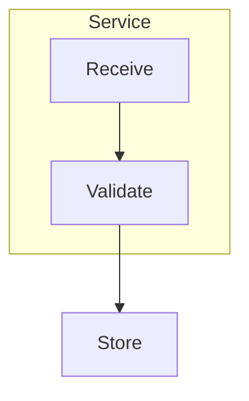
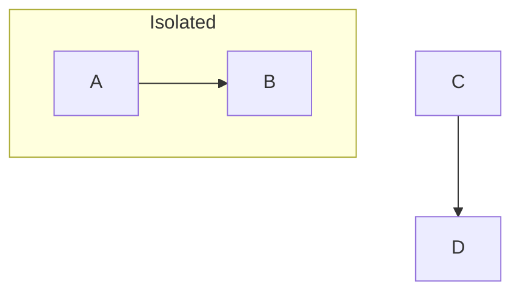
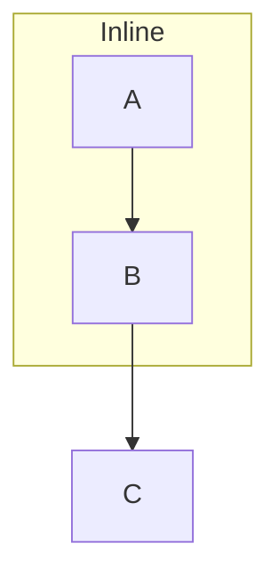
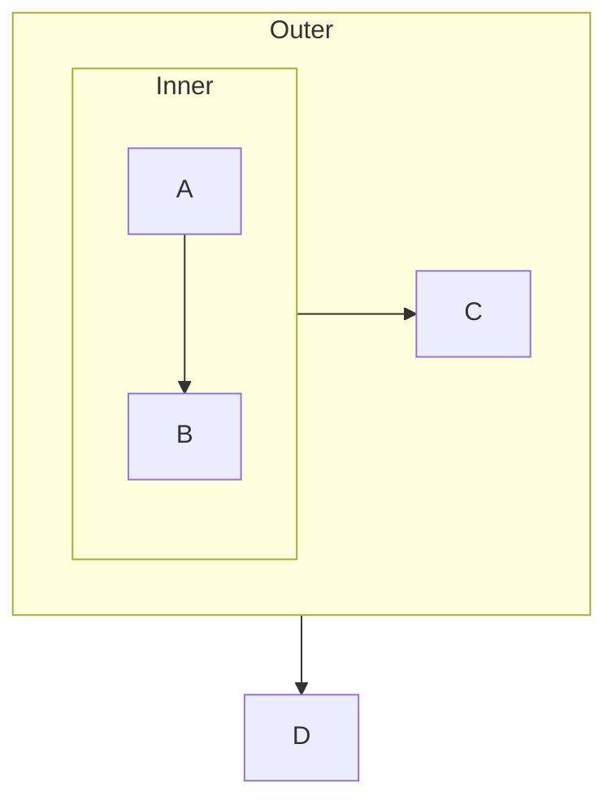
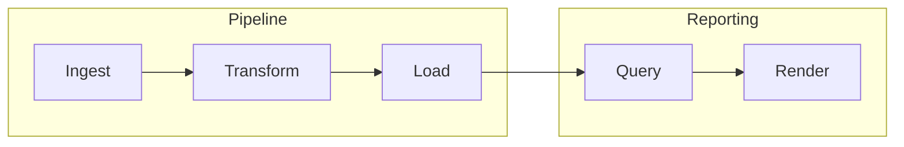
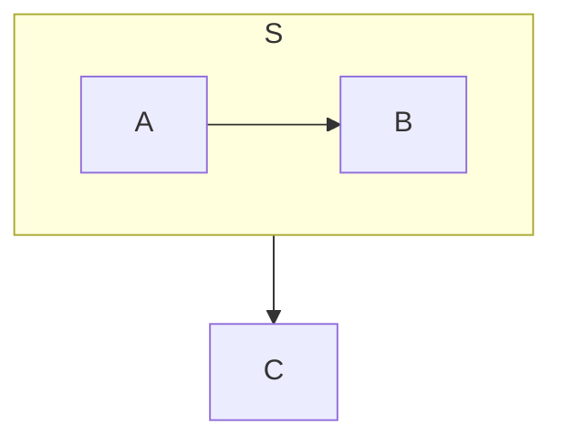

# Per-Subgraph Direction Implementation Plan

> **For agentic workers:** REQUIRED SUB-SKILL: Use superpowers:subagent-driven-development (recommended) or superpowers:executing-plans to implement this plan task-by-task. Steps use checkbox (`- [ ]`) syntax for tracking.

**Goal:** Make a `direction` line inside a `subgraph` actually lay out that subgraph's members, settable from the properties panel, matching Mermaid's own three-branch cluster layout.

**Architecture:** Add `DiagramGroup.direction` (set only when explicitly authored or chosen in the UI) and `DiagramConfig.inheritDir`. Replace `layout.ts`'s single compound-dagre call with a recursive engine in a new `core/clusterLayout.ts` that classifies each subgraph into one of Mermaid's three branches and lays collapsed clusters out bottom-up in their own dagre graphs. When every subgraph classifies FLAT the engine degenerates to exactly today's single graph, so existing diagrams are unchanged by construction.

**Tech Stack:** TypeScript, `@dagrejs/dagre`, vitest, esbuild, VS Code extension API.

**Spec:** `docs/superpowers/specs/2026-08-13-per-subgraph-direction-design.md`

## Global Constraints

- All commands run from `C:\work\ceasg\extension` unless stated otherwise. This is the git repo; trunk-based, commit directly to `main`.
- Shell is Git Bash (POSIX sh). Use `<<'EOF'` heredocs for multi-line commit messages, never PowerShell quoting.
- Unit tests: `pnpm run test:unit` (vitest). Single file: `pnpm exec vitest run src/core/parser.spec.ts`.
- Type check: `pnpm run check-types` (checks both `tsconfig.json` and `tsconfig.webview.json`). Lint: `pnpm run lint` (0 errors; warnings tolerated).
- Source style: tabs in `src/core/**`, two spaces in `src/webview/**`. Match the file you are editing — do not reformat surrounding code.
- `Direction` is `"TB" | "BT" | "LR" | "RL"` (`src/core/model.ts:19`). `TD` is not a member; normalize `TD → TB` at every parse boundary.
- **Never persist a computed direction.** Only an authored `direction` line or an explicit UI choice may set `group.direction`. See Task 4's Branch 2.
- Do NOT write a dated version heading in `CHANGELOG.md` until Task 9. Until then, changes go under `## [Unreleased]`.

---

### Task 1: Model fields

**Files:**
- Modify: `src/core/model.ts` (`DiagramGroup` ~line 133, `DiagramConfig` ~line 156, `hasConfig` ~line 165)
- Test: `src/core/model.spec.ts`

**Interfaces:**
- Consumes: nothing.
- Produces: `DiagramGroup.direction?: Direction`, `DiagramConfig.inheritDir?: boolean`. Every later task depends on these two fields.

- [ ] **Step 1: Write the failing test**

Append to `src/core/model.spec.ts`:

```ts
describe('per-subgraph direction model', () => {
  it('carries group.direction and config.inheritDir through cloneModel', () => {
    const m = emptyModel('TB');
    m.groups.push({ id: 'S', title: 'S', nodeIds: ['A'], direction: 'LR' });
    m.config.inheritDir = true;
    const c = cloneModel(m);
    expect(c.groups[0]!.direction).toBe('LR');
    expect(c.config.inheritDir).toBe(true);
    // The clone must be independent, not a shared reference.
    c.groups[0]!.direction = 'RL';
    expect(m.groups[0]!.direction).toBe('LR');
  });

  it('hasConfig reports true when only inheritDir is set', () => {
    expect(hasConfig({ inheritDir: true })).toBe(true);
    expect(hasConfig({})).toBe(false);
  });
});
```

Make sure `cloneModel` and `hasConfig` are in that file's import list from `./model`.

- [ ] **Step 2: Run test to verify it fails**

Run: `pnpm exec vitest run src/core/model.spec.ts`
Expected: FAIL — TypeScript rejects `direction` on the group literal and `inheritDir` on the config.

- [ ] **Step 3: Write minimal implementation**

In `DiagramGroup` (after `titleFormat`):

```ts
	/** `direction X` written inside this subgraph. Undefined means the author
	 *  wrote no direction line — layout then picks one per Mermaid's branch
	 *  rules (see clusterLayout.ts), and nothing is serialized back. Mirrors
	 *  Mermaid's own `hasExplicitDir`: only an authored line or an explicit UI
	 *  choice sets this, never a computed layout direction. */
	direction?: Direction;
```

In `DiagramConfig` (after `rankSpacing`):

```ts
	/** Mermaid `flowchart.inheritDir`: a subgraph with no direction line takes
	 *  the diagram's direction instead of flipping perpendicular to its parent. */
	inheritDir?: boolean;
```

In `hasConfig`, add to the `||` chain:

```ts
		cfg.inheritDir !== undefined ||
```

`cloneModel` already spreads group fields (`model.ts:709`), so it needs no change — the test proves it.

- [ ] **Step 4: Run tests**

Run: `pnpm exec vitest run src/core/model.spec.ts && pnpm run check-types`
Expected: PASS, no type errors.

- [ ] **Step 5: Commit**

```bash
git add src/core/model.ts src/core/model.spec.ts
git commit -m "feat(model): add DiagramGroup.direction and DiagramConfig.inheritDir"
```

---

### Task 2: Parser reads `direction` and `inheritDir`

**Files:**
- Modify: `src/core/parser.ts` (`applyInitConfig` ~line 423, main line loop after the `subgraph`/`end` handling ~line 690)
- Test: `src/core/parser.spec.ts`

**Interfaces:**
- Consumes: `DiagramGroup.direction`, `DiagramConfig.inheritDir` from Task 1.
- Produces: parsing behaviour only — no new exports.

**Context:** the main loop in `mermaidToModel` keeps `const groupStack: DiagramGroup[] = []` (declared ~line 671). `openGroup(...)` pushes, `/^end$/i` pops. `isStructuralLine` (line 484) currently swallows any `direction ` line into `model.extras`; the new match must run **before** that fallback so well-formed values are captured while malformed ones still round-trip.

- [ ] **Step 1: Write the failing test**

Append to `src/core/parser.spec.ts`:

```ts
describe('per-subgraph direction', () => {
  it('attaches a direction line to the enclosing subgraph', () => {
    const { model } = mermaidToModel(
      'flowchart TB\n  subgraph S\n    direction LR\n    A --> B\n  end\n  S --> C\n',
    );
    expect(model.groups.find((g) => g.id === 'S')?.direction).toBe('LR');
    expect(model.direction).toBe('TB');
    // It must not leak into the pass-through block, or it gets re-emitted
    // at top level on save and flips the whole diagram.
    expect(model.extras.join('\n')).not.toContain('direction');
  });

  it('normalizes TD to TB', () => {
    const { model } = mermaidToModel('flowchart LR\n subgraph S\n  direction TD\n  A-->B\n end\n');
    expect(model.groups.find((g) => g.id === 'S')?.direction).toBe('TB');
  });

  it('gives each nested subgraph its own direction', () => {
    const { model } = mermaidToModel(
      'flowchart TB\n subgraph Outer\n  direction LR\n  subgraph Inner\n   direction BT\n   A-->B\n  end\n end\n',
    );
    expect(model.groups.find((g) => g.id === 'Outer')?.direction).toBe('LR');
    expect(model.groups.find((g) => g.id === 'Inner')?.direction).toBe('BT');
  });

  it('leaves a subgraph without a direction line unset', () => {
    const { model } = mermaidToModel('flowchart TB\n subgraph S\n  A-->B\n end\n');
    expect(model.groups.find((g) => g.id === 'S')?.direction).toBeUndefined();
  });

  it('treats a top-level direction line as the diagram direction', () => {
    const { model } = mermaidToModel('flowchart TB\n direction LR\n A-->B\n');
    expect(model.direction).toBe('LR');
  });

  it('round-trips a malformed direction value through extras', () => {
    const { model } = mermaidToModel('flowchart TB\n subgraph S\n  direction sideways\n  A-->B\n end\n');
    expect(model.groups.find((g) => g.id === 'S')?.direction).toBeUndefined();
    expect(model.extras.join('\n')).toContain('direction sideways');
  });

  it('reads flowchart.inheritDir from an init directive', () => {
    const { model } = mermaidToModel(
      '%%{init: {"flowchart": {"inheritDir": true}}}%%\nflowchart TB\nA-->B\n',
    );
    expect(model.config.inheritDir).toBe(true);
  });
});
```

- [ ] **Step 2: Run test to verify it fails**

Run: `pnpm exec vitest run src/core/parser.spec.ts`
Expected: FAIL — direction is `undefined` on the group and present in `extras`; `inheritDir` is `undefined`.

- [ ] **Step 3: Write minimal implementation**

In `applyInitConfig`, inside the existing `if (fc && typeof fc === "object")` block:

```ts
		if (typeof fc.inheritDir === "boolean") model.config.inheritDir = fc.inheritDir;
```

In the main line loop, immediately **after** the `if (/^end$/i.test(trimmed)) { groupStack.pop(); continue; }` block:

```ts
		// `direction X`. Inside a subgraph it is that subgraph's own layout
		// direction (Mermaid's `hasExplicitDir`); at top level Mermaid treats it
		// as the diagram direction, so it folds into the header. A malformed
		// value falls through to isStructuralLine → extras, untouched.
		const dirMatch = trimmed.match(/^direction\s+(TB|TD|BT|LR|RL)$/i);
		if (dirMatch && dirMatch[1]) {
			const raw = dirMatch[1].toUpperCase();
			const dir = (raw === "TD" ? "TB" : raw) as Direction;
			const open = groupStack[groupStack.length - 1];
			if (open) open.direction = dir;
			else model.direction = dir;
			continue;
		}
```

Leave `isStructuralLine` unchanged — `direction ` must stay listed there so `direction sideways` still reaches `extras`.

- [ ] **Step 4: Run tests**

Run: `pnpm exec vitest run src/core/parser.spec.ts && pnpm run check-types`
Expected: PASS.

- [ ] **Step 5: Run the full unit suite to catch regressions**

Run: `pnpm run test:unit`
Expected: PASS. If a pre-existing test asserted a `direction` line landing in `extras`, update it — that behaviour is what this task deliberately changes. Do not weaken any other assertion.

- [ ] **Step 6: Commit**

```bash
git add src/core/parser.ts src/core/parser.spec.ts
git commit -m "feat(parser): read subgraph direction and flowchart.inheritDir"
```

---

### Task 3: Serializer writes `direction` and `inheritDir`

**Files:**
- Modify: `src/core/serializer.ts` (`configDirective` line 197, `emitGroup` line 212)
- Test: `src/core/roundtrip.spec.ts`

**Interfaces:**
- Consumes: `DiagramGroup.direction`, `DiagramConfig.inheritDir`.
- Produces: serialization behaviour only.

- [ ] **Step 1: Write the failing test**

Append to `src/core/roundtrip.spec.ts` (match the existing import style in that file — it already imports `mermaidToModel` and `modelToMermaid`):

```ts
describe('per-subgraph direction round-trip', () => {
  const src = [
    'flowchart TB',
    '    subgraph S',
    '        direction LR',
    '        A --> B',
    '    end',
    '    S --> C',
  ].join('\n');

  it('keeps the direction line inside the subgraph block', () => {
    const { model } = mermaidToModel(src);
    const out = modelToMermaid(model, { includePositions: false });
    const lines = out.split('\n').map((l) => l.trim());
    const open = lines.indexOf('subgraph S');
    const dir = lines.indexOf('direction LR');
    const end = lines.indexOf('end');
    expect(open).toBeGreaterThanOrEqual(0);
    expect(dir).toBeGreaterThan(open);
    expect(dir).toBeLessThan(end);
  });

  it('re-parses to the same direction', () => {
    const { model } = mermaidToModel(src);
    const { model: again } = mermaidToModel(modelToMermaid(model, { includePositions: false }));
    expect(again.groups.find((g) => g.id === 'S')?.direction).toBe('LR');
    expect(again.direction).toBe('TB');
  });

  it('emits no direction line for a subgraph that never had one', () => {
    const { model } = mermaidToModel('flowchart TB\n subgraph S\n  A-->B\n end\n');
    expect(modelToMermaid(model, { includePositions: false })).not.toContain('direction');
  });

  it('emits inheritDir in the init directive', () => {
    const { model } = mermaidToModel('flowchart TB\nA-->B\n');
    model.config.inheritDir = true;
    const out = modelToMermaid(model, { includePositions: false });
    expect(out).toContain('"inheritDir":true');
    const { model: again } = mermaidToModel(out);
    expect(again.config.inheritDir).toBe(true);
  });
});
```

- [ ] **Step 2: Run test to verify it fails**

Run: `pnpm exec vitest run src/core/roundtrip.spec.ts`
Expected: FAIL — no `direction LR` inside the block, no `inheritDir` in the directive.

- [ ] **Step 3: Write minimal implementation**

In `emitGroup`, immediately after the `lines.push(\`${pad}subgraph ...\`)` line and **before** the nested-child loop:

```ts
	// Only an authored direction (or one chosen in the properties panel) is
	// written back. A direction computed by layout is never stored on the
	// group, so it can never leak into the user's file here.
	if (group.direction) {
		lines.push(INDENT.repeat(depth + 2) + `direction ${group.direction}`);
	}
```

In `configDirective`, the `fc` object is typed `Record<string, number>`. Widen it and add the flag:

```ts
	const fc: Record<string, number | boolean> = {};
	if (cfg.nodeSpacing !== undefined) fc.nodeSpacing = cfg.nodeSpacing;
	if (cfg.rankSpacing !== undefined) fc.rankSpacing = cfg.rankSpacing;
	if (cfg.inheritDir !== undefined) fc.inheritDir = cfg.inheritDir;
```

- [ ] **Step 4: Run tests**

Run: `pnpm exec vitest run src/core/roundtrip.spec.ts && pnpm run test:unit && pnpm run check-types`
Expected: PASS.

- [ ] **Step 5: Commit**

```bash
git add src/core/serializer.ts src/core/roundtrip.spec.ts
git commit -m "fix(serializer): write direction inside its subgraph instead of relocating it to top level"
```

---

### Task 4: Recursive cluster layout engine

**Files:**
- Create: `src/core/clusterLayout.ts`
- Test: `src/core/clusterLayout.spec.ts`
- Modify: `src/core/index.ts` (add `export * from './clusterLayout';`)

**Interfaces:**
- Consumes: `DiagramModel`, `DiagramGroup`, `Direction`, `nodeSize`, `groupChildren`, `groupDescendantNodeIds`, `GROUP_PAD`, `GROUP_TITLE_H` from `./model`; `edgeLabelSize` from `./nodeGeometry`.
- Produces — later tasks call exactly these:
  ```ts
  export type ClusterBranch = 'collapse' | 'flat';
  export interface ClusterPlan { branch: ClusterBranch; rankdir: Direction; }
  /** Branch + resolved rankdir for every group id, keyed by group id. */
  export function planClusters(model: DiagramModel): Map<string, ClusterPlan>;
  /** Lay the whole diagram out, writing absolute x/y onto model.nodes. Throws on dagre failure. */
  export function layoutClusters(model: DiagramModel): void;
  /** Re-lay one group's subtree only, keeping its box's top-left anchored. */
  export function layoutSubtree(model: DiagramModel, groupId: string): void;
  ```

**Context — Mermaid's three branches** (from `mermaid/packages/mermaid/src/rendering-util/layout-algorithms/dagre/mermaid-graphlib.js:340-460`):

| Branch | Condition | rankdir |
|---|---|---|
| collapse | `group.direction` set | `group.direction` |
| collapse | unset **and** no edge crosses the boundary | `config.inheritDir ? model.direction : flip(parentRankdir)` |
| flat | otherwise | parent's — expanded as a dagre compound cluster |

`flip(d) = d === 'TB' ? 'LR' : 'TB'`. `parentRankdir` is the rankdir of the nearest enclosing **collapse** group, or `model.direction` at the root.

**Boundary crossing:** with `inside(g, id) = id === g.id || descendants(g).has(id)` (descendants = member node ids plus all nested group ids, transitively), a group has a crossing edge iff some edge satisfies `inside(g, e.from) !== inside(g, e.to)`. Counting the group's own id as inside is what reproduces Mermaid's anchor-rewrite marking (`mermaid-graphlib.js:306-320`) in one predicate.

- [ ] **Step 1: Write the failing test**

Create `src/core/clusterLayout.spec.ts`:

```ts
import { describe, it, expect } from 'vitest';
import { planClusters, layoutClusters } from './clusterLayout';
import { mermaidToModel } from './parser';
import { emptyModel, nodeSize, type DiagramModel } from './model';

const at = (m: DiagramModel, id: string) => m.nodes.find((n) => n.id === id)!;
/** True when the two nodes are laid out along x rather than y. */
const horizontal = (m: DiagramModel, a: string, b: string) =>
  Math.abs(at(m, a).x - at(m, b).x) > Math.abs(at(m, a).y - at(m, b).y);

describe('planClusters', () => {
  it('collapses a subgraph with an explicit direction even when an edge crosses out', () => {
    const { model } = mermaidToModel(
      'flowchart TB\n subgraph S\n  direction LR\n  A-->B\n end\n B-->C\n',
    );
    const plan = planClusters(model).get('S')!;
    expect(plan.branch).toBe('collapse');
    expect(plan.rankdir).toBe('LR');
  });

  it('collapses a self-contained subgraph perpendicular to its parent', () => {
    const { model } = mermaidToModel('flowchart TB\n subgraph S\n  A-->B\n end\n C-->D\n');
    const plan = planClusters(model).get('S')!;
    expect(plan.branch).toBe('collapse');
    expect(plan.rankdir).toBe('LR'); // TB flips to LR
  });

  it('flips anything that is not TB to TB', () => {
    const { model } = mermaidToModel('flowchart LR\n subgraph S\n  A-->B\n end\n C-->D\n');
    expect(planClusters(model).get('S')!.rankdir).toBe('TB');
  });

  it('leaves a subgraph with a crossing edge flat on the parent rankdir', () => {
    const { model } = mermaidToModel('flowchart TB\n subgraph S\n  A-->B\n end\n B-->C\n');
    const plan = planClusters(model).get('S')!;
    expect(plan.branch).toBe('flat');
    expect(plan.rankdir).toBe('TB');
  });

  it('counts an edge naming the subgraph id as a crossing edge', () => {
    const { model } = mermaidToModel('flowchart TB\n subgraph S\n  A-->B\n end\n S-->C\n');
    expect(planClusters(model).get('S')!.branch).toBe('flat');
  });

  it('honours inheritDir instead of flipping', () => {
    const { model } = mermaidToModel(
      '%%{init: {"flowchart": {"inheritDir": true}}}%%\nflowchart TB\n subgraph S\n  A-->B\n end\n C-->D\n',
    );
    expect(planClusters(model).get('S')!.rankdir).toBe('TB');
  });

  it('resolves a nested flip against the nearest collapsed ancestor', () => {
    // Outer is explicit LR; Inner is self-contained, so it flips off LR to TB.
    const { model } = mermaidToModel(
      'flowchart TB\n subgraph Outer\n  direction LR\n  subgraph Inner\n   A-->B\n  end\n end\n',
    );
    expect(planClusters(model).get('Inner')!.rankdir).toBe('TB');
  });
});

describe('layoutClusters', () => {
  it('lays an explicit-LR subgraph out horizontally inside a TB diagram', () => {
    const { model } = mermaidToModel(
      'flowchart TB\n subgraph S\n  direction LR\n  A-->B\n end\n B-->C\n',
    );
    layoutClusters(model);
    expect(horizontal(model, 'A', 'B')).toBe(true);  // inside S: left-to-right
    expect(horizontal(model, 'B', 'C')).toBe(false); // outside S: top-down
  });

  it('gives every node a finite position', () => {
    const { model } = mermaidToModel(
      'flowchart TB\n subgraph S\n  direction LR\n  A-->B\n end\n subgraph T\n  C-->D\n end\n S-->T\n',
    );
    layoutClusters(model);
    for (const n of model.nodes) {
      expect(Number.isFinite(n.x) && Number.isFinite(n.y)).toBe(true);
    }
  });

  it('does not let a collapsed subgraph overlap a sibling node', () => {
    const { model } = mermaidToModel(
      'flowchart TB\n subgraph S\n  direction LR\n  A-->B\n end\n S-->C\n',
    );
    layoutClusters(model);
    const c = at(model, 'C');
    const cs = nodeSize(model, c);
    for (const id of ['A', 'B']) {
      const n = at(model, id);
      const ns = nodeSize(model, n);
      const clear =
        Math.abs(n.x - c.x) >= (ns.w + cs.w) / 2 || Math.abs(n.y - c.y) >= (ns.h + cs.h) / 2;
      expect(clear).toBe(true);
    }
  });

  it('matches the flat engine when no subgraph collapses', () => {
    // Every group here has a crossing edge, so all are flat: one dagre graph,
    // the same one the pre-recursive engine built.
    const m = emptyModel('TB');
    for (const id of ['A', 'B', 'C']) { m.nodes.push({ id, label: id, shape: 'rect', x: 0, y: 0 }); }
    m.edges.push({ id: 'e1', from: 'A', to: 'B', label: '', kind: 'arrow' });
    m.edges.push({ id: 'e2', from: 'B', to: 'C', label: '', kind: 'arrow' });
    layoutClusters(m);
    expect(new Set(m.nodes.map((n) => n.y)).size).toBeGreaterThan(1);
    expect(horizontal(m, 'A', 'B')).toBe(false);
  });
});
```

- [ ] **Step 2: Run test to verify it fails**

Run: `pnpm exec vitest run src/core/clusterLayout.spec.ts`
Expected: FAIL — `Cannot find module './clusterLayout'`.

- [ ] **Step 3: Write the implementation**

Create `src/core/clusterLayout.ts`. Use tabs (core style). Full implementation:

```ts
/*
 * Recursive cluster layout.
 *
 * dagre has one global `rankdir`, so a subgraph cannot pick its own direction
 * inside a single graph. Mermaid solves this by laying some clusters out in
 * their own nested dagre graph and collapsing the result to one fixed-size box
 * in the parent. This module reproduces that, branch for branch, from
 *   mermaid/packages/mermaid/src/rendering-util/layout-algorithms/dagre/mermaid-graphlib.js
 * (the `extractor` function).
 *
 * Per subgraph:
 *   collapse — an explicit `direction` line               → that direction
 *   collapse — no explicit line and no edge crosses out   → perpendicular to
 *              the parent (or the diagram direction when `inheritDir` is set)
 *   flat     — otherwise → stays in the parent graph as a dagre compound
 *              cluster, sharing the parent's rankdir
 *
 * When every subgraph is flat this builds exactly one dagre graph holding every
 * node, which is the graph the pre-recursive engine built — so diagrams that
 * use no per-subgraph direction lay out exactly as they always did.
 */

import * as dagre from "@dagrejs/dagre";
import type { EdgeLabel, GraphLabel, NodeLabel } from "@dagrejs/dagre";
import {
	DiagramModel,
	DiagramGroup,
	Direction,
	GROUP_PAD,
	GROUP_TITLE_H,
	groupChildren,
	groupDescendantNodeIds,
	materializeGroupBounds,
	groupBounds,
	nodeSize,
} from "./model";
import { edgeLabelSize } from "./nodeGeometry";

const ORIGIN = 60;

export type ClusterBranch = "collapse" | "flat";

export interface ClusterPlan {
	branch: ClusterBranch;
	/** The rankdir this group's members are laid out along. For a flat group
	 *  this is the enclosing container's rankdir, which it shares. */
	rankdir: Direction;
}

/** Mermaid flips a self-contained cluster perpendicular to its parent. */
function flip(d: Direction): Direction {
	return d === "TB" ? "LR" : "TB";
}

/** Member node ids plus every nested group id, transitively. */
function descendantIds(model: DiagramModel, group: DiagramGroup): Set<string> {
	const out = new Set<string>(groupDescendantNodeIds(model, group.id));
	const walk = (id: string) => {
		for (const child of groupChildren(model, id)) {
			out.add(child.id);
			walk(child.id);
		}
	};
	walk(group.id);
	return out;
}

/**
 * True when some edge has exactly one endpoint inside the group. The group's
 * own id counts as inside: Mermaid rewrites an edge naming a cluster onto an
 * anchor node within it and marks the cluster external, which this predicate
 * captures directly.
 */
function hasCrossingEdge(model: DiagramModel, group: DiagramGroup): boolean {
	const inside = descendantIds(model, group);
	const isIn = (id: string) => id === group.id || inside.has(id);
	return model.edges.some((e) => isIn(e.from) !== isIn(e.to));
}

export function planClusters(model: DiagramModel): Map<string, ClusterPlan> {
	const plans = new Map<string, ClusterPlan>();
	// Parents before children: a child's flip is measured against the rankdir
	// its nearest collapsed ancestor resolved to, so that must be known first.
	const visit = (group: DiagramGroup, parentRankdir: Direction): void => {
		let plan: ClusterPlan;
		if (group.direction) {
			plan = { branch: "collapse", rankdir: group.direction };
		} else if (!hasCrossingEdge(model, group)) {
			plan = {
				branch: "collapse",
				rankdir: model.config.inheritDir ? model.direction : flip(parentRankdir),
			};
		} else {
			plan = { branch: "flat", rankdir: parentRankdir };
		}
		plans.set(group.id, plan);
		for (const child of groupChildren(model, group.id)) {
			visit(child, plan.rankdir);
		}
	};
	for (const g of model.groups) {
		if (!g.parentId) visit(g, model.direction);
	}
	// A group whose parentId names a missing group is orphaned; treat it as
	// top-level so it still gets a plan and is never skipped by the layout.
	const known = new Set(model.groups.map((g) => g.id));
	for (const g of model.groups) {
		if (!plans.has(g.id) && (!g.parentId || !known.has(g.parentId))) {
			visit(g, model.direction);
		}
	}
	return plans;
}

/** Relative positions of everything a collapsed container holds, plus its size. */
interface LaidOutCluster {
	/** node id → centre, relative to the cluster box's top-left. */
	positions: Map<string, { x: number; y: number }>;
	w: number;
	h: number;
}

/**
 * Lay out one container: the diagram root (`group === undefined`) or a
 * collapsed group. Flat descendant groups are expanded into this same graph as
 * dagre compound clusters; collapsed child groups are laid out first and
 * enter as a single fixed-size node.
 */
function layoutContainer(
	model: DiagramModel,
	plans: Map<string, ClusterPlan>,
	group: DiagramGroup | undefined,
	rankdir: Direction,
): LaidOutCluster {
	const g = new dagre.graphlib.Graph<GraphLabel, NodeLabel, EdgeLabel>({
		compound: true,
	});
	g.setGraph({
		rankdir,
		nodesep: model.config.nodeSpacing ?? 50,
		ranksep: model.config.rankSpacing ?? 50,
		marginx: ORIGIN,
		marginy: ORIGIN,
	});
	g.setDefaultEdgeLabel(() => ({}));

	const nodeIds = new Set(model.nodes.map((n) => n.id));
	const groupIds = new Set(model.groups.map((gr) => gr.id));

	// Which groups belong to THIS container: the direct children, plus anything
	// under a flat child (a flat group does not own a container of its own).
	const flatHere: DiagramGroup[] = [];
	const collapsedHere: DiagramGroup[] = [];
	const collect = (parentId: string | undefined): void => {
		const children = parentId
			? groupChildren(model, parentId)
			: model.groups.filter((gr) => !gr.parentId || !groupIds.has(gr.parentId));
		for (const child of children) {
			if (plans.get(child.id)?.branch === "collapse") {
				collapsedHere.push(child);
			} else {
				flatHere.push(child);
				collect(child.id);
			}
		}
	};
	collect(group?.id);

	// Nodes owned directly by this container: this group's own members, plus the
	// members of every flat group folded into it.
	const owners = [
		...(group ? [group] : []),
		...flatHere,
	];
	const ownedNodeIds = new Set<string>();
	if (group === undefined) {
		// Root: every node not inside a collapsed cluster and not in any group.
		const insideCollapsed = new Set<string>();
		for (const c of collapsedHere) {
			for (const id of descendantIds(model, c)) insideCollapsed.add(id);
		}
		for (const n of model.nodes) {
			if (!insideCollapsed.has(n.id)) ownedNodeIds.add(n.id);
		}
		// Drop nodes that belong to a flat group's own subtree only if that
		// subtree sits under a collapsed group — already handled above.
	} else {
		for (const o of owners) {
			for (const id of o.nodeIds) if (nodeIds.has(id)) ownedNodeIds.add(id);
		}
	}
	// A node inside a flat group under the root is owned by the root too.
	for (const f of flatHere) {
		for (const id of f.nodeIds) if (nodeIds.has(id)) ownedNodeIds.add(id);
	}

	for (const id of ownedNodeIds) {
		const node = model.nodes.find((n) => n.id === id);
		if (!node) continue;
		const s = nodeSize(model, node);
		g.setNode(id, { width: s.w, height: s.h });
	}

	// Flat groups become dagre compound clusters, exactly as before.
	for (const f of flatHere) {
		if (nodeIds.has(f.id)) continue; // id collides with a node — skip
		g.setNode(f.id, { width: 0, height: 0 });
	}
	for (const f of flatHere) {
		if (nodeIds.has(f.id)) continue;
		if (f.parentId && flatHere.some((o) => o.id === f.parentId)) {
			g.setParent(f.id, f.parentId);
		}
		for (const id of f.nodeIds) {
			if (ownedNodeIds.has(id)) g.setParent(id, f.id);
		}
	}

	// Collapsed children: lay out first, enter as one fixed-size node.
	const collapsed = new Map<string, LaidOutCluster>();
	for (const c of collapsedHere) {
		const inner = layoutContainer(model, plans, c, plans.get(c.id)!.rankdir);
		collapsed.set(c.id, inner);
		g.setNode(c.id, { width: inner.w, height: inner.h });
	}

	/** Map any id to the thing that represents it in THIS graph. */
	const repOf = (id: string): string | undefined => {
		if (g.hasNode(id) && !collapsed.has(id)) {
			// A flat group id is a cluster; dagre refuses an edge incident to a
			// cluster, so proxy it by one of its member nodes for ranking only.
			if (flatHere.some((f) => f.id === id)) {
				return groupDescendantNodeIds(model, id).find((n) => ownedNodeIds.has(n));
			}
			return id;
		}
		if (collapsed.has(id)) return id;
		for (const c of collapsedHere) {
			if (descendantIds(model, c).has(id)) return c.id;
		}
		return undefined;
	};

	for (const e of model.edges) {
		if (e.from === e.to) continue; // self-loops don't affect ranking
		const from = repOf(e.from);
		const to = repOf(e.to);
		if (from === undefined || to === undefined || from === to) continue;
		const label = edgeLabelSize(e);
		const prev = g.edge(from, to);
		g.setEdge(from, to, {
			width: Math.max(label.w, prev?.width ?? 0),
			height: Math.max(label.h, prev?.height ?? 0),
			labelpos: "c",
		});
	}

	dagre.layout(g);

	// Collect absolute-in-this-graph centres for every node this container holds.
	const positions = new Map<string, { x: number; y: number }>();
	for (const id of ownedNodeIds) {
		const p = g.node(id);
		if (!p || !Number.isFinite(p.x) || !Number.isFinite(p.y)) {
			throw new Error(`dagre produced no position for "${id}"`);
		}
		positions.set(id, { x: p.x, y: p.y });
	}
	// Expand each collapsed child: its members sit at the child's own relative
	// offsets, translated by where the parent placed the child's box.
	for (const c of collapsedHere) {
		const inner = collapsed.get(c.id)!;
		const p = g.node(c.id);
		if (!p || !Number.isFinite(p.x) || !Number.isFinite(p.y)) {
			throw new Error(`dagre produced no position for cluster "${c.id}"`);
		}
		const originX = p.x - inner.w / 2;
		const originY = p.y - inner.h / 2;
		for (const [id, rel] of inner.positions) {
			positions.set(id, { x: originX + rel.x, y: originY + rel.y });
		}
	}

	// Size of this container, measured from what it actually holds. The padding
	// matches groupBounds() so the drawn box encloses the members.
	let minX = Infinity;
	let minY = Infinity;
	let maxX = -Infinity;
	let maxY = -Infinity;
	for (const [id, p] of positions) {
		const node = model.nodes.find((n) => n.id === id);
		if (!node) continue;
		const s = nodeSize(model, node);
		minX = Math.min(minX, p.x - s.w / 2);
		minY = Math.min(minY, p.y - s.h / 2);
		maxX = Math.max(maxX, p.x + s.w / 2);
		maxY = Math.max(maxY, p.y + s.h / 2);
	}
	if (!Number.isFinite(minX)) {
		return { positions, w: 120, h: 80 };
	}
	// Rebase to the box's top-left so the caller can translate in one add.
	const padL = GROUP_PAD;
	const padT = GROUP_PAD + GROUP_TITLE_H;
	const rebased = new Map<string, { x: number; y: number }>();
	for (const [id, p] of positions) {
		rebased.set(id, { x: p.x - minX + padL, y: p.y - minY + padT });
	}
	return {
		positions: rebased,
		w: maxX - minX + GROUP_PAD * 2,
		h: maxY - minY + GROUP_PAD * 2 + GROUP_TITLE_H,
	};
}

/** Lay the whole diagram out, writing absolute centres onto `model.nodes`. */
export function layoutClusters(model: DiagramModel): void {
	if (model.nodes.length === 0) return;
	const plans = planClusters(model);
	const root = layoutContainer(model, plans, undefined, model.direction);
	for (const node of model.nodes) {
		const p = root.positions.get(node.id);
		if (!p) continue;
		node.x = Math.max(40, Math.round(p.x));
		node.y = Math.max(30, Math.round(p.y));
	}
}

/**
 * Re-lay one group's subtree only, keeping the group box's top-left where it
 * is. Used when the direction is changed from the properties panel: the change
 * shows immediately without discarding the manual arrangement of the rest of
 * the diagram.
 */
export function layoutSubtree(model: DiagramModel, groupId: string): void {
	const group = model.groups.find((gr) => gr.id === groupId);
	if (!group) return;
	const before = groupBounds(model, group);
	const plans = planClusters(model);
	const rankdir = plans.get(groupId)?.rankdir ?? model.direction;
	const laid = layoutContainer(model, plans, group, rankdir);
	for (const [id, rel] of laid.positions) {
		const node = model.nodes.find((n) => n.id === id);
		if (!node) continue;
		node.x = Math.round(before.x + rel.x);
		node.y = Math.round(before.y + rel.y);
	}
	// Re-fit this group and its descendants; everything else keeps its box.
	const subtree = new Set<string>([groupId]);
	const walk = (id: string) => {
		for (const child of groupChildren(model, id)) {
			subtree.add(child.id);
			walk(child.id);
		}
	};
	walk(groupId);
	for (const gr of model.groups) {
		if (subtree.has(gr.id)) {
			gr.x = gr.y = gr.w = gr.h = undefined;
		}
	}
	materializeGroupBounds(model);
}
```

Then add to `src/core/index.ts`, after the `./layout` line:

```ts
export * from './clusterLayout';
```

- [ ] **Step 4: Run tests**

Run: `pnpm exec vitest run src/core/clusterLayout.spec.ts && pnpm run check-types`
Expected: PASS. If a test fails, debug the engine — do **not** relax the assertion. The branch-classification tests encode Mermaid's documented behaviour and the layout tests encode the point of the feature.

- [ ] **Step 5: Lint**

Run: `pnpm run lint`
Expected: 0 errors.

- [ ] **Step 6: Commit**

```bash
git add src/core/clusterLayout.ts src/core/clusterLayout.spec.ts src/core/index.ts
git commit -m "feat(layout): recursive cluster engine with Mermaid's three direction branches"
```

---

### Task 5: Wire `autoLayout` to the recursive engine

**Files:**
- Modify: `src/core/layout.ts` (`autoLayout` line 34, delete `dagreLayout` lines 52-143)
- Test: `src/core/layout.spec.ts`

**Interfaces:**
- Consumes: `layoutClusters` from Task 4.
- Produces: `autoLayout(model)` keeps its signature; `dagreLayout` is gone (it was module-private, never exported).

- [ ] **Step 1: Write the failing test**

Append to `src/core/layout.spec.ts`:

```ts
describe('autoLayout honours per-subgraph direction', () => {
  it('orients an explicit-LR subgraph against its TB parent', () => {
    const { model } = mermaidToModel(
      'flowchart TB\n subgraph S\n  direction LR\n  A-->B\n end\n B-->C\n',
    );
    autoLayout(model);
    const [a, b] = ['A', 'B'].map((id) => model.nodes.find((n) => n.id === id)!);
    expect(Math.abs(a.x - b.x)).toBeGreaterThan(Math.abs(a.y - b.y));
  });

  it('re-fits the subgraph box around the re-oriented members', () => {
    const { model } = mermaidToModel(
      'flowchart TB\n subgraph S\n  direction LR\n  A-->B\n end\n B-->C\n',
    );
    autoLayout(model);
    const box = groupBounds(model, model.groups.find((g) => g.id === 'S')!);
    for (const id of ['A', 'B']) {
      const n = model.nodes.find((nn) => nn.id === id)!;
      const s = nodeSize(model, n);
      expect(n.x - s.w / 2).toBeGreaterThanOrEqual(box.x);
      expect(n.x + s.w / 2).toBeLessThanOrEqual(box.x + box.w);
      expect(n.y - s.h / 2).toBeGreaterThanOrEqual(box.y);
      expect(n.y + s.h / 2).toBeLessThanOrEqual(box.y + box.h);
    }
  });
});
```

- [ ] **Step 2: Run test to verify it fails**

Run: `pnpm exec vitest run src/core/layout.spec.ts`
Expected: FAIL on the first test — the old engine lays A and B out top-down.

- [ ] **Step 3: Write the implementation**

In `src/core/layout.ts`: add the import

```ts
import { layoutClusters } from "./clusterLayout";
```

change the `try` body in `autoLayout` from `dagreLayout(model);` to:

```ts
		layoutClusters(model);
```

and delete the whole `dagreLayout` function (lines 52-143) plus any now-unused imports (`dagre`, the dagre types, `groupDescendantNodeIds`, `edgeLabelSize` — check what `resolveOverlaps`/`layoutMissing` still need before removing; `nodeSize` and `materializeGroupBounds` are still used).

Leave the surrounding doc comment on `autoLayout` accurate: it now says dagre is applied recursively per cluster. Update the module header comment's description of the engine to match.

- [ ] **Step 4: Run tests**

Run: `pnpm exec vitest run src/core/layout.spec.ts`
Expected: PASS.

- [ ] **Step 5: Run the full suite**

Run: `pnpm run test:unit`
Expected: PASS. Some pre-existing layout assertions may now fail because a self-contained subgraph flips perpendicular (Branch 2). That is the intended parity change. For each failure, verify the new arrangement is genuinely what Mermaid produces for that diagram, then update the assertion and add a comment naming the branch. Do not delete a test to make it pass.

- [ ] **Step 6: Check types and lint**

Run: `pnpm run check-types && pnpm run lint`
Expected: clean.

- [ ] **Step 7: Commit**

```bash
git add src/core/layout.ts src/core/layout.spec.ts
git commit -m "feat(layout): route autoLayout through the recursive cluster engine"
```

---

### Task 6: Direction control in the subgraph properties panel

**Files:**
- Modify: `src/webview/wysiwyg/properties.ts` (`groupPanel` lines 245-280)
- Test: `src/webview/wysiwyg/properties.spec.ts`

**Interfaces:**
- Consumes: `planClusters`, `layoutSubtree` from Task 4 (both re-exported by `../../core`); `DiagramGroup.direction`.
- Produces: UI only.

**Context:** this file uses **two-space** indentation. `this.row(label, control)` wraps a control in a `.ceasg-panel-row` whose `<span>` holds the label — `properties.spec.ts`'s `rowControl(host, label)` helper finds controls that way. `this.hint(text)` makes a `.ceasg-panel-hint` div. `this.editor.mutate(fn, { commit: true })` applies a change as one history entry.

- [ ] **Step 1: Write the failing test**

Append to `src/webview/wysiwyg/properties.spec.ts` (reuse the existing `make`, `rowControl` and `pick` helpers already defined at the top of that file):

```ts
describe('subgraph direction control', () => {
  function grouped(direction?: 'TB' | 'BT' | 'LR' | 'RL') {
    const model = emptyModel('TB');
    model.nodes.push({ id: 'A', label: 'A', shape: 'rect', x: 0, y: 0 });
    model.nodes.push({ id: 'B', label: 'B', shape: 'rect', x: 0, y: 100 });
    model.edges.push({ id: 'e1', from: 'A', to: 'B', label: '', kind: 'arrow' });
    model.groups.push({ id: 'S', title: 'S', nodeIds: ['A', 'B'], direction });
    return make(model);
  }

  it('shows Not set for a subgraph with no direction line', () => {
    const { host, panel } = grouped();
    panel.refresh({ single: 'S', multi: new Set() } as SelectionState);
    expect(rowControl(host, 'Direction').value).toBe('');
  });

  it('reflects an explicit direction', () => {
    const { host, panel } = grouped('LR');
    panel.refresh({ single: 'S', multi: new Set() } as SelectionState);
    expect(rowControl(host, 'Direction').value).toBe('LR');
  });

  it('sets the direction on the group when picked', () => {
    const { host, panel, model } = grouped();
    panel.refresh({ single: 'S', multi: new Set() } as SelectionState);
    pick(rowControl(host, 'Direction'), 'RL');
    expect(model.groups[0]!.direction).toBe('RL');
  });

  it('clears the direction when set back to Not set', () => {
    const { host, panel, model } = grouped('LR');
    panel.refresh({ single: 'S', multi: new Set() } as SelectionState);
    pick(rowControl(host, 'Direction'), '');
    expect(model.groups[0]!.direction).toBeUndefined();
  });

  it('re-lays the members out when the direction changes', () => {
    const { host, panel, model } = grouped();
    panel.refresh({ single: 'S', multi: new Set() } as SelectionState);
    pick(rowControl(host, 'Direction'), 'LR');
    const [a, b] = ['A', 'B'].map((id) => model.nodes.find((n) => n.id === id)!);
    expect(Math.abs(a.x - b.x)).toBeGreaterThan(Math.abs(a.y - b.y));
  });

  it('names the resolved direction when the field is unset', () => {
    const { host, panel } = grouped();
    panel.refresh({ single: 'S', multi: new Set() } as SelectionState);
    const hints = Array.from(host.querySelectorAll('.ceasg-panel-hint'))
      .map((h) => h.textContent ?? '').join(' ');
    // Self-contained subgraph in a TB diagram: Mermaid flips it to LR.
    expect(hints).toContain('LR');
  });
});
```

- [ ] **Step 2: Run test to verify it fails**

Run: `pnpm exec vitest run src/webview/wysiwyg/properties.spec.ts`
Expected: FAIL — `no row labelled "Direction"`.

- [ ] **Step 3: Write the implementation**

Add to the `../../core` import list at the top of `properties.ts`: `Direction`, `planClusters`, `layoutSubtree`.

Add a module-level constant next to `DASH_PRESETS`:

```ts
/** Subgraph layout directions. '' means no `direction` line — Mermaid's branch rules decide. */
const DIRECTION_OPTIONS: ReadonlyArray<readonly [string, string]> = [
  ['', 'Not set'], ['TB', 'TB'], ['BT', 'BT'], ['LR', 'LR'], ['RL', 'RL'],
];
```

In `groupPanel`, after the `Title format` row and before the `setStyle` declaration:

```ts
    const dir = document.createElement('select');
    for (const [value, text] of DIRECTION_OPTIONS) {
      const o = document.createElement('option'); o.value = value; o.textContent = text; dir.appendChild(o);
    }
    dir.value = group().direction ?? '';
    dir.addEventListener('change', () => this.editor.mutate((m) => {
      const g = m.groups.find((gg) => gg.id === id);
      if (!g) { return; }
      g.direction = dir.value === '' ? undefined : (dir.value as Direction);
      // Re-lay only this subgraph, anchored at its current box, so the change
      // is visible immediately without disturbing the rest of the diagram.
      layoutSubtree(m, id);
    }, { commit: true }));
    this.host.appendChild(this.row('Direction', dir));

    // Unset does not mean "same as the diagram": Mermaid lays a subgraph with
    // no crossing edges out perpendicular to its parent. Naming the resolved
    // direction here keeps that from looking like a bug.
    if (group().direction === undefined) {
      const model = this.editor.getModel();
      const plan = planClusters(model).get(id);
      if (plan) {
        const why = plan.branch === 'collapse' ? 'perpendicular to parent' : 'shared with parent';
        this.host.appendChild(this.hint(`Not set → ${plan.rankdir} (${why})`));
      }
    }
```

- [ ] **Step 4: Run tests**

Run: `pnpm exec vitest run src/webview/wysiwyg/properties.spec.ts`
Expected: PASS.

- [ ] **Step 5: Full suite, types, lint**

Run: `pnpm run test:unit && pnpm run check-types && pnpm run lint`
Expected: clean.

- [ ] **Step 6: Commit**

```bash
git add src/webview/wysiwyg/properties.ts src/webview/wysiwyg/properties.spec.ts
git commit -m "feat(ui): Direction control in the subgraph properties panel"
```

---

### Task 7: Test diagram, docs, and changelog

**Files:**
- Create: `../ceasg-test/subgraph-direction.md` (repo root's sibling folder, **outside** the extension git repo)
- Modify: `docs/flowchart_diff_gap.md` (§4 lines 149-169, matrix row line ~542)
- Modify: `CHANGELOG.md`

**Interfaces:**
- Consumes: everything above. Produces: no code.

- [ ] **Step 1: Write the manual test diagram**

Create `C:\work\ceasg\ceasg-test\subgraph-direction.md`:

````markdown
# Per-subgraph direction

Open each block in the ceasg visual editor. Select a subgraph box and use the
**Direction** row in the properties panel.

## 1. Explicit direction, with an edge crossing out (Branch 1)

`S` lays its members left-to-right while the outer flow stays top-down.



## 2. Self-contained subgraph, no direction line (Branch 2)

No edge crosses `S`'s boundary, so Mermaid lays it out perpendicular to the
TB parent — left-to-right. The panel should say `Not set → LR`.



## 3. Crossing edge, no direction line (Branch 3)

`S` shares the diagram's TB direction. The panel should say
`Not set → TB (shared with parent)`.



## 4. Nested, each with its own direction



## 5. Round-trip check

Set `Direction` on a subgraph, save, and confirm a `direction X` line appears
**inside** that `subgraph … end` block — not at the end of the diagram. Set it
back to **Not set** and confirm the line is removed. Subgraphs you never touch
must gain no `direction` line at all.


````

- [ ] **Step 2: Rewrite §4 of the gap doc**

Replace lines 149-169 of `docs/flowchart_diff_gap.md` with:

```markdown
## 4. Per-subgraph direction (`direction LR` inside a `subgraph`) — supported

**Mermaid supports:** overriding flow direction within a single subgraph.

**Our editor supports:** the same, following Mermaid's own three-branch cluster
layout. A `direction` line inside a subgraph lays that subgraph's members out
along it — even when an edge crosses the boundary — while the rest of the
diagram keeps the header direction. A subgraph with no direction line and no
crossing edge is laid out perpendicular to its parent, exactly as Mermaid does,
and `flowchart.inheritDir` suppresses that flip. Nesting works to any depth,
each level resolving against its nearest enclosing directed subgraph. The
subgraph properties panel exposes **Direction** (Not set / TB / BT / LR / RL);
changing it re-lays that subgraph in place, anchored at its box, leaving the
rest of the diagram untouched, and a hint names what **Not set** resolves to.
Saving writes the `direction` line back **inside** its `subgraph … end` block.

**Remaining gap / consequence:**
- A direction chosen by Mermaid's rules rather than written by the author is
  never serialized: a subgraph you never gave a direction keeps none. This is
  deliberate — writing the computed value back would bake an author-looking
  `direction` line into every self-contained subgraph and freeze it there.
- `flowchart.inheritDir` is read and honoured but has no control in the UI;
  it round-trips through the `%%{init}%%` directive.
- A bare `direction` line at the **top level** of a diagram folds into the
  `flowchart` header, so it comes back as `flowchart LR` rather than as a
  separate line. Semantically identical to what Mermaid does with it.

**Example:** (outer flow is top-down, but `S` lays its members out left-to-right)


```

Then update the matrix row (~line 542) from:

```
| 4 | Per-subgraph direction | ⚠️ | ❌ | ❌ | ✅ extras |
```

to:

```
| 4 | Per-subgraph direction | ✅ | ✅ | ✅ | ✅ |
```

Also update the intro paragraph at lines 17-21, which lists "§1, §2, and §3" as
the supported sections, to read "§1, §2, §3 and §4".

- [ ] **Step 3: Add the changelog entry**

Add at the top of `CHANGELOG.md`, immediately after the "Check [Keep a Changelog]" line and **before** `## [0.8.1]`. Use `## [Unreleased]` — the dated heading comes in Task 9:

```markdown
## [Unreleased]

### Added
- **Per-subgraph direction.** A `direction LR` line inside a `subgraph` now lays that subgraph's members out along it, while the rest of the diagram keeps the header direction — previously the line was preserved as text but had no effect on the canvas. Nesting works to any depth, each level resolving against its nearest enclosing directed subgraph.
- A **Direction** control (Not set / TB / BT / LR / RL) in the subgraph properties panel. Changing it re-lays that subgraph in place, anchored at its box, so the rest of your arrangement is left alone, and a hint names what **Not set** resolves to. Picking a direction writes the `direction` line into the block on save; picking **Not set** removes it.
- `flowchart.inheritDir` is read from the `%%{init}%%` directive and honoured by the layout.

### Fixed
- **A `direction` line inside a subgraph no longer escapes to the top level on save.** It used to be re-emitted after the whole diagram, where Mermaid reads it as the *diagram* direction — so saving a chart with a left-to-right subgraph silently flipped the entire chart. The line now stays inside its `subgraph … end` block.

### Changed
- **Auto layout now matches Mermaid Live for subgraphs.** Mermaid lays a subgraph with no `direction` line and no edges crossing its boundary out *perpendicular* to its parent — a self-contained subgraph in a `flowchart TB` runs left-to-right. ceasg used to lay it out top-down like everything else. Clicking **Auto layout** on an existing diagram may therefore reorient such subgraphs; saved positions are untouched until you do.
```

- [ ] **Step 4: Verify the docs build nothing and nothing else broke**

Run: `pnpm run test:unit && pnpm run check-types && pnpm run lint`
Expected: clean.

- [ ] **Step 5: Commit**

`ceasg-test/` sits outside the extension git repo, so only the docs are committed.

```bash
git add docs/flowchart_diff_gap.md CHANGELOG.md docs/superpowers
git commit -m "docs: per-subgraph direction spec, plan, gap analysis and changelog"
```

---

### Task 8: Build the VSIX and hand it to the user

**Files:** none modified.

- [ ] **Step 1: Full green check**

```bash
pnpm run test:unit && pnpm run check-types && pnpm run lint
```
Expected: tests pass, no type errors, 0 lint errors.

- [ ] **Step 2: Build the package**

```bash
npx @vscode/vsce package --no-dependencies
```
Expected: produces `ceasg-0.8.1.vsix` (the version bump happens in Task 9 — this build is for the pre-release smoke test).

- [ ] **Step 3: Report to the user**

Give them the install command and point at the test file:

```
cd extension && code --install-extension ceasg-<version>.vsix
```
Then open `ceasg-test/subgraph-direction.md` and work through its five sections.

**STOP HERE.** Task 9 is the release and needs the user's go-ahead plus their manual validation result.

---

### Task 9: Release as the next minor version

**Do not start this task until the user confirms the feature works.** They have pre-authorized the release, but the checklist requires manual validation first.

Follow `../release_checklist.md` (repo root). Condensed, with this feature's specifics filled in:

- [ ] **Step 1: Confirm the version to bump from**

```bash
git fetch --tags
git tag --sort=-v:refname | head -1
```
Cross-check against `version` in `package.json` (currently `0.8.1`). Next **minor** is `0.9.0`.

- [ ] **Step 2: Bump the version**

Set `"version": "0.9.0"` in `package.json`.

- [ ] **Step 3: Date the changelog entry**

Change `## [Unreleased]` to `## [0.9.0] - <today's date, YYYY-MM-DD>`. Keep the Added / Fixed / Changed sections exactly as written in Task 7.

- [ ] **Step 4: Green checks**

```bash
pnpm run test:unit && pnpm run check-types && pnpm run lint
```

- [ ] **Step 5: Build the release VSIX**

```bash
npx @vscode/vsce package --no-dependencies
```
Produces `ceasg-0.9.0.vsix`.

- [ ] **Step 6: Commit and push**

```bash
git add -A
git commit -F - <<'EOF'
feat: per-subgraph direction

Release 0.9.0.
EOF
git push origin main
```

- [ ] **Step 7: Publish to the Marketplace**

```bash
pnpm exec vsce publish -i ./ceasg-0.9.0.vsix
```
`DONE Published ceasg.ceasg v0.9.0.` means it is done — do not poll the gallery to confirm.

- [ ] **Step 8: Tag locally, then release**

```bash
git tag v0.9.0
git push origin v0.9.0
```

Write the notes to a file first (one-line summary + `### Added` / `### Fixed` / `### Changed` + the install line), then:

```bash
gh release create v0.9.0 ceasg-0.9.0.vsix --title "v0.9.0" --notes-file <notes-path>
```

- [ ] **Step 9: Confirm it shows as Latest**

https://github.com/strowk/ceasg/releases

---

## Self-review

**Spec coverage.** Model fields → Task 1. Parser (`direction` + `inheritDir`, TD normalization, malformed fallback, top-level folding) → Task 2. Serializer (`emitGroup`, `configDirective`) → Task 3. Three-branch classification, recursive engine, `layoutSubtree` → Task 4. `autoLayout` wiring → Task 5. Direction row + resolved-direction hint → Task 6. Gap doc, matrix, changelog, `ceasg-test` sample → Task 7. VSIX → Task 8. Release → Task 9. The spec's "explicit vs computed" invariant is enforced in Task 3 (serializer writes only when set) and asserted in Task 3 Step 1's third test and Task 6's clear-to-unset test.

**Type consistency.** `ClusterPlan { branch, rankdir }`, `planClusters`, `layoutClusters`, `layoutSubtree` are declared in Task 4's Interfaces block and used with those exact names in Tasks 5 and 6. `DiagramGroup.direction` and `DiagramConfig.inheritDir` are declared in Task 1 and used unchanged in Tasks 2, 3, 4 and 6.

**Known risk.** Task 5 Step 5 is where pre-existing layout tests may fail on the Branch 2 flip. The step says to verify each against Mermaid's rule and update it, never to delete it — that is the one place the plan expects judgement rather than mechanical application.
