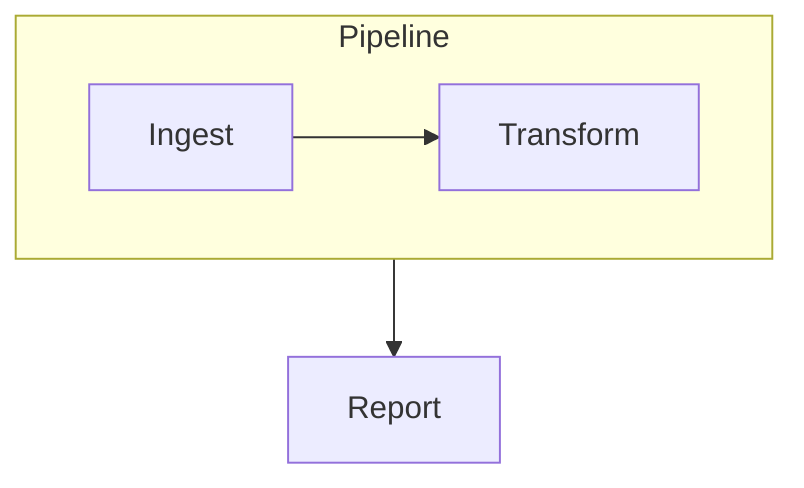

# Edges to and from subgraphs — design

Date: 2026-08-11

## Problem

Mermaid accepts a subgraph id wherever an edge expects a node:



ceasg does not. Today the parser's `ensureNode` sees the token `S1`, finds no
node, and invents one. The result is a phantom rectangle whose id collides with
the subgraph:

```
NODES   ["A","B","S1","D"]        <- phantom node "S1"
GROUPS  [{id:"S1", nodeIds:["A","B"]}]
EDGES   ["A->B","S1->D"]
```

The editor draws a stray box labelled `S1` on top of the diagram, and saving
emits a declaration the source never had:

```
    subgraph S1 ["Pipeline"]
        A["Ingest"]
        B["Transform"]
    end
    S1["S1"]                       <- written back, corrupts the diagram
```

So the current behaviour is not "ignored" — it is lossy. Opening a valid
Mermaid diagram in the visual editor and saving it produces a different, broken
diagram.

There is also no way to create such an edge in the editor: every gesture in
`pointer.ts` resolves targets with `nodeAtPoint`, and every consumer of an edge
resolves its endpoints with `model.nodes.find(...)`.

## Goals

- A hand-written diagram with subgraph edges parses, renders, and round-trips
  byte-for-byte through the visual editor.
- Subgraph edges can be created in the editor with the same gestures as node
  edges.
- Both directions and both endpoint kinds: `node -> subgraph`,
  `subgraph -> node`, `subgraph -> subgraph`.

## Non-goals

- Subgraph self-loops (`S1 --> S1`). Mermaid renders these oddly and they carry
  no useful meaning; they are refused in the UI, and a hand-written one is
  preserved but not specially drawn.
- Attaching an edge to a specific side of a subgraph. Edges meet the box border
  on the line between the two endpoint centres, as node edges already do.

## 1. Model — endpoints become a node-or-group union

`DiagramEdge.from` / `to` stay plain `string` ids. What changes is that an id
may now name a node **or** a group.

This is the whole reason the design is cheap: Mermaid's syntax makes no
distinction either — `S1 --> D` is textually identical whether `S1` is a node
or a subgraph — so `serializer.ts` needs **no changes at all**. `edgeLine()`
already just sanitizes both ids and joins them with an operator.

One new function in `model.ts` becomes the single resolution point:

```ts
/** Geometry for an edge endpoint id, which may name a node or a subgraph. */
export function endpointGeometry(
  model: DiagramModel,
  id: string,
): { x: number; y: number; w: number; h: number; shape: NodeShape } | undefined;
```

- A node id resolves to its centre, `nodeSize(model, node)`, and its real shape.
- A group id resolves to `groupBounds(model, group)` — centre `x + w/2`,
  `y + h/2` — with shape `rect`.
- An unknown id resolves to `undefined`; callers skip the edge, exactly as they
  skip a dangling edge today.

Every consumer (border points, hit testing, self-loops, layout) goes through
this one function, so the renderer and the hit test cannot disagree — the same
discipline `nodeSize()` already enforces for node boxes.

### New invariant: node ids and group ids are disjoint

`nextNodeId()` checks only `model.nodes` and `newGroupId()` checks only
`model.groups`, so the two generators can collide. With endpoint ids now
ambiguous, a collision would make an edge unresolvable. Both widen to check the
union of node and group ids.

## 2. Parser — post-parse reconciliation

Resolution cannot happen inside the line loop: `S1 --> D` may appear *before*
the `subgraph S1` block, so at the time the edge line is read the group does not
exist yet.

So the line loop is unchanged — it still creates a placeholder node for an
unknown token. A new pass runs after parsing, deleting any node whose id matches
a group id and leaving that group's edges pointing at the id. Forward and
backward references then behave identically, with no ordering rules for the user
to know.

Two ordering details fall out of where this pass sits:

- It runs **after** the existing "drop groups with no members and no child
  groups" filter (`parser.ts:646`), and that filter must additionally **keep a
  group referenced by an edge**. Otherwise `subgraph S1 end` plus `S1 --> D`
  drops the group as empty and then keeps the phantom node — the exact bug this
  spec removes, in a rarer shape.
- A subgraph id mentioned inside another subgraph's body is stripped from that
  group's `nodeIds`, and any `mermaid-flow:pos` hint recorded for the deleted
  phantom is discarded so it is not written back.

### Preserving lines that targeted the phantom

Three Mermaid constructs route through `ensureNode` and so attach to the
phantom. Deleting it without care turns a bug that *preserved* them into one
that silently drops them, which is worse:

- `style S1 fill:#f00` and `class S1 hot` are how Mermaid styles a subgraph —
  its own `flowDb.addNodeFromVertex` merges a vertex's styles and classes onto
  the subgraph node when the ids collide. ceasg does not model subgraph
  styling, so reconciliation re-emits these into `model.extras` verbatim
  (classes one `class <id> <name>` line per class, so the surviving nodes'
  assignments from `classLines()` are not duplicated).
- `click S1 "..."` is applied at the end of parsing through the local
  `nodeMap`. Reconciliation must delete the id from `nodeMap` as well as from
  `model.nodes`; the existing "binding whose target node never appeared keeps
  its line in extras" branch then preserves it with no further code.

### Node ordering is normalized, not preserved

A forward reference declares its nodes in a different order than the
equivalent backward reference (`S1 --> D` before the block declares `D` first),
so the two produce the same semantic model but different declaration order in
the output. Round-tripping a forward-reference diagram normalizes it to
canonical order on first save. That is correct, but it means such a diagram is
not byte-for-byte stable the way a canonically-ordered one is.

## 3. Geometry, render, hit test

Four sites resolve endpoints with `model.nodes.find(...)` and switch to
`endpointGeometry`:

| Site | Change |
| --- | --- |
| `edgePath.ts:6,24` | `nodeBorderPoint` / `edgePathD` / `selfLoopPathD` take ids, not `DiagramNode` |
| `render.ts:71` | `renderEdge` resolves both endpoints |
| `hitTest.ts:40` | `edgeAtPoint` resolves both endpoints |
| `editor.ts:262` | double-click-to-edit-label resolves both endpoints |

`nodeBorderPoint` keeps its shape-outline ray cast for nodes; a group endpoint
reports shape `rect`, which has no outline, so it falls to the plain box math
the function already uses.

Two things already work and need no changes:

- **Z-order.** `renderDiagram` paints group layer, then edge layer, then node
  layer, so an edge to a subgraph draws over the box fill and under its member
  nodes.
- **Bounds.** `computeContentBounds` already unions nodes and group boxes.

And because `flowchartPreview.ts` calls the same `renderDiagram`, the built-in
Markdown preview picks this up with no separate work.

### Known cosmetic case

An edge whose target sits inside the source's own box (`S1 --> A` where
`A` is a member of `S1`) draws a line leaving the box and re-entering it.
Mermaid renders that oddly too. Not special-cased; it must not crash.

## 4. Editor UI

### Anchors

`drawSelection` (`editor.ts:299–311`) gains a group branch drawing four
edge-midpoint connect anchors alongside the group's existing four corner resize
handles.

Both are drawn today by the same `overlay.handle()` circle, so a selected
subgraph would show eight indistinguishable dots. A new `Overlay.anchor()`
draws a hollow circle, used for connect points on **both** nodes and groups.
The rule becomes readable at a glance:

```
  ●──────○──────●     ● = resize (groups only)
  │  Pipeline  │      ○ = connect (nodes and groups)
  ○  [A] [B]   ○
  │            │
  ●──────○──────●
```

Corner handles and edge-midpoint anchors never coincide, so hit testing needs
no priority rule between them.

### Gestures

In `pointer.ts`:

- Anchor-drag from a selected group starts a connect with the group id as
  source, ghost line anchored at the grabbed anchor.
- Drop target resolves as `nodeAtPoint(...) ?? groupAtPoint(...)`: release over
  a member node targets that node; release over a subgraph's empty interior,
  border, or title targets that subgraph (the innermost one, matching
  `groupAtPoint`); release clear of everything cancels.
- Connect mode (`↳` toolbar toggle) uses the same resolution for both clicks.
- Self-edges are refused, matching the existing `target.id !== connectFrom`
  guard.

This mirrors the existing "drag a node into a subgraph" gesture, which already
treats a box's interior as meaning that subgraph. The trade-off is accepted:
a drag can no longer be cancelled by releasing inside a large subgraph. Esc and
releasing outside every box remain the cancel paths.

### Properties panel

`edgePanel`'s header prints raw `from → to` ids. A group endpoint shows the
group's title instead of its id, so the panel reads `Pipeline → Report` rather
than `S1 → D`.

## 5. Ungroup

`removeGroup()` drops every edge touching the group, nested or not.

Ungrouping keeps member nodes and reparents child groups, but an edge to the
box has no meaningful survivor — reattaching it to the parent group would
invent a connection the user never drew. Dropping is predictable and undo
restores it.

## 6. Auto layout

`dagreLayout` currently skips any edge with a non-node endpoint
(`layout.ts:86`). dagre cannot take an edge incident to a cluster node, so the
group endpoint is proxied to a representative descendant node
(`groupDescendantNodeIds`, first entry) for ranking only. The drawn edge still
terminates on the box. An edge whose group has no descendant nodes is skipped,
as today.

This is an approximation, not exact cluster routing: it exists so a subgraph
lands near its neighbours after Auto layout instead of being ranked as if
unconnected.

## 7. Testing

Unit tests alongside the code they cover:

- `parser.spec.ts` — no phantom node; forward reference before the block;
  `subgraph -> subgraph`; an edge-referenced empty subgraph survives the
  empty-group filter.
- `roundtrip.spec.ts` — parse then serialize reproduces the source, with no
  `S1["S1"]` line. This is the regression that motivated the work.
- `render.spec.ts` / `hitTest.spec.ts` — an edge to a group draws a path
  anchored on the box, and that path is clickable.
- `model.spec.ts` — `endpointGeometry` for both kinds; `removeGroup` drops
  attached edges; id generators avoid cross-collisions.
- `layout.spec.ts` — group endpoints are proxied to a descendant node.

Manual verification: a new `examples/subgraph-edges.md` in the same
one-line-per-check format as `examples/subgraphs.md`, covering all three
endpoint combinations, nesting, a forward reference, and a save-and-inspect case
that fails if the phantom-node declaration ever comes back.
