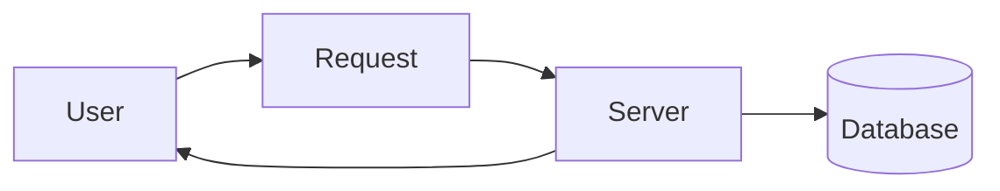
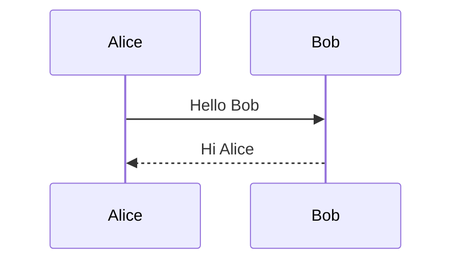

# ceasg test

This folder contains a bunch of markdown files with sample diagrams to test different features.

Open this file in the Extension Development Host (press F5 from the `extension/`
folder) and click the `◇ Open visual editor` CodeLens above any diagram below.

## Flowchart (opens the drag/drop WYSIWYG canvas)

```mermaid
flowchart BT
    B{"Decision"}
    C["Do the thing <br/>and another thing ok?"]
    D["Skip it or not!<br/>JARR"]
    E(("End of <br/>times, yay!!"))
    F["F"]
    H[["Htt"]]
    B -->|"yes or no"| C
    C --> E
    D --> E
    C -->|"muahaha"| F
    D -->|"Test!!"| H
    H --> E
    B --> D
    style C stroke:#a02c2c,color:#12af95
    style H fill:#2c2121
    linkStyle 3 mermaid-flow-animated:1
    %% ceasg:{"id":"wqg13lii"} %%
    %% mermaid-flow:pos B=279,481 C=382,306 D=156,363 E=264,149 F=416,164 H=77,250
```

## Another flowchart (left-to-right)

## Sequence diagram (opens mermaid.js live preview)

