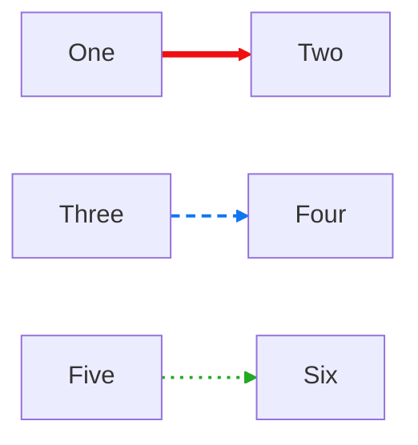
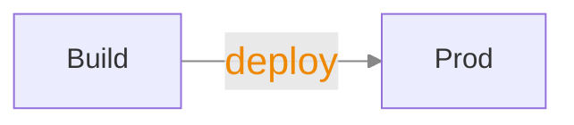
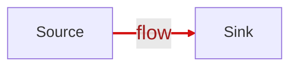
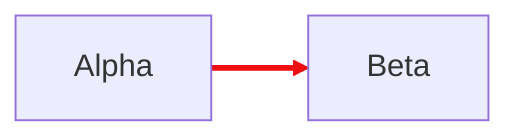

# Edge styling test cases (FG#6)

Open this file in the Extension Development Host (press F5 from the `extension/`
folder), then click the `◇ Open visual editor` CodeLens above each diagram.
Each section says, in one line, what to check.

## 1. linkStyle color / width / dash renders on the canvas

**Test:** confirm on the visual canvas (not just the external preview) that the
first edge is red and thick, the second is blue and dashed, and the third is
green and dotted.

## 2. Styled label — font size and color render

**Test:** confirm the `deploy` edge label is large and orange on the canvas.

## 3. Edit styles from the properties panel

**Test:** select the edge, then use the new **Line width**, **Dash**, **Label
size**, and **Label color** controls in the properties panel; confirm each
change shows immediately on the canvas and survives a save (check the
`linkStyle` line written back to this code block).

## 4. Selection highlight still wins over a custom color

**Test:** click the red edge and confirm it turns the focus/selection color
while selected, then reverts to red when deselected.

