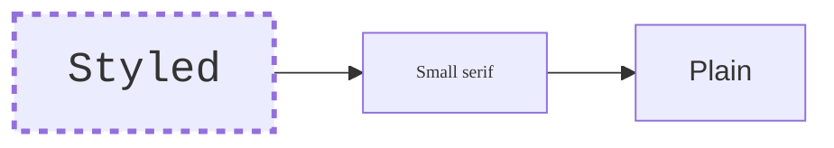
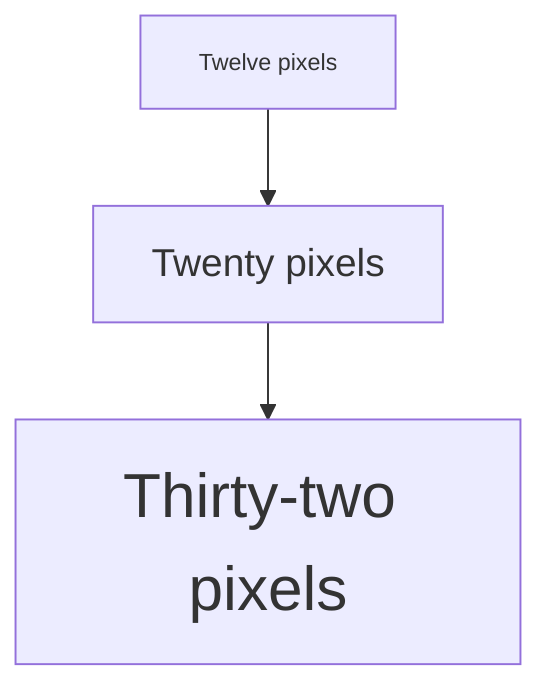
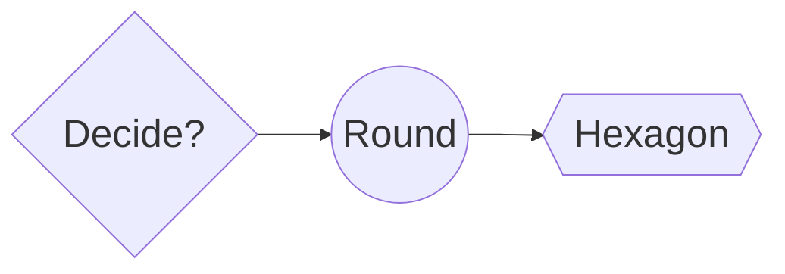
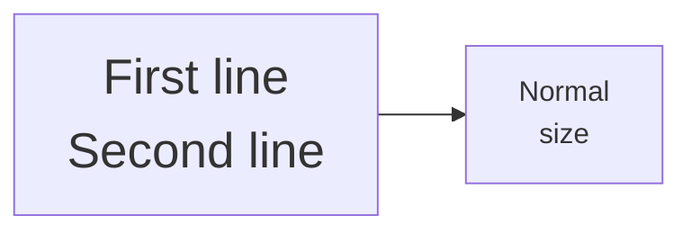
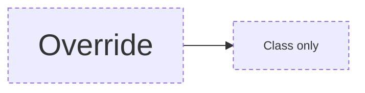
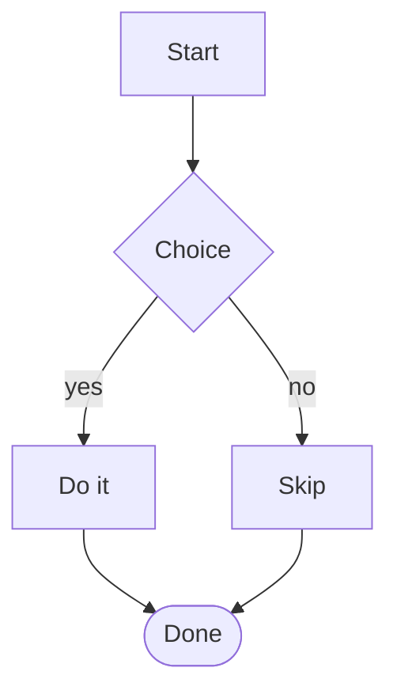

# Node font / stroke style test cases (FG#7)

Open this file in the Extension Development Host (press F5 from the `extension/`
folder), then click the `◇ Open visual editor` CodeLens above each diagram.
Each section says, in one line, what to check.

## 1. Inline `style` font-size / font-family / stroke-width / stroke-dasharray

**Test:** confirm on the visual canvas (not just the external preview) that `A`
has large monospace text with a thick dashed border, `B` has small serif text,
and `C` is a plain node for comparison.

## 2. Boxes grow to fit the text

**Test:** confirm each node's box is big enough for its label — the text must
sit fully inside the shape at every size, with no spill past the border.

## 3. Non-rectangular shapes at a large font

**Test:** confirm the diamond, circle and hexagon all grew with their text — in
particular the diamond should be visibly taller than a default one.

## 4. Multi-line label spacing follows the font size

**Test:** confirm the two lines are spaced apart proportionally to the font —
not cramped together — and both fit inside the box.

## 5. `classDef`-inherited font renders and sizes the box

**Test:** confirm `A` and `B` both pick up the large italic-serif style from the
`big` class, and that their boxes grew to match — this is inherited style, not
an inline `style` line.

## 6. Node style beats the class it inherits from

**Test:** confirm `A` renders at 30px (its own `style` line) even though the
`base` class asks for 12px, while its dashed border still comes from the class.

## 7. Edit the new properties from the panel

**Test:** select a node, then use the new **Font size**, **Font**, **Border
width** and **Border dash** controls in the properties panel; confirm each
change shows immediately on the canvas, that the box resizes as the font grows,
and that it survives a save (check the `style` line written back to this block).

## 8. Multi-select applies to every selected node

**Test:** rubber-band select all three nodes, then change **Font size** and
**Border dash** in the properties panel; confirm all three update together.

## 9. Hand-written values are not clobbered by opening the panel

**Test:** select `A` and confirm the **Font** picker shows `Georgia` and
**Border dash** shows `7 3` (values we have no preset for, listed as their own
option). Select `B`, then re-select `A` — confirm `A` still says
`font-family:Georgia,stroke-dasharray:7 3` after a save.

## 10. Unstyled diagrams are unchanged

**Test:** confirm this looks exactly as it did before the feature — node boxes
should not have shifted or resized, since no font properties are set.

