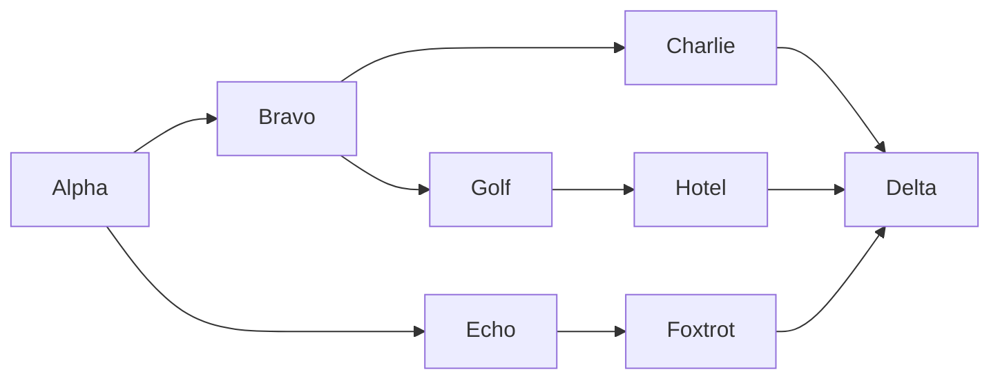
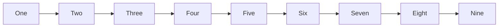

# Shape palette sidebar — manual checks

## 1. Empty canvas — add by click and by drag

Open the visual editor. The palette sidebar should be visible on the left with a
"Basic" group. Click a few shapes, then drag a few onto the canvas.

- Clicking adds near the canvas centre and the new node is selected (properties
  panel on the right shows it).
- Dragging drops the node exactly under the cursor.
- Collapsing "Basic" hides the grid; the toolbar `◧` button hides the sidebar.

## 2. Dense diagram — repeated clicks must cascade, not stack

Click the same shape five times in a row. Each new node must land down-right of
the previous one, not on top of it.

## 3. Wide diagram — resize must not distort

Toggle the sidebar with `◧`, then drag the VS Code pane divider left and right.

- The diagram must not stretch, squash, or letterbox.
- After each resize, clicking a node must select **that** node (not a neighbour),
  and double-clicking must open the rename box over the right node.

