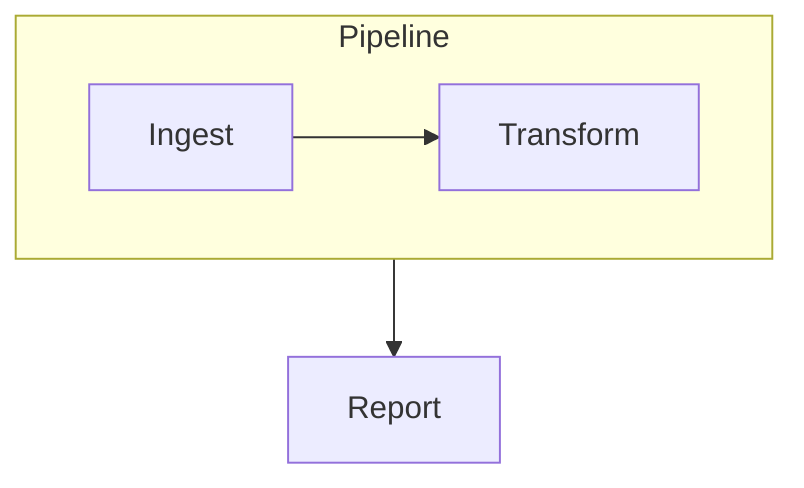
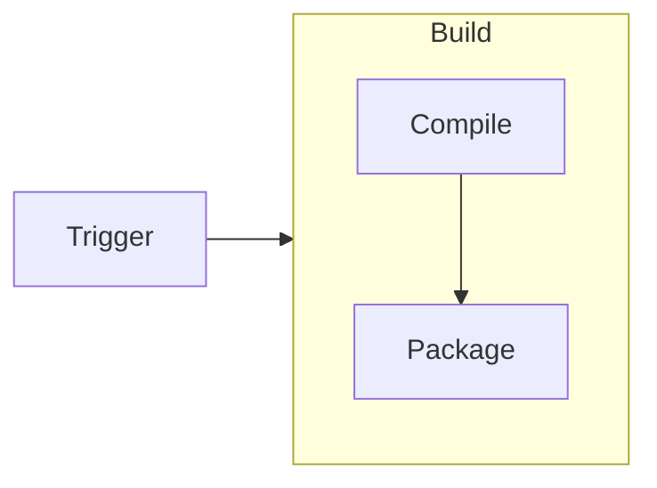
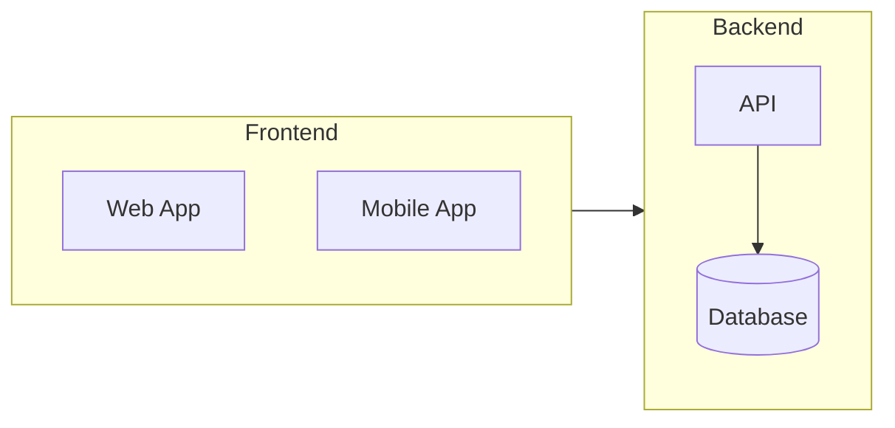
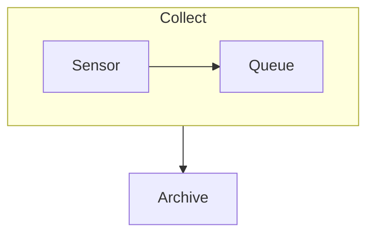
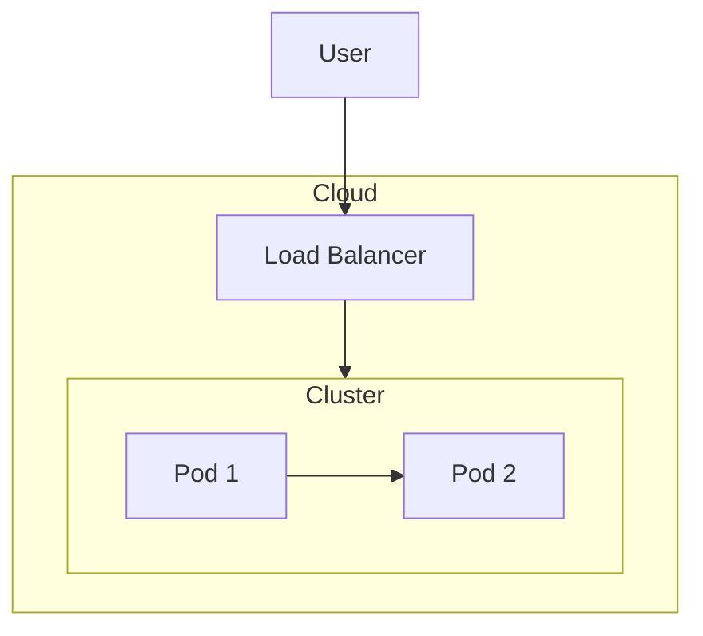
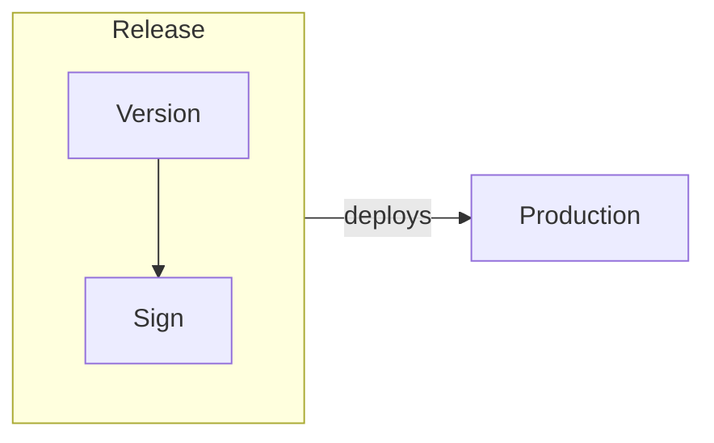
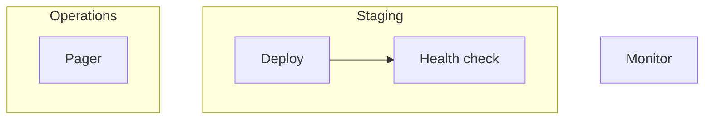
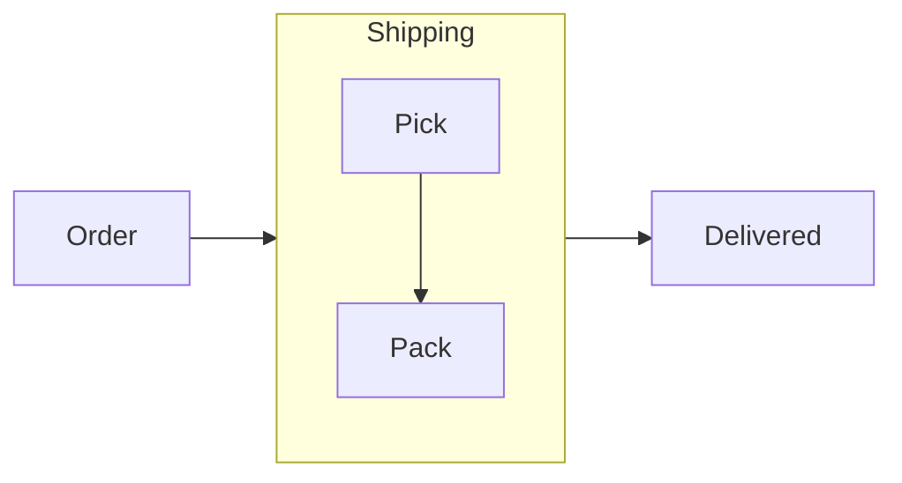
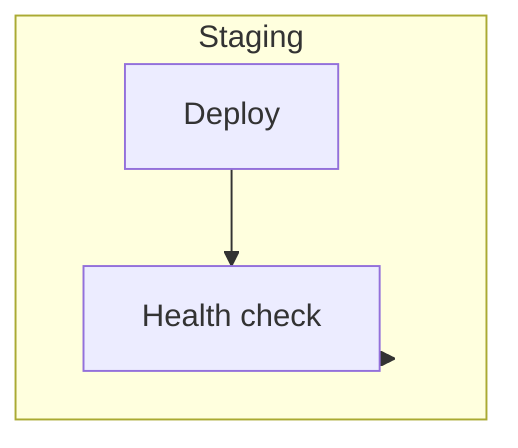

# Subgraph edge test cases

Open this file in the Extension Development Host (press F5 from the `extension/`
folder), then click the `◇ Open visual editor` CodeLens above each diagram.
Each section says, in one line, what to check.

## 1. Subgraph → node

**Test:** confirm one arrow leaves the `Pipeline` box border and lands on
`Report`, and that no stray box labelled `S1` is drawn anywhere.



## 2. Node → subgraph

**Test:** confirm the arrow from `Trigger` ends on the `Build` box border, not on
either node inside it.



## 3. Subgraph → subgraph

**Test:** confirm a single arrow runs box-to-box between `Frontend` and
`Backend`, then drag `Backend` and confirm the arrow follows it.



## 4. Forward reference — edge written before the block

**Test:** confirm the `G1 --> Out` line, written above the `subgraph G1` block,
still draws from the `Collect` box and not from a phantom node.



## 5. Nested subgraphs — edge to the inner box

**Test:** confirm the arrow from `Load Balancer` ends on the inner `Cluster`
box border, then drag `Cloud` and confirm the arrow moves with both boxes.



## 6. Labelled subgraph edge

**Test:** confirm the label `deploys` renders on the arrow leaving the `Release`
box, then double-click the label and confirm it can be edited.



## 7. Draw a subgraph edge in the editor

**Test:** click the `Staging` box to select it, drag from one of its four hollow
connect anchors (the box edge midpoints — the solid corner dots resize instead)
onto `Monitor` and confirm a new edge appears; repeat dropping onto `Health`
(a member node) to target that node, and onto the empty interior of `Staging`'s
neighbour box to target the subgraph itself.



## 8. Round-trip check — no phantom declaration after a save

**Test:** in the visual editor move a node and drag the `Ship` box, then close
the editor and look at this diagram's ` ```mermaid ` code in the Markdown file,
and confirm the `Ship --> Done` edge is still there and that no stray
`Ship["Ship"]` declaration was added.



## 9. Edge from a subgraph to one of its own members

**Test:** confirm the `Staging → Health check` arrow is visible in the gap
between the box border and the node (not hidden under it), then click that
arrow and the `Deploy → Health check` arrow and confirm each one selects
rather than selecting the `Staging` box.


