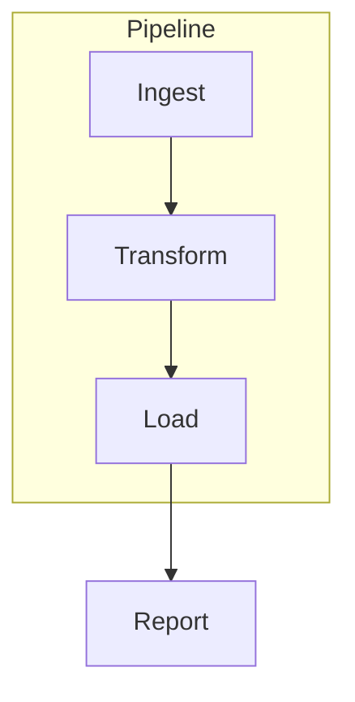
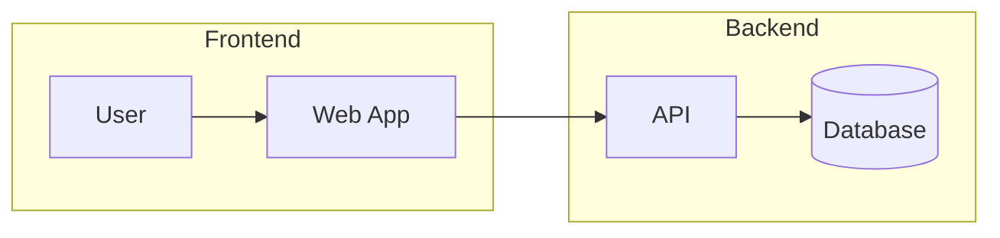
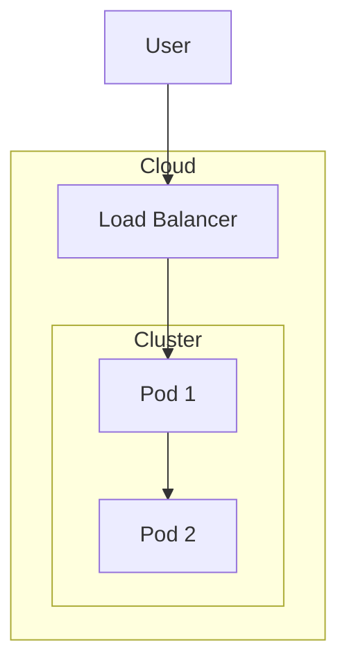
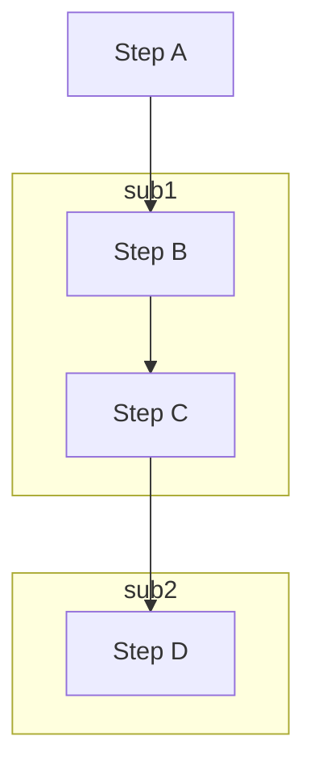
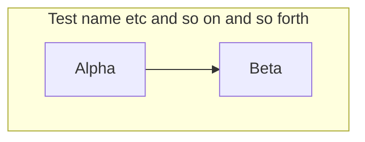
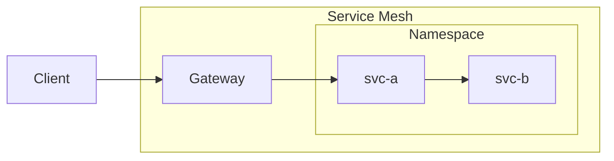

# Subgraph test cases

Open this file in the Extension Development Host (press F5 from the `extension/`
folder), then click the `◇ Open visual editor` CodeLens above each diagram.
Each section says, in one line, what to check.

## 1. Single subgraph — renders and moves as one

**Test:** the `Pipeline` box renders behind its three nodes; drag the box (grab
empty space or the title) and confirm all members move with it.



## 2. Two subgraphs — drag a node between them

**Test:** drag `Web App` out of `Frontend` and drop it inside the `Backend` box;
release to commit, then confirm it now belongs to `Backend`.



## 3. Nested subgraphs — nesting renders and moves together

**Test:** confirm `Cluster` renders nested inside `Cloud`, then drag `Cloud` and
confirm the nested `Cluster` and both pods move with it.



## 4. Create a subgraph from a selection

**Test:** marquee-select `Step B` and `Step C`, click the Group (`▢+`) toolbar
button, and confirm the two nodes get wrapped in a new subgraph.



## 5. Rename, resize, and ungroup (has saved subgraph geometry)

**Test:** double-click the subgraph title to rename it; drag a corner handle to
resize the subgraph; then select the subgraph and press Delete to ungroup (the
nodes must stay).



## 6. Round-trip check — nested + geometry survives a save

**Test:** in the visual editor, move a node and drag a subgraph; then close the
editor and look at this diagram's ` ```mermaid ` code in the Markdown file, and
confirm the nested `subgraph` blocks and an updated `%% mermaid-flow:gpos` line
were written back.


