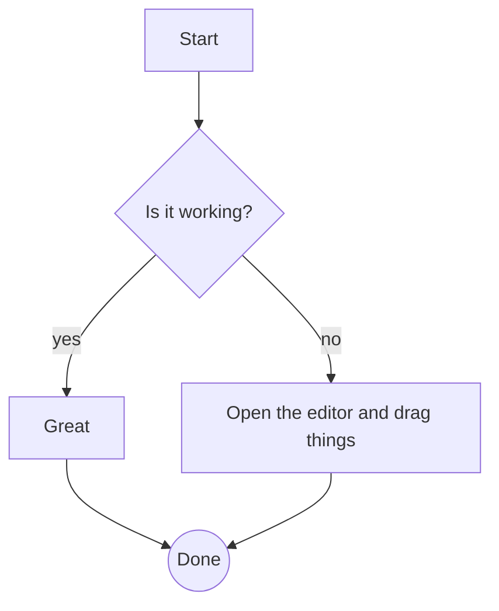
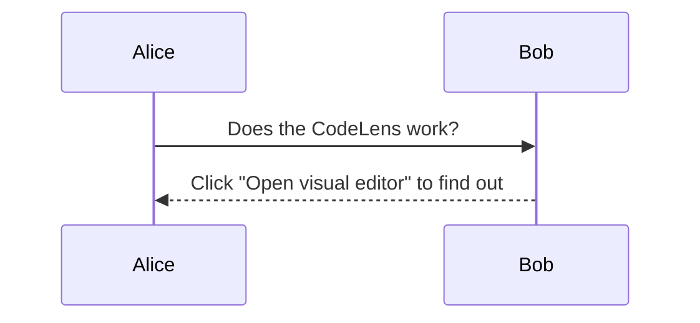

# ceasg sample diagrams

A flowchart — opens in the drag/drop WYSIWYG canvas:

```mermaid
flowchart TD
    A[Start] --> B{Is it working?}
    B -->|yes| C[Great]
    B -->|no| D[Open the editor and drag things]
    C --> E((Done))
    D --> E
```

A sequence diagram — opens in mermaid.js live-preview mode:

```mermaid
sequenceDiagram
    Alice->>Bob: Does the CodeLens work?
    Bob-->>Alice: Click "Open visual editor" to find out
```
